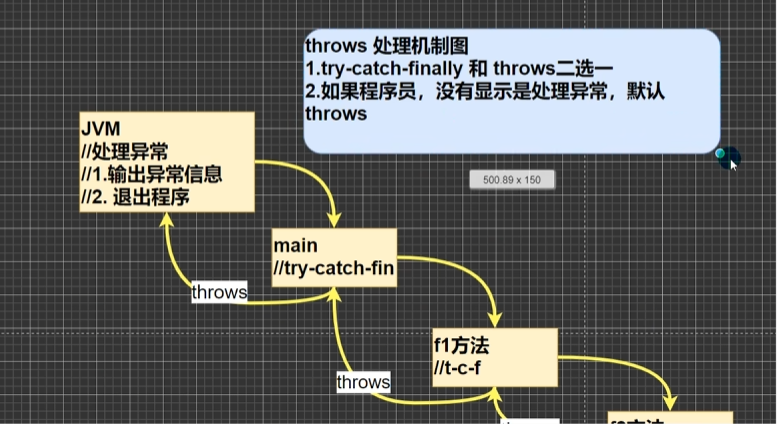

# Java初级  
## 变量  
### 浮点数  
1. 2.7 != 8.1/3 机器的计算不像数学计算，8.1/3会无限接近2.7，有精度损失。
2. 对小数进行判断相等要小心，应该是以两个数的差值的绝对值在某个精度的范围内。
3. 如果是直接查询到的小数或者直接赋值的小数，可以直接判断相等。
4. Java浮点类型有固定的范围和字段长度不受OS的影响。
5. Java默认的浮点常量为double类型，声明float类型常量，需要在后边加 ‘f’ 或者 ‘F’ 。

### 字符类型  
1. 字符常量用 '  ' 括起来。
2. '\n' 换行符。
3. char的本质是一个整数输出是对应unicode码对应的字符。
4. 可以给char付一个整数，然后输出时。按照unicode字符输出。
5. char类型可以运算，相当于一个整数，因为它有对应的nuicode码。

### 布尔类型  
1. 不可以用'0'和'1'代表false和true，这一点和C语言不同。

### 自动类型转换  
1. 在进行运算时，精度小的类型将会自动转换成精度大的类型。
2. 精度大的转换成精度小的会报错。
3. （byte，short）和char之间，若char的类型在byte范围之内可以转换，如果不在范围之内不会互相自动转换。
4. byte，short，char他们三者之间可以计算，在计算时会自动转换成int类型。
	```byte b = 16; short s = 14; short t = b + s; //错误```
5. boolean不参与转换。
6. 自动提升原则，表达式的结果的类型会自动提升为 操作数中最大的类型。
#### 基本数据类型  
+ 精度小的类型会自动转换成精度大的数据类型。
1. 整数类型：byte_1B short_2B int_4B long_8B
2. 浮点类型：float_4B double_8B
3. 字符类型：char_2B
4. 布尔类型：boolean_1B
#### 引用数据类型  
1. 类（class）
2. 接口（interface）
3. 数组（[ ]）

### 强制类型转换  
1. 当数据从大到小转换时就会用到强制类型转换。
2. 往往会使用小括号提升优先级。

### String和基本数据类型转换   
1. 基本数据类型转换成String数据类型，```int n = 1; String s1 = n + "";```
2. String数据类型转换成基本数据类型，```String s = "123"; int num = Integer.parseInt(s);```
3. 得到字符串的第n个字符
   ```java
   char c = s.charAt(n-1);
   ```
## 运算符  
### 算术运算符  
1. ```double d = 10 / 2; //2.0 因为这个做法会将2变成double类型```
2. ```10 % -3 = 1 //10 - 10 / (-3) * (-3) = 1; -10 % -3 = -1 //-10 - (-10) / (-3) * 3 = -1;```
3. 作为独立语句使用，i++ 和 ++i 都等价于 i = i + 1。

   ```java
   int j = 8;
   int k = j++;
   System.out.println("k=" + k  + "j=" + j);//8 9 
   
   int j = 8;
   int k = ++j;
   System.out.println("k=" + k  + "j=" + j);//9 9 
   
   int i = 1;
   i = i++;
   System.out.println(i)//1 (1)temp=i; (2)i=i+1; (3)i=temp;
       
   int i = 1;
   i = ++i;
   Sysatem.out.println(i)//2 (1)i=i+1; (2)temp=i; (3)i=temp;
   ```
### 关系运算符（比较运算符）  
1. ```instanceof```检查是否是类的对象。

### 逻辑运算符  
1. 用于连接多个逻辑表达式，结果也是boolean类型。
2. a&b: & 叫逻辑与：当a 和 b同时为true ,则结果为true,否则为false。
3. a&&b: && 叫短路与：当a 和b 同时为true ,则结果为true,否则为false。
	开发中， 我们使用的基本是短路与&&,效率高。
	&&：如果第一个条件为假，则直接不判断后边条件，为false。
4. a|b : |叫逻辑或：当a和b，有一个为true,则结果为true,否则为false。
5. a||b: ||叫短路或：当a 和 b，有一个为true ,则结果为true,否则为false。
	开发中， 我们使用的基本是短路或||,效率高。
	||：如果第一个条件为真，则直接不判断后边条件，为true。
6. !a:叫取反，或者非运算。当a 为true,则结果为false,当a为false，结果为true。
7. a^b: 叫逻辑异或，当 a和b不同时，则结果为true,否则为false。

### 赋值运算符  
1. 复合运算符会进行类型的转换。

   ```java
   byte b = 3;
   b += 2;//等价 b = (byte)(b + 2);
   b = b + 2;//错误
   b++;//等价 b = (byte)(b + 1);
   ```
### 三元运算符  
1. 条件表达式?表达式1：表达式2；
2. 前后的类型需要保持一致。
   
### 键盘输入语句  

```java
Scanner input = new Scanner(System.in)//创建Scanner类的对象
System.out.println("请输入姓名：");
String name = input.next();
```

## 程序控制结构  
### 分支控制  
+ 单分支

+ 双分支

+ 多分支

+ switch分支结构
	1. 表达式的数据类型应该和case后的常量类型一致。
	2. switch中的表达式的返回值必须是（byte，short，int，char，enum，String）
	3. case子句中的值必须是常量而不是变量。

	
	```java
	switch(表达式){
	case 常量1:
	语句块1;
	break;//跳出这个switch分支结构
	case 常量2:
	语句块2;
	      //如果没有break则直接进下一个语句的语句块。
	      //穿透现象
	case 常量3;
	语句块3;
	break;
	default://如果一个都没有执行，执行default;
	default语句;
	break;
	}
	```

### for循环控制  
1. for ( ; 循环控制条件 ; ) 中的初始化和变量迭代可以写到其他地方，但是两边的分号不能省略。
2. 循环初始值可以有多条初始化语句，但要求类型一样，并且中间用逗号隔开，循环变量迭代也可以有多条变量迭代语句，中间用逗号隔开。

### while循环控制  

### do..while循环控制  
1. 先执行，再判断。

```java
do{
	循环体(语句);
	循环变量迭代;
}while(循环条件)
```

### 多重循环控制  
1. 尽量使用两层循环，最好不要超过三层，如果使用三层循环代码可读性就会很差。

### 跳转控制语句-break  
1. 注意事项和细节说明:break语句出现在多层嵌套的语句块中时，可以通过标签指明要终止的是哪一层语句块 
```java
lable1:
for(int j = 0; j< 4; j++){
lable2:
	for(int i= 0; i< 10; i++){
		if(i == 2){
			break lable1;
		}
		System.out.println("i= " + i);
	}
}
```


### 跳转控制语句-return  
1. 使用return直接退出程序。

## 数组  
### 一维数组  
1. 数组的简单使用```double[] hens = {1, 2, 3, 4, 5, 6};```

2. 三种初始化方式
  1. 动态初始化
  + 数据类型[] 数组名 = new 数据类型[大小]```double[] hens = new double[5];```
  + 数据类型 数组名[] = new 数据类型[大小]```double hens[] = new double[5];```（不常用）
  2. 动态初始化
  + 数据类型[] 数组名；数组名 = new 数据类型[大小]；```int[] a; a = new int[5];```
  + 数据类型 数组名[]；数组名 = new 数据类型[大小]；```int a[]; a = new int[5];```（不常用）
  3. 静态初始化
  + 数据类型 数组名[] = {元素值， 元素值， 元素值， 元素值}；```int a[] = {1, 2, 3, 4, 5, 5, 6}```

3. 数组创建后，如果没有赋值，则有默认值int-0, short-0,以此类推。

4. 数组属于引用类型，数组型数据是对象（object）。

5. 
   ```java
    int[] arr = {4,-1,9};int max = arr[0];//假定第一个元素就是最大值
    int maxIndex=0;//
    for(int i=1;i< arr.length;i++){//从下标 1 开始遍历arr
       if(max< arr[i]){//如果max< 当前元素
           max= arr[i];//把max 设置成 当前元素
           maxIndex =i;
       }
    }
    //当我们遍历这个数组arr后，，max就是真正的最大值，maxIndex最大大下标
    System.out.println("max="+ max +" maxIndex="+ maxIndex);
   ```

6. 基本数据类型赋值，这个值就是具体的数据，并且互不影响。但是数组在默认情况下是引用传递，赋的值是地址。

```java
	int[]arr1={1，2，3};
	int[]arr2 = arr1;//把 arr1赋给 
	arr2arr2[0]= 10;
	//看看arr1的值
	System.out.println("====arr1的元素====");
	for(int i=0;i< arr1.length; i++){
		System.out.println(arr1[i]);
	}// 10, 2 ,3
```


7. 基本数据类型是传递值，引用数据类型传递地址。
   

8. 数组的内容拷贝，要求数据空间独立。
```java
int[] arr1 = {1, 2, 3};
int[] arr2 = new int[arr1.length];
	
for(int i = 1; i < arr1.length; i++){
	arr2[i] = arr1[i];
}
```

9. 数组反转
```java
public class ReverseArrayManually {
    public static void main(String[] args) {
        int[] array = {1, 2, 3, 4, 5};
        
        System.out.println("原始数组: " + java.util.Arrays.toString(array));
        
        // 反转数组
        reverse(array);
        
        System.out.println("反转后数组: " + java.util.Arrays.toString(array));
    }
    
    public static void reverse(int[] arr) {
        int left = 0;
        int right = arr.length - 1;
        
        while (left < right) {
            // 交换元素
            int temp = arr[left];
            arr[left] = arr[right];
            arr[right] = temp;
            
            left++;
            right--;
        }
    }
}
```

10. 数组的添加
```java
int[]arr = {1,2,3};
int[]arrNew = new int[arr.length + 1];
//遍历 arr 数组，依次将arr的元素拷贝到 arrNew数组
for(int i=0;i< arr.length; i++){
	arrNew[i]= arr[i];
}
//把4赋给arrNew最后一个元素
arrNew[arrNew.length-1]=4;
//让 arr 指向 
arrNewarr = arrNew;
```

### 冒泡排序  
```java
import java.util.Arrays;

public class Main {
    public static void main(String[] args) {
        int[] arr = {24, 69, 80, 57, 13};
        for (int j = 0; j < arr.length -1; j++) {
            for (int i = 0; i < arr.length-1-j ; i++) {
                if(arr[i] > arr[i+1]) {
                    int temp = arr[i+1];
                    arr[i+1] = arr[i];
                    arr[i] = temp;
                }
            }
        }
        for (int i = 0; i < arr.length ; i++) {
            System.out.print(arr[i] + " ");
        }
    }
}
```

### 二维数组  
```java
int[][] arr = {{0,0,0,0,0,0,},{0,0,1,0,0,0},{0,2,0,3,0,0},{0,0,0,0,0,0}};
```

1.动态初始化
```类型[][] 数组名 = new 类型[大小][大小]```


```类型 数组名[][]; 数组名 = new 数据类型[大小][大小]```

2. 静态初始化
```java
public class Main {
    public static void main(String[] args) {
        int[][] arr = {{0, 0, 0, 0, 0, 0,}, {0, 0, 1, 0, 0, 0}, {0, 2, 0, 3, 0, 0}, {0, 0, 0, 0, 0, 0}};
    }
}
```

3. 二维数组的遍历
```java
int arr[][]= {{4,6},{1,4,5,7},{-2}};
int sum = 0;
for(int i=0;i< arr.length; i++){
//遍历每个一维数组
	for(int j=0;j< arr[i].length; j++){
		sum += arr[i][j];
	}
}
```

4. 杨辉三角
```java
public class Main {
    public static void main(String[] args) {
        int[][] yangHui = new int[10][];
        for (int i = 0; i < yangHui.length; i++) {
            yangHui[i] = new int[i + 1];
            for (int j = 0; j < yangHui[i].length; j++) {
                if (j == 0) {
                    yangHui[i][j] = 1;
                    continue;
                }
                if (j == yangHui[i].length - 1) {
                    yangHui[i][j] = 1;
                    continue;
                }
                yangHui[i][j] = yangHui[i - 1][j] + yangHui[i - 1][j - 1];
            }
        }
        for (int i = 0; i < yangHui.length; i++) {
            for (int j = 0; j < yangHui[i].length; j++) {
                System.out.print(yangHui[i][j] + " ");
            }
            System.out.println(" ");
        }
    }
}
```

## 类与对象    
###  面向对象  
```java
class Cat{
	String name;
	int age;
	String color;
	int weight;
}

Cat cat1 = new Cat();
cat1.name = "小白";
cat1.age = 3;
cat1.color = "白色";
cat1.weight = 10;

Cat cat2 = new Cat();
cat2.name = "小花";
cat2.age = 100;
cat2.color = "黄色";
cat1.weight = 12;
```
1. 对象内存布局


### 属性（成员变量/字段）  
1. 访问修饰符 + 属性类型  + 属性名   

### 对象   
1. 先声明再创建```Cat cat; cat = new Cat();```
2. 直接创建```Cat cat = new Cat();```
3. 类与对象的内存分配机制

```java
Person p1=new Person();
p1.age=10;
p1.name="小明":
Person p2=p1; //把p1 赋给了 p2 ，让p2指向p1
System.out.println(p2.age);//10
```

4. Java内存结构分析
	1. 栈：一般存放基本数据类型（局部变量）
	2. 堆：存放变量（Cat cat， 数组）
	3. 方法区：常量池（常量，比如字符串），类加载信息
	4. 示意图[Cat（name，age，price）]

5. Java创建对象的流程简单分析
	1. 先加载类Cat信息（属性和方法信息，只会加载一次）。
	2. 在堆中分配空间，进行默认初始化（看规则）。
	3. 把地址赋给cat，cat就指向对象。
	4. 进行指定初始化，比如cat.name="小花"

### 成员方法  
1. 方法的快速入门

```java
public class Main {
    public static void main(String[] args) {
        Person p1 = new Person();
        p1.speak();
    }
}

class Person {
    String name;
    int age;

    //方法(成员方法)
    //添加speak 成员方法,输出“我是一个好人”//老韩解读
    public void speak() {
        System.out.println("我是一个好人");
    }
}
```

2. 方法的调用机制


3. 成员方法的好处：提高代码的复用性，可以将细节封装起来，然后供其他用户来调用。

4. 成员方法的定义：
```java
访问修饰符 返回数据类型 方法名（形参列表）{方法体
	语句；
	return;
}
```

5. 方法遵行驼峰命名法

6. 方法调用细节：
  + 同一个类中的方法可以直接调用
  + 跨类中的方法A类调用B类方法；需要通过对象名调用

7. 成员方法的传参机制：如果是引用数据类型，在方法中改变形参，则实参也会改变。

8. 方法递归调用
  9. 常用的解决问题的方法：8皇后问题，汉诺塔，阶乘问题，迷宫问题，球和篮子问题。
  10. 各种算法也会用到递归，快排，归并排序，二分查找，分治算法。
  11. 用栈解决的问题，递归代码比较简洁。

9. 执行一个方法时就会创建一个新的受保护的栈空间


10. 方法的局部变量是独立的，不会互相影响，比如n变量
11. 如果方法中使用的是引用类型变量，就会共享该引用类型的数据。
12. 递归的条件必须向推出递归的而条件逼近，否则就是无限递归。
13. 当一个方法执行完毕，或者遇到return，就会返回，遵守谁调用，就将结果返回给谁，同时当方法执行完毕或者返回时，该方法也就执行完毕。

14. 斐波那契数

```java
public class Main {
    public static void main(String[] args) {
        T t = new T();
        int n = 7;
        int res = t.output(n);
        if (res != -1) {
            System.out.println("当n=" + n + "对应的斐波那契数 = " + res);
        }
    }
}

class T {
    //方法(成员方法)
    public int output(int n) {
        if (n >= 1) {
            if (n == 1 || n == 2) {
                return 1;
            } else {
                return output(n - 1) + output(n - 2);
            }
        } else {
            System.out.println("输入违法");
            return -1;
        }
    }
}
```

15. 猴子吃桃问题


```java
public class Main {
    public static void main(String[] args) {
        T t = new T();
        int day = 1;
        int res = t.peach(day);
        if (res != -1) {
            System.out.println("第" + day + "天有" + res + "个桃子");
        }
    }
}

class T {
    //方法(成员方法)
    public int peach(int day) {
        if (day == 10) {
            return 1;
        } else if ( day >= 1 && day <= 9) {
            return (peach(day + 1) + 1) * 2;
        } else{
            System.out.println("day在1-10");
            return -1;
        }
    }
}
```

16. 老鼠出迷宫问题

```java
public class Main {
    public static void main(String[] args) {
        int[][] map = new int[8][7];//将最上面的一行和最下面的一行，全部设置为1
        for (int i = 0; i < 7; i++) {
            map[0][i] = 1;
            map[7][i] = 1;
        }

        for (int i = 0; i < 7; i++) {
            map[i][0] = 1;
            map[i][6] = 1;
        }

        map[3][1] = 1;
        map[3][2] = 1;

        //输出当前地图情况
        System.out.println("=====当前地图情况======");
        for (int i = 0; i < map.length; i++) {
            for (int j = 0; j < map[i].length; j++) {
                System.out.print(map[i][j] + "");//输出一行
            }
            System.out.println();
        }

        T t1 = new T();
        t1.findWay(map,1 ,1);

        System.out.println("=====找路后的情况======");
        for (int i = 0; i < map.length; i++) {
            for (int j = 0; j < map[i].length; j++) {
                System.out.print(map[i][j] + "");//输出一行
            }
            System.out.println();
        }
    }
}

class T {
    //使用递归回溯的思想来解决老鼠出迷宫
    //1.findway方法就是专内来找出迷宫的路径
    // 2.如果找到，就返回 true，
    // 3.map 就是二维数组，即表示迷宫
    //4.i,j 就是老鼠的位置，初始化的位置为(1,1)
    // 5.因为我们是递归的找路，所以我先规定 map数组的各个值的含义“0 表示可以走 1 表示障碍物 2 表示可以走 3 表示走过，但是走不通是死路
    // 6:当map[6][5]=2 就说明找到通路,就可以结束，否则就继续找
    public boolean findWay(int[][] map, int i, int j){
        if(map[6][5] == 2){
            return true;
        } else {
            if(map[i][j] == 0){//当前位置为0
                //假定可以走通
                map[i][j] = 2;
                //使用找路的策略，来确定该位置是否真的可以走通
                //下-右-上-左
                if(findWay(map, i+1, j)){
                    return true;
                }else if(findWay(map, i, j+1)){
                    return true;
                }else if(findWay(map, i-1, j)){
                    return true;
                }else if(findWay(map, i, j-1)){
                    return true;
                }else {
                    map[i][j] = 3;
                    return false;
                }
            } else {
                return false;
            }
        }
    }
}
```

17. 汉诺塔  

```java
//todo
```

18. 八皇后  

```java
//todo
```

### 重载（overload）  
1. java中允许同一个类中，多个同名方法存在，但他必须要求形参列表不一样，返回类型没有要求。

```java
class MyCalculator{
//两个整数的和
public int calculate(int nl, int n2){
	return n1 + n2;
}
//一个整数，一个double的和
public double calculate(int nl, double n2){
	return n1 + n2;
}
//-个double，一个Int和
public double calculate(double nl, int n2){
	return n1 + n2;
}
//三个int的和
rublic int calculate(int nl, int n2,int n3){
	return n1 + n2 + n3;
}
```

### 可变参数  
1. java允许将同一个类中多个同名同功能但参数个数不用的方法封装成一个方法。

```java
class HspMethod {
//可以计算 2个数的和，3个数的和，4.5.//可以使用方法重载
public int sum(int nl, int n2){//2个数的和
	return nl + n2;
}
public int sum(int n1,int n2,int n3){//3个数的和
	return n1 + n2 + n3;
}
public int sum(int nl, int n2,int n3,int n4){//4个数的和
	return n1 + n2 + n3 + n4;
}

//1. int... 表示接受的是可变参数，类型是int，即可以接受多个int（0-多）
//2. 使用可变参数时，可以当作数组来使用， 即 nums 可以当作数组
public int sum(int... nums){//2个数的和
	int res = 0;
	for(int i = 0; i < nums.length; i++){
		res += nums[i];
	}
	return res;
}
```

2. 可变参数的实参可以为0个或者任意多个。
3. 可变参数的实参可以为数组。
4. 可变参数的本质就是数组。
5. 可变参数可以和普通类型的参数一起放在形参列表，但必须保证可变参数在最后
6. 一个形参列表中只能出现一个可变参数

### 作用域  
1. 属性和局部变量可以重名，访问时遵循就近原则。在同一个作用域中，比如在同一个成员方法中，两个局部变量，不能重名。
2. 属性生命周期较长，伴随着对象的创建而创建，伴随着对象的死亡而死亡。局部变量，生命周期较短，伴随着它的代码块的执行而创建，伴随着代码块的结束而死亡即在一次方法调用过程中。

### 构造器（构造方法）  
1. 构造器的名称必须和类名保持一致
2. 构造器对新对象的初始化而不是创建对象
3. 构造器没有返回值，也不能写void
4. ``` Person p1 = new Person("smith", 80)```
5. 一个类可以定义多个不同的构造器，即构造器重载
6. 如果程序员没有定义构造器，系统会自动给类生成一个默认的无参构造器，比如``` Person() {}```
7. 一旦自己定了构造器，就不能再使用无参构造器，默认的构造器被覆盖了``` Person p1 = new Person();//使用的是默认的无参构造器，如果定义了构造器，需要再显式的定义构造器```

### this关键字   
1. 
```java
	public Dog(string nqme,int age){//构造器
		//this.name就是当前对象的属性name
		this.name = name;
		//this.age 就是当前对象的属性age
		this.age = age;
	}
```

2. 小结: 简单的说，哪个对象调用，this就代表哪个对象.
3. this关键字可以用来访问本类的属性，方法，构造器。
4. 访问成员方法的语法：this.方法名(参数列表).
5. 访问构造器语法：this(参数列表) 注意只能在构造器中使用
6. this不能在类定义的外部使用，只能在类定义的方法中使用
```java
//细节:访问构造器语法:this(参数列表)
//注意只能在构造器中使用(即只能在构造器中访问另外一个构造器)
//注意: 访问构造器语法:this(参数列表);必须放置第一条语句
public T(){
//这里去访问 T(String name,int age)构造器	
	this("jack",100);
	System.out.println("T()构造器”);
}
```


# Java中级  
## IDEA的使用  
### 常用快捷键   
+ 删除当前行 ctrl + x
+ 复制当前行 ctrl + d
+ 选中当前行 ctrl + w
+ 快速格式化代码  ctrl + shift + L
+ 快速运行程序 alt + N
+ 导入类 ctrl + R

## 包  
### 包的定义  
1. 三大作用：区分相同名字的类；当类很多的时候，可以更好地管理类；控制访问范围
2. 包的本质实际上就是创建不同的文件夹保存类文件

### 包的命名  
1. 只能包含数字、字母、下划线、小圆点.,但不能用数字开头，不能是关键字或保留字
2. 一般是小写字母+小圆点    一般是com.公司名.项目名.业务模块名

### 包的导入  
1. 需要什么类就导入什么类
2. package的作用是声明当前类所在的包，需要放在类的最上边，一个类中最多只有一句package

##  访问修饰符  
java提供四种访问控制修饰符号，用于控制方法和属性(成员变量)的访问权限(范围)
1. 公开级别:用public 修饰,对外公开
2. 受保护级别:用protected修饰,对子类和同一个包中的类公开
3. 默认级别:没有修饰符号,向同一个包的类公开
4. 私有级别:用private修饰,只有类本身可以访问,不对外公开

| 访问级别 | 访问控制修饰符 | 同类 | 同包 | 子类 | 不同包 |
| -------- | -------------- | ---- | ---- | ---- | ------ |
| 公开     | public         | √    | √    | √    | √      |
| 受保护   | protected      | √    | √    | √    | ×      |
| 默认     | 没有修饰符     | √    | √    | ×    | ×      |
| 私有     | private        | √    | ×    | ×    | ×      |

5. 修饰符可以用来修饰类中的属性，成员方法以及类
6. 只有默认的和公开才能修饰类，并且遵循上述访问权限的特点。
7. 成员方法的访问规则和属性完全一样.

## 封装  
1. 封装(encapsulat ion)就是把抽象出的数据[属性]和对数据的操作[方法]封装在一起,数据被保护在内部,程序的其它部分只有通过被授权的操作[方法],才能对数据进行操作。
2. 好处：隐藏实现细节，可以对数据进行验证，保证安全合理

### 封装的实现步骤  
1. 先将属性私有化private 
2. 提供一个公共（public）的set方法，用于对属性判断并赋值
3. 提供一个公共（public）的get方法，用于获取属性的值

```java
package com.encap;

public class Encapsulation01 {
    public static void main(String[] args) {
        Person person = new Person();
        person.setName("jacky");
        person.setAge(22);
        person.setSalary("30000");
        System.out.println(person.info());
    }
}

class Person{
    public String name;
    private int age;
    private String salary;
    //手写太慢 使用快捷键

    public int getAge() {
        return age;
    }

    public void setAge(int age) {
        this.age = age;
    }

    public String getSalary() {
        return salary;
    }

    public void setSalary(String salary) {
        this.salary = salary;
    }

    public String getName() {
        return name;
    }

    public void setName(String name) {
        this.name = name;
    }

    public String info(){
        return "Name: " + name + ", Age: " + age + ", Salary: " + salary;
    }
}

```

### 构造器和set方法  
```java
public Person(String name,int age, double salary){
	//this.name = name
	//this.age = age;
	//this.salary = salary;
	//我们可以将set方法写在构造器中，这样仍然可以验证
	this.setName(name);
	this.setAge(age);
	this.setSalary(salary);
}
```

## 继承  
### 继承的定义  
1. 继承可以解决代码复用,让我们的编程更加靠近人类思维,当多个类存在相同的属性(变量和方法时,可以从这些类中抽象出父类,在父类中定义这些相同的属性和方法，所有的子类不需要重新定义这些属性和方法，只需要通过extends来声明继承父类即可。
2. 

### 继承的基本语法  
1. 子类就会自动拥有父类定义的属性和方法
2. 父类又叫 超类，基类。
3. 子类又叫派生类。

### 继承的使用细节  
```java
public class Student {
    public String name;
    public int age;
    private double score;
    public void setScore(double score) {
        this.score = score;
    }
    public void showInfo(){
        System.out.println("Name: " + name + " Age: " + age + " Score: " + score);
    }
}

public class Pupil extends Student{

    public void testing(){
        System.out.println("小学生" + name + "正在考试");
    }
}

public class Graduate extends Student{

    public void testing(){
        System.out.println("大学生" + name + "正在考试");
    }
}
```

1. 子类继承了所有的属性和方法，非私有的属性和方法可以在子类直接访问，但是私有属性和方法不能在子类直接访问，要通过公共的方法去访问。
2. 子类必须调用父类的构造器完成父类的初始化。
3. 当创建子类对象时，不管使用子类的哪个构造器，默认情况下总会去调用父类的无参构造器，如果父类没有提供无参构造器，则必须在子类的构造器中用 super 去指定使用父类的哪个构造器完成对父类的初始化工作，否则，编译不会通过。
4. 如果希望指定用父类的某个构造器，则显式的调用一下:super(参数列表)
5. super在使用时，需要放在构造器第一行
6. super()和 this()都只能放在构造器第一行，因此这两个方法不能共存在一个构造器
7. Object是所有类的基类
8. 父类的构造器调用不限于直接父类！价格一直往上追溯到Object类(顶级父类)
9. ctrl + H 可以看到继承关系
10. 子类最多只能继承一个父类(指直接继承)，即java中是单继承机制。
11. 如何让A类继承B类和C类? A继承B B继承C
12. 不能滥用继承，子类和父类之间必须满足 is-a 的逻辑关系


```java
package com.extend.improve;

public class Base {
    public int n1 = 100;
    protected int n2 = 200;
    int n3 = 300;
    private int n4 = 400;

    public Base() {
        System.out.println("Base()无参构造器被调用...");
    }

    //覆盖父类的无参构造器
    public Base(String name, int age) {
        System.out.println("Base Constructor");
    }

    //父类提供一个public的方法，返回n4
    public int getN4(){
        return n4;
    }

    public void test100(){
        System.out.println("Base.test100()...");
    }

    protected void test200(){
        System.out.println("Base.test200()...");
    }

    void test300(){
        System.out.println("Base.test300()...");
    }

    protected void test400(){
        System.out.println("Base.test400()...");
    }
}

package com.extend.improve;

public class Sub extends Base{
    public Sub(){//无参构造器
        super();//默认调用父类的无参构造器，如果被覆盖了则需要使用对应的构造器
        //不可以这么使用，调用自己的构造器，只能与 super()二选一
        //this("tom");
        System.out.println("Sub()无参构造器被调用...");
    }
    public Sub(String name){
        super("tom",30);
        System.out.println("Sub(String name)构造器被调用...");
    }

    public void sayOk(){
        //非私有的属性和方法可以在子类直接访问
        // 但是私有属性和方法不能在子类直接访问
        System.out.println(n1 + " " + n2 + " " + n3);
        test100();
        test200();
        test300();
        //test400();错误
        //要通过父类提供公共的方法去访问
        System.out.println("n4 = " + getN4());
    }
}

package com.extend.improve;

public class ExtendsDetail {
    public static void main(String[] args) {
        Sub sub = new Sub();//创建了子类对象
        Sub sub2 = new Sub("jacky");//创建了子类对象
        //sub.sayOk();
    }
}

```

### 继承的本质分析  
1. 创建子类对象时，当子类对象创建好之后，内存中会建立查找关系
2. 首先看子类是否有该属性
3. 如果子类有这个属性，并且可以访问，则返回信息
4. 如果子类没有这个属性，就看父类有没有这个属性(如果父类有该属性，并且可以访问，就返回信息..)
5. 如果父类没有就按照(3)的规则，继续找上级父类，直到0bject

```java
public class ExtendsTheory {
    public static void main(String[] args) {
        Son son = new Son();//内存的布局

        System.out.println(son.name);
        System.out.println(son.getAge());
    }
}

class GrandPa {
    //爷类
    String name = "大头爷爷";
    String hobby = "旅游";
}
class Father extends GrandPa {
    //父类
    String name ="大头爸爸";
    private int age = 39;

    public int getAge(){
        return this.age;
    }
}

class Son extends Father {
    //子类
    String name ="大头儿子";
}

```


## super关键字  
1. super代表父类的引用，用于访问父类的属性，方法，构造器
2. 访问父类的属性，但不能访问父类的private属性  super.属性名;
3. 访问父类的方法，不能访问父类的private方法 super.方法名(参数列表);
4. 访问父类的构造器(这点前面用过):super(参数列表);只能放在构造器的第一句，只能出现一句!

### super关键字的好处  
1. 调用父类的构造器的好处(分工明确,父类属性由父类初始化，子类的属性由子类初始化)
2. 当子类中有和父类中的成员(属性和方法)重名时，为了访问父类的成员，必须通过super。如果没有重名，使用super、this、直接访问是一样的效果!

```java
package com.extend.super_;

public class B extends A{
    public void hi(){
        System.out.println(super.n1 + " " + super.n2 + " " + super.n3 );
    }
    public void sum(){
        System.out.println("B类的sum()");
        //希望调用父类A的cal方法
        //这时，因为子类B没有cal方法，因此我可以使用下面三种方式

        //找cal方法时，顺序是
        //(1)先找本类，如果有，则调用
        //(2)如果没有，则找父类(如果有，并可以调用，则调用)
        //(3)如果父类没有，则继续找父类的父类，这个规则，就是一样的，直到Object类
        //提示:如果查找方法的过程中，找到了，但是不能访问，则报错
        //如果查找方法的过程中，没有找到，则提示方法不存在
        cal();
        this.cal();//等价cal();
        super.cal();//没有查找本来的过程，直接查找父类

        //演示访问属性的规则
        //n1和this.n1 查找的规则是
        //(1)先找本类，如果有，则调用
        //(2)如果没有，则找父类(如果有，并可以调用，则调用)
        //(3)如果父类没有，则继续找父类的父类,整个规则，就是一样的,直到 0bject类
        //提示:如果查找属性的过程中，找到了，但是不能访问，则报错，cannot access11
        //如果查找属性的过程中，没有找到，则提示属性不存在
        System.out.println(n1);
        System.out.println(this.n1);

        //找n1(super.n1)的顺序是直接查找父类属性，其他的规则一样
        System.out.println(super.n1);
    }

    public void ok() {
        super.test100();
        super.test200();
        super.test300();
        //super.test400();//不能访问父类private方法
    }
}

```

3. super的访问不限于直接父类，如果爷爷类和本类中有同名的成员，也可以使用super去访问爷爷类的成员;如果多个基类中都有同名的成员，使用super访问遵循就近原则。A->B->C


## 方法重写/覆盖(override)  
### 方法重写的使用  
1. 简单的说:方法覆盖(重写)就是子类有一个方法,和父类的某个方法的名称、返回类型、参数一样，那么我们就说子类的这个方法覆盖了父类的那个方法


```java
package com.override;

public class Animal {
    public void cry() {
        System.out.println("动物叫唤");
    }
}
public class Dog extends Animal{
    //1.因为Dog 是Animal子类
    //2.Dog的 cry方法和 Animal的 cry定义形式一样(名称、返回类型、参数)
    //3.这时我们就说 Dog的cry方法，重写了Animal的cry方法
    public void cry() {
        System.out.println("小狗汪汪叫...");
    }
}
public class Overrride01 {
    public static void main(String[] args) {
        Dog dog = new Dog();
        dog.cry();
    }
}
```

### 方法重写的使用细节  
1. 子类的方法的参数,方法名称,要和父类方法的参数,方法名称完全一样。
2. 子类方法的返回类型和父类方法返回类型一样，或者是父类返回类型的子类比如 父类 返回类型是 Object,子类方法返回类型是String
```public object getInfo(){}```
```public string getInfo(){}```
3. 子类方法不能缩小父类方法的访问权限
```void sayok(){}```
```public void sayok(){}```

### 重载和重写的区别  


## 多态  
### 多态的基本介绍  
1. 问题是: 代码的复用性不高，而且不利于代码维护
2. 解决方案: 多态

### 方法的多态   
1. 重写和重载体现了方法的多态

### 对象的多态   
1. 一个对象的编译类型和运行类型可以不一致
2. 编译类型在定义对象时，就确定了，不能改变
3. 运行类型是可以变化的
4. 编译类型看定义时 =号 的左边，运行类型看=号的 右边

```java
Animal animal = new Dog();
animal = new Cat(); 
```

```java
public class PolyObject {
    public static void main(String[] args) {
        //体验对象多态特点

        //animal 编译类型就是 Animal ，运行类型 Dog
        Animal animal = new Dog();
        //因为运行时 ，执行到改行时，animal运行类型是Dog，所以cry就是Dog的cry
        animal.cry();//小狗汪汪叫

        //animal 编译类型 Animal,运行类型就是 Cat
        animal = new Cat();
        animal.cry();//小猫喵喵叫
    }
}
```

```java
public class Master {
    private String name;
    public Master(String name){this.name = name;}

    public String getName() {
        return name;
    }

    public void setName(String name) {
        this.name = name;
    }

    //使用多态机制，可以统一的管理主人喂食的问题
    //使用多态机制，可以统一的管理主人喂食的问题
    // animal 编译类型是Animal,可以指向(接收)Animal子类的对象
    // food 编译类型是Food可以指向(接收)Food子类的对象
    public void feed(Animal animal,Food food) {
        System.out.println("主人"+ name + "给"+ animal.getName()+"吃"+ food.getName());
    }

//    //完成主人给小狗 喂食 骨头
//    public void feed(Dog dog, Bone bone){
//        System.out.println("主人"+ name + "给"+ dog.getName()+"吃"+ bone.getName());
//    }
//    //完成主人给小猫 喂食 鱼
//    public void feed(Cat cat, Fish fish){
//        System.out.println("主人"+ name + "给"+ cat.getName()+"吃"+ fish.getName());
//    }
}
```
### 多态向上转型  
1. 两个对象(类)存在继承关系
2. 多态的向上转型
	+ 本质:父类的引用指向了子类的对象
	+ 语法:父类类型引用名=new 子类类型();
	+ 特点:编译类型看左边，运行类型看右边。
	+ 可以调用父类中的所有成员(需遵守访问权限)
	+ 不能调用子类中特有成员;最终运行效果看子类的具体实现!

```java
public class PloyDetail {
    public static void main(String[] args) {
        //向上转型:父类的引用指向了子类的对象
        // 语法:父类类型引用名=new子类类型();
        Animal animal = new Cat();
        Object obj = new Cat();//可以吗?可以 0bject 也是 Cat的父类
		
		//向上转型调用方法的规则如下
        //可以调用父类中的所有成员(需遵守访问权限)
        // 但是不能调用子类的特有的成员
        // 因为在编译阶段，能调用哪些成员，是由编译类型来决定的
        //animal.catchMouse();//无法调用

        //最终运行效果看子类的具体实现，即调用方法时，按照从子类(运行类型)开始查找
        //然后调用，规则我前面我们讲的方法调用规则一致。
        animal.eat();
        animal.run();
        animal.show();
        animal.sleep();
    }
}
```

### 多态向下转型  
1. 语法:子类类型引用名= (子类类型)父类引用;
2. 只能强转父类的引用，不能强转父类的对象
3. 要求父类的引用必须指向的是当前目标类型的对象
4. 可以调用子类类型中所有的成员

```java
Animal animal = new Cat();
//希望可以调用Cat的 catchMouse方法
//多态的向下转型
//语法:子类类型引用名=(子类类型)父类引用;
//cat 的编译类型 是Cat，运行类型是Animal
//要求父类的引用必须指向的是当前目标类型的对象
Cat cat = (Cat) animal;
cat.catchMouse();

Dog dog =(Dog) animal;//不可以
```

### 多态的注意事项和细节  
1. 属性没有重写之说，属性的值看编译类型。  

```java
public class PolyDetail02 {
	public static void main(string[] args){
	//属性没有重写之说!属性的值看编译类型
	Base base = new Sub();//向上转型
	System.out.println(base.count);//?看编译类型Base 为 10
	Sub sub = new Sub();
	System.out.println(sub.count);//?看编译类型Sub 为 20
}
class Base { //父类
	int count=10;//属性
}
class Sub extends Base {//子类
	int count= 20;//属性
}
```

2. instanceOf 比较操作符，用于判断对象的类型或者运行类型是否为XX类型或XX类型的子类型

```java
public class PolyDetail03 {
public static void main(string[] args){
	BB bb = new BB();
	System.out.println(bb instanceof BB);// true
	System.out.println(bb instanceof AA);// true
	
	//aa编译类型AA，运行类型是BB
	AA aa = new BB();
	System.out.println(aa instanceof AA)// true
	System.out.println(aa instanceof BB)// true


class AA {} //父类
class BB extends AA {//子类
```
### java的重要特性  动态绑定机制   


1. 当调用对象方法的时候，该方法会和该对象的运行类型(内存地址)绑定
2. 当调用对象属性时，没有动态绑定机制，哪里声明，那里使用

```java
public static void main(stringll args){
	//a 的编译类型 A，运行类型
	A a = new B();//向上转型
	System.out.println(a.sum());//30
	System.out.println(a.sum1());//20
}
class A {//父类
    public int i = 10;//动态绑定机制:
    public int sum(){return getI()+ 10;} //20 + 10
    public int sum1(){return i + 10;}
    public int getI(){return i;} //父类getI
}
class B extends A {//子类
	public int i= 20;
	//public int sum(){return i+ 20;}
	public int getI(){return i;}//子类getI()
	//public int sum1(){return i + 10;}
}
```

### 多态数组  

```java
public class Person {
    private String name;
    private int age;
    public Person(String name, int age) {
        this.name = name;
        this.age = age;
    }

    public String getName() {
        return name;
    }

    public void setName(String name) {
        this.name = name;
    }

    public int getAge() {
        return age;
    }

    public void setAge(int age) {
        this.age = age;
    }

    public String say(){//返回名字和年龄
        return name + "\t" + age + "\n";
    }
}
public class Student extends Person {
    private double score;

    public Student(String name, int age, double score) {
        super(name, age);
        this.score = score;
    }

    public double getScore() {
        return score;
    }

    public void setScore(double score) {
        this.score = score;
    }

    @Override
    public String say(){
        return super.say() + "score = " + this.getScore();
    }

    //特有方法
    public void study(){
        System.out.println("学生" + getName() + "正在听课");
    }
}
public class Teacher extends Person {
    private double salary;

    public Teacher(String name, int age, double salary) {
        super(name, age);
        this.salary = salary;
    }

    public double getSalary() {
        return salary;
    }

    public void setSalary(double salary) {
        this.salary = salary;
    }

    @Override
    public String say(){
        return super.say() + "salary = " + salary;
    }

    //特有方法
    public void teach(){
        System.out.println("老师" + getName() + "正在讲课");
    }
}

public class PolyArray {
    public static void main(String[] args) {
        Person[] persons = new Person[5];
        persons[0]= new Person("jack",20);
        persons[1]= new Student("jack",18, 100);
        persons[2]= new Student("smith",19, 30.1);
        persons[3]= new Teacher("scott",30,20000);
        persons[4]= new Teacher("king",50,25000);

        //循环遍历多态数组，调用say
        for (int i = 0; i < persons.length; i++) {
            //person[i]的编译类型是person，运行类型是根据实际情况JVM来判断
            System.out.println(persons[i].say());;//动态绑定机制
        }

        for(int i=0;i< persons.length; i++) {
            //老师提示:person[i]编译类型是Person,运行类型是是根据实际情况有JVM来判断
            if (persons[i] instanceof Student) {//判person[i] 的运行类型是不是
                Student student = (Student) persons[i];//向下转型
                student.study();
                //小伙伴也可以使用一条语句
                //((Student)persons[i]).study();
            } else if (persons[i] instanceof Teacher) {
                Teacher teacher = (Teacher) persons[i];
                teacher.teach();
            } else {
                System.out.println("你的类型有误，请自己检査..");

            }
        }
    }
```

### 多态参数 
```java
package com.poly_.polyparameter;

public class Employee {
    private String name;
    private double salary;

    public Employee(double salary, String name) {
        this.salary = salary;
        this.name = name;
    }

    public String getName() {
        return name;
    }

    public void setName(String name) {
        this.name = name;
    }

    public double getSalary() {
        return salary;
    }

    public void setSalary(double salary) {
        this.salary = salary;
    }

    //得到年工资的方法
    public double getAnnualSalary() {
        return 12 + salary;
    }
}
package com.poly_.polyparameter;

import org.w3c.dom.ls.LSOutput;

public class Manager extends Employee{
    private double bonus;

    public Manager(double salary, String name, double bonus) {
        super(salary, name);
        this.bonus = bonus;
    }

    public double getBonus() {
        return bonus;
    }

    public void setBonus(double bonus) {
        this.bonus = bonus;
    }

    public void manage(){
        System.out.println("经理" + getName() + "正在管理");
    }

    @Override
    public double getAnnualSalary(){
        return super.getAnnualSalary() + bonus;
    }

}
package com.poly_.polyparameter;

public class Worker extends Employee {
    public Worker(String name, double salary) {
        super(salary, name);
    }

    public void work(){
        System.out.println("员工" + getName() + "正在工作");
    }

    @Override
    public double getAnnualSalary() {
        return super.getAnnualSalary();
    }
}

package com.poly_.polyparameter;

public class EmpAnnual {
    public static void main(String[] args) {
        Worker tom = new Worker("tom", 2500);
        Manager bigtom = new Manager(5000, "bigtom", 200000);
        EmpAnnual empAnnual = new EmpAnnual();
        empAnnual.showEmpAnnual(tom);
        empAnnual.showEmpAnnual(bigtom);

        empAnnual.testWork(tom);
        empAnnual.testWork(bigtom);
    }
    public void showEmpAnnual(Employee emp) {
        System.out.println(emp.getAnnualSalary());
    }

    //添加一个方法，testWork,如果是普通员工，则调用work方法，如果是经理，则调用manage方法
    public void testWork(Employee emp) {
        if (emp instanceof Worker){
            ((Worker) emp).work();//向下转型
        }else if (emp instanceof Manager){
            ((Manager) emp).manage();//向下转型
        }
    }
}
```

## Object类的详解  
### equals()方法  和  ==
+ == 和 equals（）方法的比较
	+ ==：既可以判断基本类型，又可以判断引用类型
	+ ==：如果判断基本类型，判断的是值是否相等。示例: int i =10; double d = 10.0 ;
	+ ==：如果判断引用类型，判断的是地址是否相等，即判定是不是同一个对象
	+ equals()方法：equals: 是Object类中的方法，只能判断引用类型.
	+ equals()方法：默认判断的是地址是否相等，子类中往往重写该方法，用于判断内容是否相等。比如 String 和 Integer中会重写该方法 
	+ equals()方法：从源码可以看到 Integer和String 也重写了0bject的equals方法变成了判断两个值是否相同。
```java
// ==
public class Equals01 {
    public static void main(String[] args) {
        A a = new A();
        A b = a;
        A c = b;
        System.out.println(a == c);//true 判断是否指向同一个地址
        System.out.println(b == c);//true 判断是否指向同一个地址

        B bObj = a;//向上转型
        System.out.println(bObj == c);//true bObj也是指向a的地址
        
        Integer integer1 = new Integer(1000)
        Integer integer2 = new Integer(1000);
        System.out.println(integer1 == integer2);//false
        System.out.println(integer1.equals(integer2));//true
        
        String str1 = new String("hspedu");
        String str2 = new string("hspedu");
        System.out.println(str1 == str2);//false
        System.out.println(str1.equals(str2));//true
    }
}
class B {}
class A extends B {}
```

### 重写equals()方法  

```java
//重写0bject 的 equals方法
public boolean equals(0bject obj){
    //判断如果比较的两个对象是同一个对象，则直接返回true
    if(this == obj){
        return true;
    }
    //类型判断
    if(obj instanceof Person){//是Person，我们才比较
    //进行 向下转型，因为我需要得到obj的 各个属性
    	Person p=(Person)obj;
		return this.name.equals(p.name)&& this.age == p.age && this.gender == p.gender;
	}
	//如果不是Person，则直接返网false
	return false;
}
```

### hashCode方法
1. 提高具有哈希结构的容器的效率
2. 两个引用，如果指向的是同一个对象，则哈希值肯定是一样的
3. 两个引用，如果指向的是不同对象，则哈希值是不一样的
4. 哈希值主要根据地址号来的!，不能完全将哈希值等价于地址。
5. obj.hashCode()[测试:A obj1 = new A(); A obj2 = new A(); Aobj3 = obi1]
6. 后面在集合，中hashcode 如果需要的话，也会重写

```java
public class HashCode_ {
    public static void main(String[] args) {
        AA aa = new AA();
        AA aa2 = new AA();
        AA aa3 = aa;
        System.out.println(aa.hashCode());//557041912
        System.out.println(aa2.hashCode());//1134712904
        System.out.println(aa3.hashCode());//557041912
    }
}
class AA {}
```

### toString方法
1. 基本介绍：默认返回: 全类名 + @ + 哈希值的十六进制
2. 子类往往重写toString方法，用于返回对象的属性信息
3. 重写toString方法，打印对象或拼接对象时，都会自动调用该对象的toString形式
4. 当直接输出一个对象时，toString 方法会被默认的调用,比如System.out.println(monster);就会默认调用 monster.toString()

```java
public class toString_ {
    public static void main(String[] args) {
        Monster monster = new Monster("tom", "巡山", 500);
        System.out.println(monster.toString());//com.Object.Monster@2133c8f8
        //重写后的toString方法
        System.out.println(monster.toString());//Monster{name='tom', job='巡山', sal=500.0}
    }
}
class Monster {
    private String name;
    private String job;
    private double sal;

    public Monster(String name, String job, double sal) {
        this.name = name;
        this.job = job;
        this.sal = sal;
    }

    //重写toString方法
    //使用快捷键生成
    @Override
    public String toString() {
        return "Monster{" +
                "name='" + name + '\'' +
                ", job='" + job + '\'' +
                ", sal=" + sal +
                '}';
    }
}
```

### finalize方法（垃圾回收器）  
1. 当对象被回收时，系统自动调用该对象的finalize方法。子类可以重写该方法做一些释放资源的操作
2. 什么时候被回收:当某个对象没有任何引用时，则jvm就认为这个对象是一个垃圾对象，就会使用垃圾回收机制来销毁该对象，在销毁该对象前，会先调用finalize方法。
3. 垃圾回收机制的调用，是由系统来决定，也可以通过System.gc()主动触发垃圾回收机制。
4. 实际开发中，几乎不会使。

```java
public class Finalize_ {
    public static void main(String[] args) {
        Car bmw = new Car("宝马车");
        //这时 car对象就是一个垃圾,垃圾回收器就会回收(销毁)对象,在销毁对象前，会调用finalize方法
        //程序员就可以在 finalize中，写自己的业务逻辑代码(比如释放资源:数据库连接,或者打开文件..)
        //如果程序员不重写finalize方法，那么就调用Object类的finalize，即默认处理
        //如果程序员重写了finalize，就可以实现自己的逻辑
        bmw = null;
        System.gc();//主动调用垃圾回收器a

        System.out.println("end!");
    }
}

class Car {
    private String name;

    public Car(String name) {
        this.name = name;
    }

    //重写finalize

    @Override
    protected void finalize() throws Throwable {
        System.out.println("我们销毁汽车 " + name);
        System.out.println("我们进行某些操作");
    }
}

```

## 断点调试  
### 断点调试的介绍  
1. 在开发中，新手程序员在查找错误时,这时老程序员就会温馨提示，可以用断点调试一步一步的看源码执行的过程，从而发现错误所在。
2. 重要提醒：在断点调试过程中是运行状态，是以对象的运行类型来执行的.
3. 断点调试是指在程序的某一行设置一个断点，调试时，程序运行到这一行就会停住然后你可以一步一步往下调试，调试过程中可以看各个变量当前的值，出错的话，调试到出错的代码行即显示错误，停下。进行分析从而找到这个Bug.
4. 断点调试也能帮助我们查看java底层源代码的执行过程，提高程序员的Java水平.

### 断点调试的快捷键  
1. F7 跳入
2. F8 跳过
3. shift + F8 跳出
4. F9 执行到下一个断点

## 零钱通  
+ 面向过程编程  
```java
package com.smallchange;

import java.text.SimpleDateFormat;
import java.util.Date;
import java.util.Scanner;

public class SmallChangeSys {
    public static void main(String[] args) {
        boolean loop = true;
        Scanner scanner = new Scanner(System.in);
        String key = "";

        //2.完成零钱通明细
        //老韩思路，(1)可以把收益入账和消费，保存到数组(2)可以使用对象(3)简单的话可以使用string拼接
        String details = "------------零钱通明细------------";

        //3.完成收益入账完成功能驱动程序员增加新的变化和代码//老韩思路，定义新的变量
        double money = 0;
        double balance = 0;
        Date date =null;//date 是java.util.Date 类型，表示日期
        SimpleDateFormat sdf = new SimpleDateFormat("yyyy-MM-dd HH:mm:ss");//用于日期格式化

        //4.消费
        //定义新变量，保存消费的原因
        String note = "";

        do{
            System.out.println("==========零钱通菜单========");
            System.out.println("\t\t\t1 零钱通明细");
            System.out.println("\t\t\t2 收益入账");
            System.out.println("\t\t\t3 消费");
            System.out.println("\t\t\t4 退出");

            System.out.print("请选择(1-4):");
            key = scanner.next();

            //使用switch
            //使用switch 分支控制
            switch(key){
                case "1":
                    System.out.println(details);
                    break;
                case "2":
                    System.out.println("收益入账金额：");
                    money = scanner.nextDouble();
                    //money 的值范围应该校验-> 一会在完善
                    //找出不正确的金额条件，然后给出提示，就直接break
                    if(money <= 0) {
                        System.out.println("收益入账金额 需要 大于 0");
                        break;
                    }

                    balance += money;
                    date = new Date();
                    //拼接收益入账信息details
                    details +="\n收益入账\t+ " + money + "\t" + sdf.format(date) + "\t" + balance;
                    break;
                case "3":
                    System.out.println("消费金额：");
                    money = scanner.nextDouble();
                    //todo money 的值范围应该校验-> 一会在完善
                    if(money <= 0 || money > balance) {
                        System.out.println("你的消费金额 应该在 0-"+ balance);
                        break;
                    }
                    System.out.println("消费说明：");
                    note = scanner.next();
                    balance -= money;
                    date = new Date();
                    //拼接消费信息details
                    details +="\n" + note + "\t-" + money + "\t" + sdf.format(date) + "\t" + balance;
                    break;
                case "4":
                    //用户输入4退出时，给出提示"你确定要退出吗?y/n"，必须输入正确的y/n，否则循环输入指令，直到输入y或者n。
                    String choice = "";
                    while(true){
                        System.out.println("你确定要退出吗?y/n");
                        choice = scanner.next();
                        if("y".equals(choice) || "n".equals(choice)){
                            break;
                        }
//                        if("y".equals(choice)){
//                            loop = false;
//                            break;
//                        } else if("n".equals(choice)){
//                            break;
//                        }
                    }

                    //当用户退出while，进行判断
                    if(choice.equals("y")){
                        loop = false;
                    }
                    break;
                default:
                    System.out.println("选择有误，请重新选择。");
            }
        }while(loop);

        System.out.println("-------退出了零钱通-----");
    }
}

```

+ 面向对象编程（OOP）


```java
package com.smallchange.oop;

import java.text.SimpleDateFormat;
import java.util.Date;
import java.util.Scanner;

/**
 * 该类是完成零钱通的各个功能的类
 * 使用OOP 面向对象编程
 */
public class SmallChangeSysOOP {
    boolean loop = true;
    Scanner scanner = new Scanner(System.in);
    String key = "";

    //2.完成零钱通明细
    //老韩思路，(1)可以把收益入账和消费，保存到数组(2)可以使用对象(3)简单的话可以使用string拼接
    String details = "------------零钱通明细------------";

    //3.完成收益入账完成功能驱动程序员增加新的变化和代码//老韩思路，定义新的变量
    double money = 0;
    double balance = 0;
    Date date =null;//date 是java.util.Date 类型，表示日期
    SimpleDateFormat sdf = new SimpleDateFormat("yyyy-MM-dd HH:mm:ss");//用于日期格式化

    //4.消费
    //定义新变量，保存消费的原因
    String note = "";

    //先完成显示菜单，并可以选择
    public void mainMenu() {
        do{
            System.out.println("==========零钱通菜单(OOP版)========");
            System.out.println("\t\t\t1 零钱通明细");
            System.out.println("\t\t\t2 收益入账");
            System.out.println("\t\t\t3 消费");
            System.out.println("\t\t\t4 退出");

            System.out.print("请选择(1-4):");
            key = scanner.next();

            //使用switch
            //使用switch 分支控制
            switch(key){
                case "1":
                    this.detail();
                    break;
                case "2":
                    this.inCome();
                    break;
                case "3":
                   this.outCome();
                    break;
                case "4":
                    this.exit();
                    break;
                default:
                    System.out.println("选择有误，请重新选择。");
            }
        }while(loop);
    }

    //完成零钱通明细
    public void detail(){
        System.out.println(details);
    }

    //完成收益入账
    public void inCome(){
        System.out.println("收益入账金额：");
        money = scanner.nextDouble();
        //money 的值范围应该校验-> 一会在完善
        //找出不正确的金额条件，然后给出提示，就直接break
        if(money <= 0) {
            System.out.println("收益入账金额 需要 大于 0");
            return;//退出方法，不在执行后面的代码。
        }
        balance += money;
        date = new Date();
        //拼接收益入账信息details
        details +="\n收益入账\t+ " + money + "\t" + sdf.format(date) + "\t" + balance;
    }

    //完成消费
    public void outCome(){
        System.out.println("消费金额：");
        money = scanner.nextDouble();
        //todo money 的值范围应该校验-> 一会在完善
        if(money <= 0 || money > balance) {
            System.out.println("你的消费金额 应该在 0-"+ balance);
            return;
        }
        System.out.println("消费说明：");
        note = scanner.next();
        balance -= money;
        date = new Date();
        //拼接消费信息details
        details +="\n" + note + "\t-" + money + "\t" + sdf.format(date) + "\t" + balance;
    }

    //完成退出
    public void exit(){
        //用户输入4退出时，给出提示"你确定要退出吗?y/n"，必须输入正确的y/n，否则循环输入指令，直到输入y或者n。
        String choice = "";
        while(true){
            System.out.println("你确定要退出吗?y/n");
            choice = scanner.next();
            if("y".equals(choice) || "n".equals(choice)){
                break;
            }
//                        if("y".equals(choice)){
//                            loop = false;
//                            break;
//                        } else if("n".equals(choice)){
//                            break;
//                        }
        }
        //当用户退出while，进行判断
        if(choice.equals("y")){
            loop = false;
        }
    }
}

package com.smallchange.oop;

/*
直接调用SmallChangeSysoop对象 显示主菜单即可
 */
public class SmallChangeSysApp {

    public static void main(String[] args) {
        new SmallChangeSysOOP().mainMenu();
    }
}

```

# Java中级  
## 类变量和类方法（静态变量和静态方法）  
### 类变量的定义  
1. 静态方法被同一个类所有对象共享
2. static变量在类加载的时候就生成了
3. 类变量也叫静态变量/静态属性，是该类的所有对象共享的变量,任何一个该类的对象去访问它时,取到的都是相同的值,同样任何一个该类的对象去修改它时,修改的也是同一个变量。

### 类变量的语法  
1. 访问修饰符 static 数据类型 变量名:[推荐]
2. static 访问修饰符 数据类型 变量名;
3. 访问方法： 类名.变量名

### 类变量的注意事项和细节讨论  
1. 当我们需要让某个类的所有对象都共享一个变量时，就可以考虑使用类变量(静态变量):比如:定义学生类，统计所有学生共交多少钱。
2. 类变量是该类的所有对象共享的，而实例变量是每个对象独享的。
3. 加上static称为类变量或静态变量，否则称为实例变量/普通变量/非静态变量
4. 类变量是在类加载时就初始化了，也就是说，即使你没有创建对象，只要类加载了，就可以使用类变量。
5. 类变量的生命周期是随类的加载开始，随着类消亡而销毁。

### 类方法的语法  
1. 访问修饰符 static  数据返回类型 方法名(){}   （推荐）
2. static 访问修饰符 数据返回类型 方法名(){}
3. 使用方式: 类名.类方法名 或者 对象名.类方法名

### 类方法的使用场景  
1. 当方法中不涉及到任何和对象相关的成员，则可以将方法设计成静态方法,提高开发效率。 比如:工具类中的方法 utilsMath类、Arrays类、Collections 集合类看下源码
2. 在程序员实际开发，往往会将一些通用的方法，设计成静态方法，这样我们不需要创建对象就可以使用了，比如打印一维数组，冒泡排序,完成某个计算任务 等..

```java
int a = 0;
int b = 2;
int c = MyTools.calSum(a, b)

class MyTools {
	//求出两个数的和
	pubtic static double calSum(int n1, int n2){
		return n1 + n2;
	}
}
```

### 类方法注意事项和细节讨论  
1. 类方法和普通方法都是随着类的加载而加载，将结构信息存储在方法区类方法中无this的参数普通方法中隐含着this的参数
2. 类方法可以通过类名调用，也可以通过对象名调用。
3. 类方法中不允许使用和对象有关的关键字，比如this和super。普通方法(成员方法)可以。
4. 类方法(静态方法)中 只能访问 静态变量 或 静态方法
5. 小结： 静态方法，只能访问静态的成员，非静态的方法，可以访问静态成员和非静态成员

## main方法  
### main方法的语法和注意事项  
1. public static void main(String[] args){}
2. main是java虚拟机调用的。
3. java虚拟机需要调用类的main()方法，所以该方法的访问权限必须是public
4. java虚拟机在执行main()方法时不必创建对象，所以该方法必须是static
5. 该方法接收参数.该方法接收String类型的数组参数，该数组中保存执行java命令时传递给所运行的类的参数
6. java 执行的程序 参数1 参数2 参数3。

```JAVA
public class Hello {
    public static void main(String[] args) {
        //args 是如何传入
        //遍历显示
        for (int i = 0; i < args.length; i++) {
            System.out.println("第" + (i + 1) + "个参数是" + args[i]);
        }
    }
}
```


7. 在main()方法中，我们可以直接调用main方法所在类的静态方法或静态属性。
8. 但是，不能直接访问该类中的非静态成员，必须创建该类的一个实例对象后，才能通过这个对象去访问类中的非静态成员，

```JAVA
package com.high.main_;

public class Main01 {

    //静态的变量/属性
    private static String name = "ryan";
    //非静态的变量/属性
    private int n1= 10000;

    //静态方法
    public static void hi(){
        System.out.println("Main01的 hi方法");
    }

    //非静态方法
    public void cry() {
        System.out.println("Main01的 cry方法");
    }

    public static void main(String[] args) {
        //可以直接使用 name
        // 1.静态方法可以访问本类的静态成员
        System.out.println("name="+ name);
        hi();

        //2.静态方法main 不可以访问本类的非静态成员
        System.out.println("n1="+ n1);//错误
        //2.静态方法main 不可以访问本类的非静态成员
        // System.out.println("n1=”+ n1);//错误
        // cry();
        //3.静态方法main 要访问本类的非静态成员，需要先创建对象，再调用即可
        Main01 main01 = new Main01();//ok
        main01.cry();//ok

    }
}
```

9. 如何在idea 传入 args 参数


## 代码块  
### 代码块的定义  
1. 代码化块又称为初始化块,属于类中的成员[即 是类的一部分]，类似于方法，将逻辑语句封装在方法体中，通过仆包围起来。但和方法不同，没有方法名，没有返回，没有参数，只有方法体，而且不用通过对象或类显式调用，而是加载类时，或创建对象时隐式调用。
2. 语法 ： [修饰符] {代码}

### 代码块的注意事项  
1. 修饰符 可选，要写的话，也只能写 static
2. 代码块分为两类，使用static 修饰的叫静态代码块，没有static修饰的，叫普通代码块。
3. 逻辑语句可以为任何逻辑语句(输入、输出、方法调用、循环、判断等)
4. ；号可以写上，也可以省略。

### 代码块的应用场景  
1. 相当于另外一种形式的构造器(对构造器的补充机制)，可以做初始化的操作
2. 如果多个构造器中都有重复的语句，可以抽取到初始化块中，提高代码的重用性

```java
public class CodeBlock01 {
    public static void main(String[] args) {

        Movie movie = new Movie("你好李焕英");

    }
}

class Movie{
    private String name;
    private double pricel;
    private String director;

    //(1)下面的三个构造器都有相同的语句
    //(2)这样代码看起来比较冗余
    //(3)这时我们可以把相同的语句，放入到一个代码块中，即可
    //(4)这样当我们不管调用哪个构造器，创建对象，都会先调用代码块的内容
    //(5)代码块调用的顺序优先于构造器.
    {
        System.out.println("电影屏幕打开...");
        System.out.println("广告开始...");
        System.out.println("电影正是开始...");
    }
    public Movie(String name) {
//        System.out.println("电影屏幕打开...");
//        System.out.println("广告开始...");
//        System.out.println("电影正是开始...");
        this.name = name;
    }

    public Movie(String name, double pricel) {
        this.name = name;
        this.pricel = pricel;
    }

    public Movie(String name, double pricel, String director) {
        this.name = name;
        this.pricel = pricel;
        this.director = director;
    }
}
```

### 代码块的使用细节  
1. static代码块也叫静态代码块，作用就是对类进行初始化，而且它随着类的加载而执行，并且只会执行一次。如果是普通代码块，每创建一个对象，就执行一次。
2. 类什么时候被加载-------十分重要
	+ 创建对象实例时(new)
	+ 创建子类对象实例，父类也会被加载
	+ 使用类的静态成员时(静态属性，静态方法)
3. 普通的代码块，在创建对象实例时，会被隐式的调用，被创建一次，就会调用一次。如果只是使用类的静态成员时，普通代码块并不会执行。
4. 小结: static代码块是类加载时，执行，因为类只会加载一次，所以只会执行一次。普通代码块是在创建对象时调用的。

```java
package com.high.codeblock;

public class CodeBlockDetail01 {
    public static void main(String[] args) {
        //类被加载的情况举例
        //1.创建对象实例时(new)
        AA aa = new AA();
        // 2.创建子类对象实例，父类也会被加载，而且，父类先被加载，子类后被加载
        AA aa2 = new AA();
        //3。使用类的静态成员时(静态属性，静态方法)
        System.out.println(Cat.n1);

        //static代码块，是在类加载时，执行的，而且只会执行一次.
        DD dd = new DD();
        DD dd1 = new DD();

        //普通的代码块，在创建对象实例时，会被隐式的调用。
        //被创建一次，就会调用一次。
        //如果只是使用类的静态成员时，普通代码块并不会执行

        System.out.println(DD.n1);//9999 静态代码块会被调用 但是普通代码块不调用
    }
}
class DD {
    public  static int n1 = 9999;
    //静态代码块
    static {
        System.out.println("DD 的静态代码1被执行...");//1次
    }
    //普通代码块，在new 对象时，被调用，而且是每创建一个对象，就调用一次
    {
        System.out.println("DD 的普通代码块..");//2次
    }
}

class Animal {
    //静态代码块
    static {
        System.out.println("Animal 的静态代码被执行...");//
    }
}


class Cat extends Animal {
    public static int n1 = 999;//静态属性

    //静态代码块
    static {
        System.out.println("Cat 的静态代码1被执行...");//1
    }
}

class BB {
    //静态代码块
    static {
        System.out.println("BB 的静态代码1被执行...");
    }
}

class AA extends BB {
    //静态代码块
    static {
        System.out.println("AA 的静态代码1被执行...");
    }
}

```

5. 创建一个对象时，在一个类 调用顺序是:(重点，难点)
	+ 调用静态代码块和静态属性初始化(注意:静态代码块和静态属性初始化调用的优先级一样，如果有多个静态代码块和多个静态变量初始化，则按他们定义的顺序调用)
	+ 调用普通代码块和普通属性的初始化(注意:普通代码块和普通属性初始化调用的优先级一样，如果有多个普通代码块和多个普通属性初始化，则按定义顺序调用)
	+ 最后调用构造方法。

```java
package com.high.codeblock;

public class CodeBlockDetail02 {
    public static void main(String[] args) {
        A a = new A();
        //(1)A 静态代码块01  (2)getN1被调用...   (3)getN2被调用...  (4)A 普通代码块01  (5)A()构造器被调用
    }
}

class A {

    //普通属性的初始化
    private int n2 = getN2();
    //静态属性的初始化
    private static int n1 = getN1();

    {//普通代码块
        System.out.println("A 普通代码块01");
    }

    static {//静态代码块
        System.out.println("A 静态代码块01");
    }
    public static int getN1() {
        System.out.println("getN1被调用...");
        return 100;
    }

    public int getN2(){
        System.out.println("getN2被调用...");
        return 200;
    }

    //无参构造器

    public A() {
        System.out.println("A()构造器被调用");
    }
}

```

6. 构造方法(构造器)的最前面其实隐含了 super() 和 调用普通代码块，静态相关的代码块，属性初始化，在类加载时，就执行完毕因此是优先于构造器和普通代码块执行的.

```java
package com.high.codeblock;

public class CodeBlockDetail03 {
    public static void main(String[] args) {
        new BBB();
//        AAA的普通代码块...
//        AAA()构造器被调用....
//        BBB的普通代码块...
//        BBB()构造器被调用....
    }
}

class AAA {
    {
        System.out.println("AAA的普通代码块...");
    }

    public AAA() {
        //(1)super()
        //(2)调用本类的普通代码块
        System.out.println("AAA()构造器被调用....");
    }
}

class BBB extends AAA {

    {
        System.out.println("BBB的普通代码块...");
    }

    public BBB() {
        //(1)super()
        //(2)调用本类的普通代码块
        super();
        System.out.println("BBB()构造器被调用....");
    }
}
```

7. 我们看一下创建一个子类时(继承关系)，他们的静态代码块，静态属性初始化普通代码块，普通属性初始化，构造方法的调用顺序如下:
	+ 1 父类的静态代码块和静态属性(优先级一样，按定义顺序执行)
	+ 2 子类的静态代码块和静态属性(优先级一样，按定义顺序执行)
	+ 3 父类的普通代码块和普通属性初始化(优先级一样，按定义顺序执行)
	+ 4 父类的构造方法
	+ 5 子类的普通代码块和普通属性初始化(优先级一样，按定义顺序执行)
	+ 6 子类的构造方法 

```java
package com.high.codeblock;

public class CodeBlockDetail04 {
    public static void main(String[] args) {
        new B02();
//        getVal01
//        A02的一个静态代码块。
//        getVal03
//        B02的一个静态代码块。
//        A02的第一个普通代码块..
//        getVal02
//        A02的构造器
//        B02的第一个普通代码块..
//        getVal04
//        B02的构造器
    }
}
class A02 { //父类

    private static int n1 = getVal01();

    static {
        System.out.println("A02的一个静态代码块。");
    }

    {
        System.out.println("A02的第一个普通代码块..");
    }

    public int n3 = getVal02();

    public static int getVal01(){
        System.out.println("getVal01");
        return 10;
    }

    public int getVal02(){
        System.out.println("getVal02");
        return 10;
    }
    public A02(){
        System.out.println("A02的构造器");
    }
}

class B02 extends A02 {

    private static int n3= getVal03();

    static {
        System.out.println("B02的一个静态代码块。");
    }

    {
        System.out.println("B02的第一个普通代码块..");
    }

    public int n5 = getVal04();
    public static int getVal03(){
        System.out.println("getVal03");
        return 10;
    }

    public int getVal04(){
        System.out.println("getVal04");
        return 10;
    }
    public B02(){
        System.out.println("B02的构造器");
    }


}
```

## 单例设计模式  
+ 设计模式是在大量的实践中总结和理论化之后优选的代码结构、编程风格、以及解决问题的思考方式 。设计模式就像是经典的棋谱，不同的棋局，我们用不同的棋谱，免去我们自己再思考和摸索。
+ 所谓类的单例设计模式，就是采取一定的方法保证在整个的软件系统中，对某个类只能存在一个对象实例，并且该类只提供一个取得其对象实例的方法
+ 就是从开始到结束某一个类只有一个实例，不能有第二个。

### 饿汉式   
1. 使用步骤：
	1. 构造器私有化（防止直接new）
	2. 类的内部创建对象
	3. 向外暴露一个静态的公共方法。getInstance
	4. 代码实现

2. "饿汉式" 这个名称源于其实现方式的特点，即 "急切" 地创建实例。


```java
public class SingleTon01 {
    public static void main(String[] args) {

        //通过方法获取对象
        GirlFriend instance = GirlFriend.getInstance();
        System.out.println(instance.toString());

    }
}

//有一个类，GirlFriend
//只能有一个女朋友

class GirlFriend{
    private String name;

    //为了能够在静态方法中，返回 girlFriend对象，需要将其修饰为static
    private static GirlFriend girlFriend = new GirlFriend("小红红");

    //如何保障我们只能创建一个 GirlFriend 对象
    //步骤[单例模式，饿汉式]
    //1.将构造器私有化
    //2.在类的内部直接创建
    //3.提供的公共的静态方法，返回对象
    private GirlFriend(String name){
        this.name = name;
    }

    //因为静态方法可以不去创建对象就能使用，所以需要是静态方法
    public static GirlFriend getInstance(){
        return girlFriend;
    }

    public String toString(){
        return name;
    }
}
```

### 懒汉式  
```java
package com.high.single_;

public class SingleTon02 {
    public static void main(String[] args) {
        Cat instance = Cat.getInstance();
        System.out.println(instance.toString());

        //再次調用getInstance
        Cat instance2 = Cat.getInstance();
        System.out.println(instance2);

        System.out.println(instance == instance2);//T
    }
}

class Cat {
    private String name;
    private static Cat cat;

    //步骤[单例模式，懒汉式]
    //1.仍然将构造器私有化
    //2.定义一个static静态属性的对象
    //3.提供一个public的静态方法，可以返回一个对象
    //4.懒汉式，只有當用戶使用getInstance时，才返回cat對象，后面再调用时，会返回上次调用的对象
    private Cat(String name){
        this.name = name;
    }

    //因为静态方法可以不去创建对象就能使用，所以需要是静态方法
    public static Cat getInstance(){
        if (cat == null){//如果还没有创建对象
            cat = new Cat("cat");
        }
        return cat;//返回刚刚创建的对象
    }

    public String toString(){
        return name;
    }
}
```

### 饿汉式vs懒汉式  
1. 二者最主要的区别在于创建对象的时机不同:饿汉式是在类加载就创建了对象实例而懒汉式是在使用时才创建。
2. 饿汉式不存在线程安全问题，懒汉式存在线程安全问题。(后面学习线程后，会完善一把)
3. 饿汉式存在浪费资源的可能。因为如果程序员一个对象实例都没有使用，那么饿汉式创建的对象就浪费了，懒汉式是使用时才创建，就不存在这个问题。
4. 在我们iavaSE标准类中，java.lang.Runtime就是经典的单例模式。

## final关键字   
### 使用场景  
1. 当不希望类被继承时,可以用final修饰
```java
//如果我们要求A类不能被其他类继承
//可以使用final修饰 A类
final class A { }
class B extends A {}//无法继承A
```
2. 当不希望父类的某个方法被子类覆盖/重写(override)时,可以用final关键字修饰。
```java
class c{
	//如果我们要求hi不能被子类重写
	//可以使用final修饰 hi方法
	public final void hi(){}
}
class D extends C{
	@0verride
	//public void hi(){
		//System.out.println("重写了C类的hi方法..")
	//}
}
```
3. 当不希望类的的某个属性的值被修改,可以用final修饰.
```java
//当不希望类的的某个属性的值被修改,可以用final修饰
class E {
	public double TA RATE= 0.08;
}
```
4. 当不希望某个局部变量被修改，可以使用final修饰 
```java
//当不希望某个局部变量被修改，可以使用final修饰
class F {
	public void cry(){
	//这时，NUM也称为局部常量
	final double NuM= 0.01;
	//NUM = 0.9;
	System.out.printn("NUM="+ NUM);
	}
}
```
### final注意事项和细节讨论  
1. final修饰的属性又叫常量,一般用 XX_XX_XX 来命名
2. final修饰的属性在定义时,必须赋初值,并且以后不能再修改，赋值可以在如下位置之一【选择一个位置赋初值即可】:
	+ 定义时
	+ 在构造器中
	+ 在代码块中

```java
class AA {
//1.定义时:如 public final double TAX_RATE=0.08;
//2.在构造器中
//3.在代码块中
	public final doubLe TAXRATE = 0.08;// 定义时
	public final double TAX_RATE2 ;
	public final double TAX_RATE3 ;
	
	public AA(){//在构造器中
		TAX_RATE2 = 1.1;
	}
	
	{//在代码块中
		TAX_RATE3 = 8.8;
	}
}
```

3. 如果final修饰的属性是静态的，则初始化的位置只能是
	+ 定义时 
	+ 在静态代码块 不能在构造器中赋值

```java
class BB {
//如果final修饰的属性是静态的，则初始化的位置只能是1.定义时 2.在静态代码块 不能在构造器中赋值。
	public static final double TAX_RATE = 99.9;
	public static final double TAX_RATE2;
	public static final doubLe TAX RATE3;
	
	public BB(){
		TAX_RATE3 = 8.7;//错误
	}
	static {
		TAX_RATE2 = 3.3;
	}
}

```

4. final类不能继承，但是可以实例化对象。
5. 如果类不是final类，但是含有final方法，则该方法虽然不能重写，但是可以被继承。

```java
//如果类不是final类，但是含有final方法，则该方法虽然不能重写，但是可以被继承
//即，仍然遵守继承的机制
class DD {
	public final void cal(){
		System.out.println("cal()方法");
	}
}
class EE extends DD { }
//cal()可以被EE调用
```

6. 一般来说，如果一个类已经是final类了，就没有必要再将方法修饰成final方法
7. final不能修饰构造方法(即构造器)
8. final 和 static 往往搭配使用，效率更高，不会导致类加载，底层编译器做了优化处理。

```java
class AAA {
	public static void main(String[] args){
		System.out.println(BBB.num);
	}
}

class BBB {
	public final static int num = 10000;//这样定义就不会执行静态代码块
	static{
		System.out.println("BBB 静态代码被执行");
	}
}
```

9. 包装类(Integer, Double, Float, Boolean等都是final),String也是final类。

## 抽象类  
### 抽象类的定义  
1. 当父类的某些方法，需要声明，但是又不确定如何实现时，可以将其声明为抽象方法，那么这个类就是抽象类.

```java
public class Abstract01 {
    public static void main(String[] args) {

    }
}

abstract class Animal {
    private String name;

    public Animal(String name) {
        this.name = name;
    }
    //思考
    //思考:这里eat这里你实现了，其实没有什么意义
    //即:父类方法不确定性的问题
    //===>考虑将该方法设计为抽象(abstract)方法
    //===>当一个类中存在抽象方法时，需要将该类声明为abstract类
    //===>所谓抽象方法就是没有实现的方法
    //===>所谓没有实现就是指，没有方法体
    //===>一般来说，抽象类会被继承，有其子类来实现抽象方法。
    public abstract void eat();
}
```

2. 用abstract 关键字来修饰一个类时,这个类就叫抽象类访问修饰符 abstract 类名{}
3. 用abstract 关键字来修饰一个方法时,这个方法就是抽象方法 访问修饰符 abstract 返回类型 方法名(参数列表);//没有方法体
4. 抽象类的价值更多作用是在于设计，是设计者设计好后，让子类继承并实现抽象类
5. 抽象类，是考官比较爱问的知识点，在框架和设计模式使用较多

### 抽象类使用细节  
1. 抽象类不能被实例化
2. 抽象类不一定要包含abstract方法。也就是说,抽象类可以没有abstract方法
3. 一旦类包含了abstract方法,则这个类必须声明为abstract
4. abstract 只能修饰类和方法，不能修饰属性和其它的。
5. 抽象类还是类
6. 抽象方法不能有主体，即不能实现
7. 如果一个类继承了抽象类，则它必须实现抽象类的所有抽象方法，除非它自己也声明为abstract类。
8. 抽象方法不能使用private、final 和 static来修饰，因为这些关键字都是和重写相违背的。

### 抽象模板设计模式  

## 接口   
### 接口的基本介绍  
1. 接口就是给出一些没有实现的方法,封装到一起,到某个类要使用的时候,在根据具体情况把这些
方法写出来。
2. 语法 ：
    interface
    接口名{
    	//属性
    	//方法
    	//1. 抽象方法
    	//2. 默认实现
    	//3. 静态方法
    }
    class 类名 implements 接囗{
    	自己属性;
    	自己方法;
    	必须实现的接口的抽象方法
    }
3. Jdk8.0后接口类可以有静态方法，默认方法，也就是说接口中可以有方法的具体实现

### 接口的应用场景  
1. 例如：说现在要制造战斗机,武装直升机.专家只需把飞机需要的功能/规格定下来即可,然后让别的人具体实现就可。
2. 例如：说现在有一个项目经理,管理三个程序员,功能开发一个软件,为了控制和管理软件,项目经理可以定义一些接口，然后由程序员具体实现。

### 接口的使用细节  
1. 接口不能被实例化
2. 接口中所有的方法是 public方法，接口中抽象方法，可以不用 abstrat 修饰
3. 一个普通类实现接口,就必须将该接口的所有方法都实现。
4. 抽象类实现接口，可以不用实现接口的方法。
5. 一个类同时可以实现多个接口
6. 接口中的属性,只能是final的，而且是 public static final 修饰符。比如:int a=1; 实际上是 public static final int a=1;(必须初始化)
7. 接口中属性的访问形式: 接口名.属性名
8. 一个接口不能继承其它的类,但是可以继承多个别的接口

```java
public class Interface02 {
    public static void main(String[] args) {
        //老韩证明接口中的属性,是public static final
        System.out.println(IB.n1);
        //IB.n1=30;说明n1 是final
    }
}


interface IB {
    //接口中的属性,只能是final的，而且是 public static final 修饰符
    int n1=10; // 等价 public static final int n1 = 10;
    void hi();
}
interface IC {
    void say();
}

//接口不能继承其它的类,但是可以继承多个别的接口
interface ID extends IB,IC {

}

interface IE{}
//接口的修饰符 只能是 public 和默认，这点和类的修饰符是一样的

class Pig implements IB,IC {
    @Override
    public void hi() {

    }

    @Override
    public void say() {

    }
}

```

### 实现接口 VS 继承类  
1. 当子类继承了父类，就自动的拥有父类的功能
2. 如果子类需要扩展功能，可以通过实现接口的方式扩展
3. 可以理解实现接口是对java 单继承机制的一种补充。
	+ 继承的价值主要在于:解决代码的复用性和可维护性。
	+ 接口的价值主要在于:设计，设计好各种规范(方法)，让其它类去实现这些方法。即更加的灵活...
4. 接口比继承更加灵活
5. 接口比继承更加灵活，继承是满足is - a的关系，而接口只需满足 like-a的关系
6. 接口在一定程度上实现代码解耦 [即: 接口规范性+动态绑定]

```java
public class ExtendsVsInterface {
    public static void main(String[] args) {
        LittleMonkey wukong = new LittleMonkey("wukong");
        wukong.climbing();
        wukong.swimming();
        wukong.flying();
    }
}

//猴子
class Monkey {
    private String name;

    public Monkey(String name) {
        this.name = name;
    }

    public void climbing() {
        System.out.println(name + "会爬树...");
    }

    public String getName() {
        return name;
    }

    public void setName(String name) {
        this.name = name;
    }
}

//接口
interface Fishable {
    public void swimming();
}

//接口
interface Birdable {
    public void flying();
}

//继承
class LittleMonkey extends Monkey implements Fishable,Birdable {
    public LittleMonkey(String name) {
        super(name);
    }
    public void swimming() {
        System.out.println(getName() + "会游泳");
    }

    @Override
    public void flying() {
        System.out.println(getName() + "会飞");
    }
}
```

### 接口的多态特性  
1. 多态参数 ：在前面的Usb接口案例，UsbInterface usb，既可以接收手机对象，又可以接收相机对象，就体现了接口多态(接口引用可以指向实现了接口的类的对象)

```java
package com.high.Interface;

//Iphone要实现USB接口
// 解读1.即 Phone类需要实现 UsbInterface接口 规定/声明的方法
public class Iphone implements UsbInterface{
    @Override
    public void start(){
        System.out.println("Iphone开始工作");
    }

    @Override
    public void stop(){
        System.out.println("Iphone停止工作");
    }
}
package com.high.Interface;

public class Camera implements UsbInterface{//实现接口

    @Override
    public void start(){
        System.out.println("Camera开始工作");
    }

    @Override
    public void stop(){
        System.out.println("Camera停止工作");
    }

}
package com.high.Interface;

public interface UsbInterface {//接口
    //规定了接口的相关方法
    public void start();
    public void stop();
}
package com.high.Interface;

public class Computer{
    //编写个方法
    public void work(UsbInterface usbInterface){
        //编写方法工作
        System.out.println("Computer is working...");
        //通过接口，来调用方法
        //1.UsbInterface usbInterface 形参是接口类型 UsbInterface
        // 2.看到接收实现了 UsbInterface接口的类的对象实例
        usbInterface.start();
        usbInterface.stop();
    }
}
package com.high.Interface;

public class Interface01 {
    public static void main(String[] args) {
        //创建手机，相机对象
        //Camera 实现了UsbInterface
        Camera camera =new Camera();
        //Phone 实现了UsbInterface
        Iphone phone = new Iphone();
        //创建计算机
        Computer computer=new Computer();
        computer.work(phone);//把手机接入到计算机
    }
}

```

2. 接口类型的变量可以指向 实现了接口的对象实例
```java
public class InterfacePolyParameter {
	public static void main(string[] args){
		//接口的多态体现	
		//接口类型的变量 if01可以指向实现了IF接口的对象实例
		IF if01 = new Monster();
		if01 = new Car();
	}
}
interface IF {}
class Monster implements IF{}
class Car implements IF{}
```

3. 多态数组

```java
package com.high.Interface;

public class InterfacePolyArr {
    public static void main(String[] args) {
        //多态数组->接口类型数组
        Usb[] usbs = new Usb[2];
        usbs[0] = new Phone_();
        usbs[1] = new Camera_();

        /*
        给Usb数组中，存放Phone和相机对象，Phone类还有一个特有的方法call()
        请遍历Usb数组，如果是Phone对象，除了调用Usb接口定义的方法外，
        还需要调用Phone 特有方法call
        */

        for(int i = 0; i<usbs.length; i++){
            usbs[i].work();//动态绑定
            //和前面一样，我们仍然需要进行类型的向下转型
            if (usbs[i] instanceof Phone_){//判断他的运行类型是 Phone_
                ((Phone_) usbs[i]).call();
            }
        }
    }
}

interface Usb{
    void work();
}
class Phone_ implements Usb {
    public void call() {
        System.out.println("手机可以打电话...");
    }

    @Override
    public void work() {
        System.out.println("手机working...");
    }
}
class Camera_ implements Usb {

    @Override
    public void work() {
        System.out.println("相机working...");
    }
}

```

4. 接口存在多态传递现象

```java
public class InterfacePolyPass {
    public static void main(String[] args) {
        //接口类型的变量可以指向，实现了该接口的类的对象实例
        IG ig = new Teacher();
        //如果IG继承了IH接口，而Teacher 类实现了  IG接口
        //如果IG继承了IH接口，而Teacher类实现了  IG接口
        //那么，实际上就相当于 Teacher 类也实现了 IH接口.
        //这就是所谓的 接口多态多态传递现象
        IH ih = new Teacher();
    }
}
interface IH{}
interface IG extends IH{}
class Teacher implements IG {
}
```

## 内部类  
+ 一个类的内部又完整的嵌套了另一个类结构。被嵌套的类称为内部类(inner class)嵌套其他类的类称为外部类(outer class)。内部类是我们类的第五大成员【类的五大成员包括属性、方法、构造器、代码块和内部类】
+ 内部类最大的特点就是可以直接访问私有属性，并且可以体现类与类之间的包含关系。


### 内部类的基本语法  
```java
class Outer{ //外部类
	class lnner{//内部类
	}
}
class Other{ //外部其他类
}
```

### 内部类的分类  
+ 定义在外部类局部位置上(比如方法内):
    + 局部内部类(有类名)
    + 匿名内部类(没有类名，重点!!!!!!!)
+ 定义在外部类的成员位置上:
    + 成员内部类(没用static修饰)
    + 静态内部类(使用static修饰)

### 局部内部类  
1. 说明:局部内部类是定义在外部类的局部位置，比如方法中，并且有类名
2. 可以直接访问外部类的所有成员，包含私有的
3. 不能添加访问修饰符,因为它的地位就是一个局部变量。局部变量是不能使用修饰符的。但是可以使用final 修饰，因为局部变量也可以使用final
4. 作用域:仅仅在定义它的方法或代码块中。
5. 局部内部类---访问---->外部类的成员[访问方式:    直接访问
6. 外部类---访问---->局部内部类的成员访问方式:     创建对象，再访问(注意:必须在作用域内)

```java
package com.high.InnerClass;

public class LocalInnerClass {
    public static void main(String[] args) {
        //演示一把
        Outer02 outer02 = new Outer02();
        outer02.m1();
    }
}

class Outer02{//外部类
    private int n1 = 100;
    private void m2() {
        System.out.println("m2()");
    }
    public void m1(){
        //1. 局部内部类是定义在外部类的局部位置，通常在方法
        //3.不能添加访问修饰符,但是可以使用final 修饰
        //4.作用域:仅仅在定义它的方法或代码块中
        class Inner02{//局部内部类
            //2.可以直接访问外部类的所有成员，包含私有的
            public void f1(){
                //5.局部内部类可以直接访问外部类的成员，比如下面外部类n1 和 m2()
                System.out.println("n1 = " + n1);
                m2();
            }
        }
        //6. 外部类在方法中，可以创建Inner02对象，然后调用方法即可
        Inner02 inner02 =new Inner02();
        inner02.f1();
    }

}

```

7. 外部其他类---不能访问------>局部内部类(因为 局部内部类地位是一个局部变量)
8. 如果外部类和局部内部类的成员重名时，默认遵循就近原则，如果想访问外部类的成员，则可以使用(外部类名.this.成员)去访问 

### 匿名内部类（重要）   
1. 匿名内部类是定义在外部类的局部位置，比如方法中，并且没有类名，同时也是一个对象
2. 语法：
	new 类或接口 (参数列表) { 
		类体
	}
3. 基于接口的匿名内部类 

```java
package com.high.InnerClass;

public class AnonymousInnerClass {
    public static void main(String[] args) {
        Outer04 outer04 = new Outer04();
        outer04.method();
    }
}

class Outer04 {//外部类
    private int n1 = 10;
    public void method() {
        //基于接口的匿名内部类
        //1.需求 想使用IA接口
        //2.传统方式，是写一个类，实现该接口，并创建对象
        //3.老韩需求是 Tiger类只是使用一次，后面再不使用
        //4.可以使用匿名内部类来简化开发
        //5.tiger的编译类型?IA
        // 6.tiger的运行类型?就是匿名内部类 XXXX = Outer04$1
        /*
            我们看底层
            class XXX implements IA{
                @Override
                public void cry() {
                System.out.println("老虎叫唤...");
            }
            }
         */
        //7.jdk底层在创建匿名内部类 0uter04$1,立即马上就创建了 0uter04$1实例，并且把地址
        //返回给tiger
        //8.匿名内部类使用一次，就不能再使用
        IA tiger = new IA() {
            @Override
            public void cry() {
                System.out.println("老虎叫唤...");
            }
        };
        System.out.println("tiger的运行类型=" + tiger.getClass());//com.high.InnerClass.Outer04$1
        tiger.cry();
    }
}

interface IA {
    public void cry();
}

class Father {
    public Father(String name) {
    }

    public void test() {
    }
}

```

4. 基于类的匿名内部类 

```java
package com.high.InnerClass;

public class AnonymousInnerClass {
    public static void main(String[] args) {
        Outer04 outer04 = new Outer04();
        outer04.method();
    }
}

class Outer04 {//外部类
    private int n1 = 10;
    public void method() {
        //演示基于类的匿名内部类
        //分析
        // 1.father编译类型 Father
        //2.father运行类型 0uter04$2
        /*
            class Outer04$2 extends Father{
                @Override
                public void test() {
                System.out.println("匿名内部类重写了test方法");
            }
         */
        // 同时也直接返回了 匿名内部类0uter04$2的对象
        //5.注意('jack")参数列表会传递给构造器
        Father father = new Father("jack"){
            //不可以重写构造器
            @Override
            public void test() {
                System.out.println("匿名内部类重写了test方法");
            }
        };
        System.out.println("father的运行类型=" + father.getClass());//com.high.InnerClass.Outer04$2
        father.test();

        //基于抽象类的匿名内部类
        Animal animal = new Animal() {
            @Override
            void eat() {
                System.out.println("吃东西");
            }
        };
    }
}

interface IA {
    public void cry();
}

class Father {
    public Father(String name) {
    }
    public void test() {
    }
}

abstract class Animal {
    abstract void eat();
}
```

### 匿名内部类的使用细节  
1. 匿名内部类的语法比较奇特，请大家注意，因为匿名内部类既是一个类的定义，同时它本身也是一个对象，因此从语法上看，它既有定义类的特征，也有创建对象的特征，对前面代码分析可以看出这个特点,因此可以调用匿名内部类方法。
2. 可以直接访问外部类的所有成员，包含私有的
3. 不能添加访问修饰符,因为它的地位就是一个局部变量。
4. 作用域:仅仅在定义它的方法或代码块中。
5. 匿名内部类---访问---->外部类成员 [访问方式:直接访问]
6. 外部其他类---不能访问----->匿名内部类(因为 匿名内部类地位是一个局部变量)
7. 如果外部类和内部类的成员重名时，内部类访问的话，默认遵循就近原则，如果想
访问外部类的成员，则可以使用(外部类名.this.成员)去访问

```java

package com.high.InnerClass;

public class AnonymousInnerClassDetail {
    public static void main(String[] args) {
        Outer05 outer05 = new Outer05();
        outer05.f1();
    }
}

class Outer05 {
    private int n1 = 99;

    public void f1() {
        //创建一个基于类的匿名内部类
        //不能添加访问修饰符,因为它的地位就是一个局部变量
        //作用域:仅仅在定义它的方法或代码块中

        Person p = new Person() {
            private int n1 = 88;//就近原则

            //如果外部类和匿名内部类的成员重名时，匿名内部类访问的话，
            //默认遵循就近原则，如果想访问外部类的成员，则可以使用(外部类名.this.成员)去访问
            @Override
            public void hi() {
                //0uter05.this 就是调用 f1的 对象
                System.out.println("匿名内部类重写了 hi方法 n1 = "  + n1 +
                        "外部类的n1 = " + Outer05.this.n1);
            }
        };
        p.hi();////动态绑定，运行类型是0uter05$1

        //也可以直接调用，匿名内部类本身也是返回对象
        //class 匿名内部类 extends Person {}
        new Person() {
            @Override
            public void hi() {
                System.out.println("直接调用匿名内部类重写了 hi方法" + n1);
            }

            @Override
            public void ok(String str) {
                super.ok(str + n1);
            }
        }.ok("jack");
    }
}

class Person {
    public void hi() {
        System.out.println("Person hi()");
    }

    public void ok(String str) {
        System.out.println("Person ()" + str);
    }
}
```

### 成员内部类  
1. 成员内部类是定义在外部类的成员位置，并且没有static修饰
2. 可以添加任意访问修饰符(public、protected、默认、private),因为它的地位就是一个成员。
3. 作用域和外部类的其他成员一样，为整个类体比如前面案例，在外部类的成员方法中创建成员内部类对象，再调用方法.
4. 成员内部类---访问---->外部类(比如:属性)[访问方式:直接访问
5. 外部类---访问------>内部类访问方式: 创建对象，再访问
6. 外部其他类---访问---->成员内部类
7. 如果外部类和内部类的成员重名时，内部类访问的话，默认遵循就近原则，如果想访问外部类的成员，则可以使用(外部类名.this.成员)去访问

```java
package com.high.InnerClass;

public class MemberInnerClass01 {
    public static void main(String[] args) {
        Outer08 outer08 = new Outer08();
        outer08.ti();

        //外部其他类 使用成员类的三种方式
        //第一种方式
        ////outer8.new Inner08();相当于把 new Inner08()当做是outer08成员
        // 这就是一个语法，不要特别的纠结.
        Outer08.Inner08 inner08 = outer08.new Inner08();
        outer08.ti();

        //第二种方式 在外部类中，编写一个方法，可以返回Inner08对象
        Outer08.Inner08 inner08Instance = outer08.getInner08Instance();
        inner08Instance.say();
    }
}

class Outer08 {//外部类
    private int n1 = 10;
    public String name = "张三";

    //注意:成员内部类，是定义在外部内的成员位置上
    class Inner08 {//成员内部类
        private int n1 =666;
        public void say() {
            //如果成员内部类的成员和外部类的成员重名，会遵守就近原则
            //，可以通过外部类名.this.属性来访问外部类的成员
            //可以直接访问外部类的所有成员，包含私有的
            System.out.println("n1=" + n1 + "name = " + name + "外部类的n1 = " + Outer08.this.n1 );
        }
    }

    //第二种方式 在外部类中，编写一个方法，可以返回Inner08对象
    public Inner08 getInner08Instance(){
        return new Inner08();
    }

    public void ti(){
        Inner08 obj = new Inner08();
        obj.say();
    }
}

```

### 静态内部类  
1. 静态内部类是定义在外部类的成员位置，并且有static修饰
2. 可以直接访问外部类的所有静态成员，包含私有的，但不能直接访问非静态成员
3. 可以添加任意访问修饰符(public、protected 、默认、private), 因为它的地位就是一个成员。
4. 作用域 :同其他的成员，为整个类体

```java
package com.high.InnerClass;

public class StaticInnerClass {
    public static void main(String[] args) {
        Outer10 outer10 = new Outer10();
        outer10.m1();
    }
}

class Outer10 {//外部类
    private int n1 = 10;
    private static String name = "张三";
    //Inner10就是静态内部类
    // 1.放在外部类的成员位置
    // 2.使用static 修饰
    //3.可以直接访问外部类的所有静态成员，包含私有的，但不能直接访问非静态成员
    //4，可以添加任意访问修饰符(public、protected 、默认、private),因为它的地位就是一个成员
    //5.作用域 :同其他的成员，为整个类体
    static class Inner10 {
        public void say(){
            System.out.println(name);
        }
    }

    public void m1(){
        Inner10 inner10 = new Inner10();
        inner10.say();
    }
}
```

5. 静态内部类---访问---->外部类(比如:静态属性)[访问方式:直接访问所有静态成员]
6. 外部类---访问------>静态内部类 访问方式:创建对象，再访问
7. 如果外部类和静态内部类的成员重名时，静态内部类访问的时，默认遵循就近原则，如果想访问外部类的成员，则可以使用(外部类名.成员)去访问

## 枚举  
### 枚举的定义  
1. 枚举属于一种特殊的类，里面只包含一组有限的特定的对象。
2. 实现方式
	+ 自定义类实现枚举
	+ 使用enum 关键字实现枚举

### 自定义枚举  
1. 不需要提供setXxx 方法，因为枚举对象值通常为只读.
2. 对枚举对象/属性使用 final + static 共同修饰，实现底层优化
3. 枚举对象名通常使用全部大写，常量的命名规范
4. 枚举对象根据需要，也可以有多个属性

```java
package com.high.enum_;

/**
 * @version 1.0
 * @auther Ryan
 */
public class Enumeration02 {
    public static void main(String[] args) {
        System.out.println(Season.AUTUMN);
    }
}

//演示自定义枚举实现

class Season{
    private String name;
    private String desc;

    //定义了四个对象
    public static final Season SPRING = new Season("春天","温暖");
    public static final Season WINTER = new Season("冬天","寒冷");
    public static final Season AUTUMN = new Season("秋天","凉爽");
    public static final Season SUMMER = new Season("夏天","炎热");

    //1. 将构造器私有化，目的防止 直接new
    //2.去掉setXxx方法，防止属性被修改
    //3.在Season 内部，直接创建固定的对象
    //4.优化，可以加入 final 修饰符
    private Season(String name, String desc) {
        this.name = name;
        this.desc = desc;
    }

    public String getName() {
        return name;
    }

    public String getDesc() {
        return desc;
    }

    @Override
    public String toString() {
        return "Season{" +
                "name='" + name + '\'' +
                ", desc='" + desc + '\'' +
                '}';
    }
}
```

5. 特点：
	+ 1)构造器私有化
	+ 2)本类内部创建一组对象
	+ 3)对外暴露对象(通过为对象添加public final static修饰符)
	+ 4)可以提供 get方法，但是不要提供 set

### 使用关键字enum定义枚举   
1. 当我们使用enum 关键字开发一个枚举类时，默认会继承Enum类
2. 传统的 public static final Season2 SPRING = new Season2("春天”"温暖2");简化成 SPRING("春天”,“温暖”)， 这里必须知道，它调用的是哪个构造器
3. 如果使用无参构造器 创建 枚举对象，则实参列表和小括号都可以省略
4. 当有多个枚举对象时，使用,间隔，最后有一个分号结尾
5. 枚举对象必须放在枚举类的行首.

```java
package com.high.enum_;

/**
 * @version 1.0
 * @auther Ryan
 */
public class Enumeration03 {
    public static void main(String[] args) {
        System.out.println(Season2.SPRING);
    }
}

//演示使用enum关键字来实现枚举类
enum Season2{

    //如果使用了enum 来实现枚举类
    //1.使用关键字 enum 替代 class
    //2.public static final Season SPRING = new Season("春天"，"温暖")直接使用
    // ---->SPRING("春天"，"温暖")解读 常量名(实参列表)
    //3.如果有多个常量(对象)，使用号间隔即可
    //4.如果使用enum来实现枚举，要求将定义常量对象，写在前面
    SPRING("春天", "温暖"),WINTER("冬天","寒冷");
    private String name;
    private String desc;//描述

    private Season2(String name, String desc) {
        this.name = name;
        this.desc = desc;
    }

    public String getName() {
        return name;
    }

    public String getDesc() {
        return desc;
    }

    @Override
    public String toString() {
        return "Season{" +
                "name='" + name + '\'' +
                ", desc='" + desc + '\'' +
                '}';
    }
}
```

### 枚举常用方法说明  
1. 使用关键字enum时，会隐式继承Enum类,这样我们就可以使用Enum类相关的方法。
2. 
3. toString:Enum类已经重写过了，返回的是当前对象名,子类可以重写该方法，用于返回对象的属性信息
4. name:返回当前对象名(常量名)，子类中不能重写
5. ordinal:返回当前对象的位置号，默认从0开始
6. values:返回当前枚举类中所有的常量
7. valueOf:将字符串转换成枚举对象，要求字符串必须为已有的常量名，否则报异常
8. compareTo:比较两个枚举常量，比较的就是编号!

```java
package com.high.enum_;

import org.w3c.dom.ls.LSOutput;

/**
 * @version 1.0
 * @auther Ryan
 * 演示Emun类的各种使用方法
 */
public class EmunMethod {
    public static void main(String[] args) {
        //使用Season2枚类，来演示各种方法
        Season2 autumn = Season2.AUTUMN;
        //输出枚举对象的名字
        System.out.println(autumn.name());
        //ordinal()输出的是该枚举对象的次序/编号，从0开始编号
        //AUTUMN 枚举对象是第三个，因此输出2
        System.out.println(autumn.ordinal());
        //从反编译可以看出 values方法，返回 Season2[]
        // 含有定义的所有枚举对象
        Season2[] values = Season2.values();
        for (Season2 s : values) {//增强for循环
            System.out.println(s);
        }
        //value0f:将字符串转换成枚举对象，要求字符串必须VT为已有的常量名，否则报异常
        //1.根据你输入的"AUTUMN"到 Season2的枚举对象去查找
        //2。如果找到了，就返回，如果没有找到，就报错
        Season2 autumn1 = Season2.valueOf("AUTUMN");
        System.out.println("autumn1="+ autumn1);

        //compareTo:比较两个枚举常量，比较的就是编号
        //1.就是把 Season2.AUTUMN 枚举对象的编号比较
        //public final int compareTo(E o){
        //    return self.ordinal - other.ordinal;

        System.out.println(Season2.AUTUMN.compareTo(Season2.SUMMER));//2-1

//        int[] nums = {1,2,9};
        //普通的for循环
//        for(int i = 0; i < nums.length; i++){
//            System.out.println(nums[i]);
//        }
//        System.out.println("==============");
//        //执行流程是依次从nums数组中取出数据，赋给1，如果取出完毕，则退出for
//        for(int i : nums) {
//            System.out.println("i=" + i);
//        }

    }
}
```
9. 使用enum关键字后，就不能再继承其它类了，因为enum会隐式继承Enum而java是单继承机制。
10. 枚举类和普通类一样，可以实现接口，如下形式。enum 类名 implements 接囗1，接囗2{}

## 注解  
1. 注解(Annotation)也被称为元数据(Metadata)用于修饰解释 包、类、方法、属性、构造器、局部变量等数据信息。
2. 和注释一样，注解不影响程序逻辑，但注解可以被编译或运行，相当于嵌入在代码中的补充信息。
3. 在JavaSE中，注解的使用目的比较简单，例如标记过时的功能，忽略警告等。在JavaEE中注解占据了更重要的角色，例如用来配置应用程序的任何切面，代替java EE旧版中所遗留的繁冗代码和XML配置等。

### 基本注解  
1. 使用 Annotation 时要在其前面增加 @ 符号,并把该 Annotation 当成一个修饰符使用。用于修饰它支持的程序元素>三个基本的 Annotation:
	+ @Override: 限定某个方法，是重写父类方法,该注解只能用于方法
	+ @Deprecated: 用于表示某个程序元素(类,方法等)已过时
	+ @SuppressWarnings: 抑制编译器警告

### @Override  
1. @Qverride 表示指定重写父类的方法(从编译层面验证)，如果父类没有方法，则会报错
2. 如果不写@Override 注解,而父类仍有 public void fly(){}，仍然构成重写
3. @Override 只能修饰方法，不能修饰其它类，包，属性等等
4. 查看@Override注解源码为 @Target(ElementType.METHOD),说明只能修饰方法
5. @Target 是修饰注解的注解,称为元注解
```java
class Father{//父类
	public void fly(){
	System.out.println("Father fly...");
}
class Son extends Father {//子类
	//1.@0verride 注解放在fly方法上，表示子类的fly方法时重写了父类的fLy
	//2。这里如果没有写 @0verride 还是重写了父类fly
	//3.如果称写了@0verride注解，编译器就会去检查该方法是否真的重写了父类的
	// 方法，如果的确重写了，则编译通过，如果没有构成重写，则编译错误
	@0verride   //说明
	public void fly(){
		System.out.println("Son fly....");
	}
}
```

### @Deprecated  
1. 用于表示某个程序元素(类，方法等)已过时可以修饰方法，类，字段,包,参数 等
2. @Target(value={CONSTRUCTOR, FIELD, LOCAL VARIABLE, METHODPACKAGE, PARAMETER, TYPE})@Deprecated 的作用可以做到新旧版本的兼容和过渡

```java
//1.@Deprecated 修饰某个元素，表示该元素已经过时
//2。即不在推荐使用，但是仍然可以使用@Deprecated
class A {
	public int n1 = 10;
	@Deprecated
	public void hi(){
	}
}
```

### @SuppressWarnings  
1. unchecked 是忽略没有检查的警告
2. rawtypes 是忽略没有指定泛型的警告(传参时没有指定泛型的警告错误)
3. unused 是忽略没有使用某个变量的警告错误
4. @SuppressWarnings 可以修饰的程序元素为,查看@Target4
4. 生成@SupperssWarnings 时，不用背，直接点击左侧的黄色提示，就可以选择(注意可以指定生成的位置)

### 四种元注解  

## 异常处理  
###  异常的概念  
1. Java语言中，将程序执行中发生的不正常情况称为“异常”。(开发过程中的语法错误和逻辑错误不是异常)
2. 执行过程中所发生的异常事件可分为两类
	+ Error(错误):Java虚拟机无法解决的严重问题。如:JVM系统内部错误、耗尽等严重情况。比如:StackOverflowError[栈溢出]和OOM(out ofmemory)，Error 是严重错误，程序会崩溃。
	+ Exception: 其它因编程错误或偶然的外在因素导致的一般性问题，可以使用针对性的代码进行处理。例如空指针访问，试图读取不存在的文件，网络连接中断等等，
		+ Exception 分为两大类:运行时异常(程序运行时，发生异常)和编译时异常（编译时，编译器检查出的问题）。

```java
package com.high.Exception;

/**
 * @version 1.0
 * @auther Ryan
 */
public class Exception01 {
    public static void main(String[] args) {
        int num1 = 10;
        int num2 = 0;
        //老韩解读
        //1.num1/num2=>10 /0
        //2.当执行到 num1/num2 因为 num2=0，程序就会出现(抛出)异常 ArithmeticException
        //3.当抛出异常后，程序就退出，崩溃了，下面的代码就不在执行
        //4.大家想想这样的程序好吗?不好，不应该出现了一个不算致命的问题，就导致整个系统崩溃
        //5.java 设计者，提供了一个叫 异常处理机制来解决该问题
        //如果程序员，认为一段代码可能出现异常/问题，可以使用try-catch异常处理机制来解决
        // 从而保证程序的健壮性
        //将该代码块->选中->快捷键 ctrl+alt+t->选中 try-catch
        //6。如果进行异常处理，那么即使出现了异常，程序可以继续执行
        try {
            int res = num1 / num2;
        } catch (Exception e) {
            //throw new RuntimeException(e);
            System.out.println("出现异常的原因" + e.getMessage());//输出异常信息
        }
        System.out.println("程序继续运行....");
    }
}
```

### 异常体系图  
1. 
2. 


3. 异常分为两大类，运行时异常和编译时异常
4. 运行时异常，编译器检测不出来。一般是指编程时的逻辑错误，是程序员应该避免其出现的异常。java.lang.RuntimeException类及它的子类都是运行时异常
5. 对于运行时异常，可以不作处理，因为这类常很普遍，若全处理可能会对程序的可读性和运行效率产生影响
6. 编译时异常，是编译器要求必须处置的异常

### 五大运行时异常  
+ NullPointerException空指针异常


```java
public class NullPointerException_{
	public static void main(string[] args){
		String name = null;
		System.out.println(name.length());
	}
}
```

+ ArithmeticException数学运算异常

```java
 		int num1 = 10;
        int num2 = 0;
        int res = num1 / num2;
```

+ ArrayIndexOutOfBoundsException数组下标越界异常

```java
public class ArrayIndex0utOfBoundsException_{
	public static void main(string[] args){
		int[] arr = {1,2,4};
		for(int i=0;i <= arr.length; i++){
			System.out.println(arr[i]);
		}
	}
}
```

+ ClassCastException类型转换异常

```java
public class classCastException_{
	public static void main(string[] args){
		Ab= new B();//向上转型
		B b2=(B)b;//向下转型，这里是OK
		C c2=(c)b;//这里抛出ClassCastException
	}
}
class A {}
class B extends A {}
class c extends A {}
```

+ NumberFormatException数字格式不正确异常[]

```java
public class NumberFormatException_{
	public static void main(string[] args){
		String name ="韩顺平教育"//将string 转成 int
		int num = Integer.parseInt(name);//抛出NumberFormatException
		System.out.println(num);//
	}
}
```

### 编译异常  
1. 编译异常是指在编译期间就必须处理的异常，不否则代码不能通过编译。
2. 常见的编译异常
	SQLException //操作数据库时，查询表可能发生异常
	IOException //操作文件时，发生的异常
	FileNotFoundExceptiog//当操作一个不存在的文件时，发生异常
	ClassNotFoundException //加载类，而该类不存在时，异常
	EOFException // 操作文件，到文件末尾，发生异常
	llegalArguementException //参数异常
	
### 异常处理的方式  
1. 异常处理就是当异常发生时，对异常处理的方式: CTRL +  ALT + T 异常处理的快捷键

#### try-catch-finally 
+ 程序员在代码中捕获发生的异常，自行处理
+ 如果异常发生了，则异常发生后面的代码不会执行，直接进入到catch块
+ 如果异常没有发生，则顺序执行try的代码块，不会进入到catch.
+ 如果希望不管是否发生异常，都执行某段代码(比如关闭连接，释放资源等)则使用如下代码-finally{}
+ 可以有多个catch语句，捕获不同的异常(进行不同的业务处理)，要求父类异常在后，子类异常在前，比如(Exception在后NullPointerException 在前)，如果发生异常，只会匹配一个catch
+ 可以进行 try-finally 配合使用, 这种用法相当于没有捕获异常，因此程序会直接崩掉。应用场景，就是执行一段代码，不管是否发生异常，都必须执行某个业务逻辑.

```java
try {
	//代码/可能有异常
}catch(Exception e){
	//捕获到异常时
	//1.当异常发生时
	//2.系统将异常封装成Exception 对象e，传递给catch
	//3得到异常对象后，程序员，自己处理
	//4.注意，如果没有发生异常catch代码块不执行
}finally{
	//1.不管try代码块是否有异常发生，始终要执行finall
	//2.所以，通常将释放资源的代码，放在finally
```

```java
/**
 * @version 1.0
 * @auther Ryan
 */
public class TryCatchDetail {
    public static void main(String[] args) {
        //1.如果异常发生了，则异常发生后面的代码不会执行，直接进入到catch块
        //2.如果异常没有发生，则顺序执行try的代码块，不会进入到catch
        //3.如果希望不管是否发生异常，都执行某段代码(比如关闭连接，释放资源等)则使用如下代码- finally
        //可以有多个catch语句，捕获不同的异常(进行不同的业务处理)，要求父类异常在后，子类异常在前，比如(Exception在后NullPointerException 在前)，如果发生异常，只会匹配一个catch,
        try {
            String str ="123";
            int a = Integer.parseInt(str);
            System.out.println("数字:"+ a);
        } catch (NumberFormatException e) {
            System.out.println("异常信息=" + e.getMessage());
        } finally {
            System.out.println("finally代码块被执行...");
        }

        System.out.println("程序继续");
    }
}
```

```java
package com.high.trycatch;

/**
 * @version 1.0
 * @auther Ryan
 */
public class TryCatchDetail02 {
    public static void main(String[] args) {
        try {
            //1.如果try代码块有可能有多个异常
            //2.可以使用多个catch 分别捕获不同的异常，相应处理
            //3.要求子类异常写在前面，父类异常写在后面
            Person person = new Person();
            person = null;
            System.out.println(person.getName());//NullPointerException
            int n1 = 10;
            int n2 = 0;
            int res = n1 / n2;//ArithmeticException
        } catch (NullPointerException e) {
            System.out.println("空指针异常 "  + e.getMessage());
        } catch (ArithmeticException e) {
            System.out.println("算术异常 "  + e.getMessage());
        } catch (Exception e) {
            System.out.println("错误类型是 " + e.getMessage());
        } finally {

        }
    }
}

class Person {
    private String name = "jack";

    public String getName() {
        return name;
    }
}
```

#### throws
+ 将发生的异常抛出，交给调用者(方法)来处理，最顶级的处理者就是JVM
+ 如果一个方法(中的语句执行时)可能生成某种异常，但是并不能确定如何处理这种异常，则此方法应显示地声明抛出异常，表明该方法将不对这些异常进行处理，而由该方法的调用者负责处理。
+ 在方法声明中用throws语句可以声明抛出异常的列表，throws后面的异常类型可以是方法中产生的异常类型，也可以是它的父类。
+ 对于编译异常，程序中必须处理，比如 try-catch 或者 throws
+ 对于运行时异常，程序中如果没有处理，默认就是throws的方式处理
+ 子类重写父类的方法时，对抛出异常的规定:子类重写的方法，所抛出的异常类型要么和父类抛出的异常一致，要么为父类抛出的异常的类型的子类型
+ 在throws 过程中，如果有方法 try-catch,就相当于处理异常，就可以不必throws




```java
try {
	//代码/可能有异常
}catch(Exception e){
	//捕获到异常时
	//1.当异常发生时
	//2.系统将异常封装成Exception 对象e，传递给catch
	//3得到异常对象后，程序员，自己处理
	//4.注意，如果没有发生异常catch代码块不执行
}finally{
	//1.不管try代码块是否有异常发生，始终要执行finall
	//2.所以，通常将释放资源的代码，放在finally
```

```java
package com.high.trycatch;

import java.io.FileInputStream;
import java.io.FileNotFoundException;

/**
 * @version 1.0
 * @auther Ryan
 */
public class Throws01 {
    public static void main(String[] args) {

    }

    public void f1() throws Exception {
        //创建了一个文件流对象
        //这里的异常是一个FileNotFoundException 编译异常处理
        //2.使用前面讲过的 try-catch-finally
        //3.使用throws抛出异常，让调用f1方法的调用者处理
        //4.throws后面的异常类型可以是方法中产生的异常类型，也可以是它的父类
        //5.throws关键字后也可以是 异常列表，即可以抛出多个异常
        FileInputStream fis = new FileInputStream("d://aa.txt");
    }
}

```

```java
package com.high.trycatch;

import java.io.FileInputStream;
import java.io.FileNotFoundException;

/**
 * @version 1.0
 * @auther Ryan
 */
public class ThrowsDeatil {
    public static void main(String[] args) {

    }

    public void f2() {
        //1.对于编译异常，程序中必须处理，比如try-catch或者throws
        //2.对于运行时异常，程序中如果没有处理，默认就是throws的方式处理
        int n1 = 10;
        int n2 = 0;
        double res = n1 / n2;
    }
}

class Father {//父类

    public void method() throws RuntimeException {
    }
    public void f1 () throws FileNotFoundException {
        //这里大家思考问题 调用f3()报错//老韩解读
        //1.因为f3()方法抛出的是一个编译异常
        //2.即这时，就要去f1()必须处理这个编译异常
        //3.在f1()中，要么 try-catch-finally,或者继续throws 这个编译异常
        //f3();//抛出异常
    }
    public void f3 () throws FileNotFoundException {
        FileInputStream fis = new FileInputStream("d://aa.txt");
    }

    public static void f4() {
        //1.在f4()中调用方法f5()是OK
        // 2。原因是f5()抛出的是运行异常
        //3.而java中，并不要求程序员显示处理,因为有默认处理机制
        f5();
    }
    public static void f5() throws ArithmeticException {
    }
}

class Son extends Father {
    //3.子类重写父类的方法时，对抛出异常的规定:子类重写的方法，
    //      所抛出的异常类型要么和父类抛出的异常一致，要么为父类抛出的异常的类型的子类型
    //4.在throws过程中，如果有方法try-catch，就相当于处理异常，就可以不必throws
    @Override
    public void method() throws NullPointerException {
    }
}

```

### 自定义异常  
1. 当程序中出现了某些“错误”,但该错误信息并没有在Throwable子类中描述处理，这个时候可以自己设计异常类，用于描述该错误信息。
2. 处理步骤：
	+ 定义类:自定义异常类名(程序员自己写)继承Exception或RuntimeException
	+ 如果继承Exception，属于编译异常
	+ 如果继承RuntimeException，属于运行异常(一般来说，继承RuntimeException)

```java
public class CustomException {
	public static void main(string[] args){
		int age = 80;
		//要求范围在18-120 之间，否则抛出一个自定义异常
		if(!(age >= 18 && age<= 120){
			throw new AgeException("年龄需要在 18 - 120 之间");
		}
	}
}
		
//1.一般情况下，我们自定义异常是继承 RuntimeException
//2。即把自定义异常做成 运行时异常，好处时，我们可以使用默认的处理机制
//自定义一个异常
class AgeException extends RuntimeException {
	public AgeException(string message){//构造器
		super(message);
	}
}
```

### throw和throws的区别   


## 常用类  
### 八大包装类 Wrapper  
1. 针对八种基本数据类型的引用类型------->包装类
2. 有了类的特点，就可以调用类中的方法。

| 基本数据类型 | 包装类    |父类|
| ------------ | --------- |---------|
| boolean      | Boolean   |Object|
| char         | Character |Object|
| byte         | Byte      |Object-Number|
| short        | Short     |Object-Number|
| int          | Integer   |Object-Number|
| long         | Long      |Object-Number|
| float        | Float     |Object-Number|
| double       | Double    |Object-Number|

### 拆箱和装箱  
1. jdk5 前的手动装箱和拆箱方式，装箱: 基本类型->包装类型,反之，拆箱
2. dk5 以后(含jdk5)的自动装箱和拆箱方式
3. 自动装箱底层调用的是valueOf方法，比如Integer.valueOf()
4. 其他包装类 类比如下。

```java
package com.high.wrapper;

/**
 * @version 1.0
 * @auther Ryan
 */
public class Integer01 {
    //jdk5前是手动装箱和拆箱
    //7手动装箱
    int n1 = 100;
    Integer integer = new Integer(n1);//第一种方式装箱
    Integer integer1 = Integer.valueOf(n1);////第二种方式装箱

    //手动拆箱
    //Integer -> int
    int i = integer.intValue();

    //jdk5后，就可以自动装箱和自动拆箱
    int n2 = 200;
    //自动装箱 int->Integer
    Integer integer2 = n2;// 底层使用的是 Integer.value0f(n2)
    //自动拆箱 Integer->int
    int n3 = integer2;//底层仍然使用的是 intValue()方法
}
```

### 包装类型和String类型的相互转换  

```java
package com.high.wrapper;

/**
 * @version 1.0
 * @auther Ryan
 */
public class WrapperVSString {
    public static void main(String[] args) {
        //包装类(Integer)->String
        Integer i= 100;//自动装箱
        //方式1
        String str1 = i + "";
        //方式2
        String str2 = i.toString();
        //方式3
        String str3 = String.valueOf(i);

        //string->包装类(Integer)
        //方式1
        String str4="12345";
        Integer i2 = Integer.parseInt(str4);//自动装箱
        //方式2
        Integer i3 = new Integer(str4);//构造器
    }
}
```

### 包装类常用方法  
1. Integer
	+ System.out.printIn(Integer.MIN VALUE); //返回最小值
	+ System.out.printIn(Integer.MAX VALUE);//返回最大值
2. Character
	+ System.out.printIn(Character.isDigit('a'));//判断是不是数字
	+ System.out.printIn(Character.isLetter('a'));//判断是不是字母
	+ System.out.println(Character.isUpperCase('a'));//判断是不是大写
	+ System.out.printIn(Character.isLowerCase('a'));//判断是不是小写
	+ System.out.printIn(Character.isWhitespace('a'));//判断是不是空格
	+ System.out.println(Character.toUpperCase('a”));//转成大写
	+ System.out.println(Character.toLowerCase('A'));//转成小写
	
### Integer的创建机制-面试题  
1. 面试题 Integer.valueOf()源码，-128 -- 127 是IntegerCache的范围，所以Integer n = 1直接返回，Integer x=128为Integer对象

```java
public void method1(){
	Integer i = new Integer(1);
	Integer j= new Integer(1);
	System.out.println(i == j); //Flase
	
	Integer m = 1;//底层 Integer.valueOf(1);-> 阅读源码
	Integer n = 1;//底层Integer.valueOf(1);-> 阅读源码
	System.out.printin(m == n);//true
	
	//Integer.valueOf()源码
	// -128 -- 127 是IntegerCache的范围
	public static Integer value0f(int i){
		if(i >= IntegerCache.low && i <= IntegerCache.high){
			return IntegerCache.cache[i+(-IntegerCache.low)];
		}
		return new Integer(i);
	}
	
	Integer x = 128;
	Integer y = 128;
	System.out.printin(x == y);//Flase
	
	Integer i11 = 127;
	int i12 = 127;//只有有基本数据类型，判断的是值是否相同
	System.out.println(i11==i12);//true
	
	Integer i13 = 128;
	int i14 = 128;
	System.out.println(i13==i14);//true
```

## String类型  
### String的结构剖析         
1. String 对象用于保存字符串，也就是一组字符序列
2. 字符串常量对象是用双引号括起的字符序列。例如:"你好"、"12.97"、"boy"等
3. 字符串的字符使用Unicode字符编码，一个字符(不区分字母还是汉字)占两个字节4)
4. String类较常用构造方法(其它看手册)
	+ String s1 = new String(); //
	+ String s2 = new String(String original);
	+ String s3 = new String(char[] a);
	+ String s4 = new String(char[] a,int startlndex,int count)
	+ 说明:

```java
public class String01 {
    public static void main(String[] args) {
        //1.String对象用于保存字符串，也就是一组字符序列
        //2."jack”字符串常量，双引号括起的字符序列
        //3.字符串的字符使用Unicode字符编码，一个字符(不区分字母还是汉字)占两个字节
        //4.String 类有很多构造器，构造器的重载
        //常用的有 string s1=new string();
        //strings2 = new string(string original);
        //strings3 = new string(char[] a);
        //strings4 = new string(char[] a,int startIndex, int count);
        //strings5 = new string(byte[] b)
        //5.String 类实现了接口 Serializable [string 可以串行化:可以在网络传输] 接口
        //                    Comparable [string 对象可以比较大小]
        //6.string 是final 类，不能被其他的类继承
        //7.String 有属性 private final charqlue[];用于存放字符串内容
        //8.一定要注意:value 是一个final类型，不可以修改(value不能指向新的地址，但是单个字符内容是可以变化)
        String name = "jack";
        name = "TOM";
        final char[] value= {'a','b','c'};
        char[] value2= {'d','e','f'};
        value[0] = 'H';

        value = value2;//报错
    }
}
```

### String创建剖析  
1. 两种创建String对象的区别
	1. 方式一：直接赋值 String s="hsp" ;
		+ 方式一:先从常量池查看是否有"hsp"数据空间，如果有，直接指向;如果没有则重新创建，然后指向s最终指向的是常量池的空间地址
	2. 方式二：调用构造器 String s2 = new String("hsp");
		+ 方式二:先在堆中创建空间，里面维护了value属性，指向常量池的hsp空间,如果常量池没有"hsp"，重新创建，如果有，直接通过value指向。最终指向的是堆中的空间地址。
		
		

```JAVA
String a = "abc";
String b = "abc";
//先从常量池查看是否有"abc"数据空间，直接指向;
System.out.printIn(a.equals(b));//T
System.out.println(a==b);//T
```

```JAVA
String a = "hsp";
String b = new String("hsp");
System.out.println(a.equals(b));//T
System.out.println(a==b);//F

//当调用intern方法时，如果池已经包含与equals(0bject)方法确定的相当于此string对象的字符串，则返回来自池的字符串。否则，此string对象将添加到池中，并返回对此string对象的引用。
//b.intern()方法最终返回的是常量池的地址(对象)

System.out.println(a==b.intern());//T
System.out.printIn(b==b.intern());//F b指向堆的对象b.intern()指向常量池的地址
```

```JAVA
String s1 = "hspedu";//指向常量池”hepedu”
String s2 = "java";//指向常量池”java”
String s4 = "java";//指向常量池”java”
String s3 = new String("java");//指向堆中对象
System.out.println(s2 == s3);//F
System.out.println(s2 == s4);//T
System.out.printIn(s2.equals(s3));//T
System.out.println(s1 == s2);//F
```

```JAVA
Person p1 = new Person();
p1.name ="hspedu";
Person p2 = new Person();
p2.name ="hspedu";
System.out.printIn(p1.name.equals(p2.name));//比较内容 T
System.out.println(p1.name == p2.name);//T 他们指向池中的地址相同
System.out.println(p1.name == "hspedu");//T 他们在池中的地址相同

String s1 = new String("bcde");
String s2 = new String("bcde"");
System.out.println(s1 == s2);//F
```


### String特性   
1. String是一个final类，代表不可变的字符序列
2. 字符串是不可变的。一个字符串对象一旦被分配，其内容是不可变的

```JAVA
String s1 = "hello";
s1="haha"; 
//创建了两个对象 
```

```JAVA
String a = "hello"+"abc";
//创建了几个对象?只有1个对象。1min
//String a = "hello" + "abc";
//==>优化等价 String a = "helloabc";
```

```JAVA
String a = "hello"+"abc";
//创建了几个对象?只有1个对象。1min
//String a = "hello" + "abc";
//==>优化等价 String a = "helloabc";
```

```java
String a = "hello";//创建 a对象
String b = "abc"://创建 b对象
String c = a + b; //创建了 三个对象 

public class StringExercise01 {
    public static void main(String[] args) {
        String a="hello";//创建 a对象
        String b="abc";//创建 b对象
        //1.先创建一个 stringBuilder sb = stringBuilder()
        //2.执行sb.append("hello");
        //3. sb.append("abc");
        //4.string c = sb.tostring()
        //最后其实是c指向堆中的对象(String)value[]->池中"helloabc"
        String c = a + b;
    }
}
```

```java
String s1 = "hspedu";//指向池中的"hspedu"
String s2 = "java";//指向池中的"java"
String s5 = "hspedujava";//指向池中的"hspedujava"
String s6 = (s1 + s2).intern();//指向池中的"hspedujava"
System.out.println(s5 == s6);//True
System.out.printIn(s5.equals(s6));//True
```


```java
public class Test1 {
	String str = new String("hsp"");
	final char[] ch = { 'j', 'a', 'v', 'a'};
	public void change(String str, char ch[]){
		str = "java"ch[o] = 'h';
	}
	
	public static void main(String[] args){
		Test1 ex = new Test1();
		ex.change(ex.str, ex.ch);
		System.out.print(ex.str + " and ");
		System.out.println(ex.ch);
}//hsp and hava

//String 是不可变对象，一旦创建就不能被修改。
//在 change 方法中，参数 str 是一个局部变量，它接收的是 ex.str 的值（即字符串"hsp" 的引用）。
//当执行 str = "java" 时，只是将局部变量 str 指向了新的字符串对象 "java"，但原成员
//变量 ex.str 的引用并未改变，仍然指向最初的 "hsp"。

//数组是引用类型，change 方法接收的参数 ch 是数组的引用（即内存地址）
//虽然数组变量 ch 被 final 修饰（表示引用不可变，不能指向新数组），但数组中的元素可以被修改。
//在 change 方法中，ch[0] = 'h' 是通过引用直接修改了原数组的第一个元素（将 'j' 改为 'h'）。
//因此，原数组 ex.ch 的内容发生了变化，从 {'j','a','v','a'} 变成了 {'h','a','v','a'}，打印时输出 hava。
```

### String的常用方法   
1. String类是保存字符串常量的。每次更新都需要重新开辟空间，效率较低，因此java设计者还提供了StringBuilder 和 StringBuffer 来增强String的功能并提高效率。
2. equals // 区分大小写，判断内容是否相等
3. equalslgnoreCase //忽略大小写的判断内容是否相等
4. length // 获取字符的个数，字符串的长度
5. indexOf //获取字符在字符串中第1次出现的索引,索引从0开始,如果找不到,返回-1
6. lastIndexOf //获取字符在字符串中最后1次出现的索引,索引从0开始,如找不到,返回-1
7. substring //截取指定范围的子串
8. trim //去前后空格
9. charAt:获取某索引处的字符,注意不能使用Str[index] 这种方式
10. toUpperCase 变成大写
11. toLowerCase 变成小写
12. concat 拼接字符串
13. replace 替换字符串中的字符
14. split 分割字符串,对于某些分割字符，我们需要 转义比如|\等案例: String poem ="锄禾曰当午,汗滴禾下土,谁知盘中餐,粒粒皆辛苦";和 文件路径。
15. compareTo //比较两个字符串的大小
16. toCharArray //转换成字符数组
17. format //格式字符串,%s 字符串 %c 字符 %d 整型 %.2f 浮点型案例，将一个人的信息格式化输出

## StringBuffer类  
1. java.lang.StringBuffer代表可变的字符序列，可以对字符串内容进行增删。
2. 很多方法与String相同，但StringBuffer是可变长度的:
3. StringBuffer是一个容器

```java
package com.high.String_.StringBuffer;

/**
 * @version 1.0
 * @auther Ryan
 */
public class StringBuffer01 {
    public static void main(String[] args) {
        //1.stringBuffer 的直接父类是AbstractstringBuilder
        //2.stringBuffer 实现了 Serializable，即stringBuffer的对象可以串行化
        //3.在父类中 AbstractstringBuilder 有属性 char[] value,不是final
        // 该value 数组存放字符串内容，引出存放在堆中的
        //4.StringBuffer 是一个 final类，不能被继承
        //5.因为StringBuffer字符内容是存在char[]value，所有在变化(增加/删除)
        // 不用每次都更换地址(即不是每次创建新对象)，所以效率高于String
        StringBuffer sb = new StringBuffer("Hello World");
    }
}

```

### String VS StringBuffer  
1. String保存的是字符串常量，里面的值不能更改，每次String类的更新实际上就是更改地址，效率较低//private final char value[];
2. StringBuffer保存的是字符串变量，里面的值可以更改，每次StringBuffer的更新实际上可以更新内容，不用更新地址，效率较高//char[] value; // 这个放在堆.

### StringBuffer 构造器  
1. StringBuffer()构造一个其中不带字符的字符串缓冲区，其初始容量为16个字符。
2. StringBuffer(CharSequence seq)public java.lang.StringBuilder(charSequence seq)构造一个字符串缓冲区，它包含与指定的Charsequence 相同的字符。
3. StringBuffer(int capacity)//capacity[容量]构造一个不带字符，但具有指定初始容量的字符串缓冲区。即对charl]大小进行指定
4. StringBuffer(String str)构造一个字符串缓冲区，并将其内容初始化为指定的字符串内容。

```java
package com.high.String_.StringBuffer;

/**
 * @version 1.0
 * @auther Ryan
 */
public class StringBuffer02 {
    //构造器的使用//老韩解读
    //1.创建一个 大小为16的 char[],用于存放字符内容
    StringBuffer stringBuffer = new StringBuffer();

    //2 通过构造器指定 char[]大小
    StringBuffer stringBuffer1 = new StringBuffer(100);

    //3.通过给一个String 创建 StringBuffer char[]大小就是 str.length()+ 16
    StringBuffer hello = new StringBuffer("hello");
}
```

### StringBuffer 和 String 的转换  

```java
package com.high.String_.StringBuffer;

/**
 * @version 1.0
 * @auther Ryan
 */
public class StringAndStringBuffer {
    public static void main(String[] args) {
        //看 string-->StringBuffer
        String str = "hello tom";
        // 方式1 使用构造器
        //注意:返回的才是StringBuffer对象，对str本身没有影响
        StringBuffer stringBuffer = new StringBuffer(str);

        //方式2 使用的是append方法
        StringBuffer stringBuffer1 = new StringBuffer();
        stringBuffer1 = stringBuffer1.append(str);

        //看看 stringBuffer ->string
        StringBuffer stringBuffer3 = new StringBuffer("韩顺平教育");

        //方式1 使用StringBuffer提供的 tostring方法
        String s= stringBuffer3.toString();

        //方式2 使用构造器来搞定
        String s1 = new String(stringBuffer3);
    }
}
```

### StringBuffer常用方法  
1. 增 append
2. 删delete(start,end)
3. 改 replace(start,end,string)//将start----end 间的内容替换掉,不含end
4. 查 indexOf //查找子串在字符串第1次出现的索引,如果找不到返回-1\
5. 插 insert（)
6. 获取长度 length

```java
String str = null;
StringBuffer sb = new StringBuffer(),sb.append(str);//需要看源码，底层调用的是 AbstractStringBuilder 的 appendNull
System.out.printin(sb.length());//4

System.out.println(sb)//null
StringBuffer sb1 = new StringBuffer(str);//抛出空指针异常！
System.out.println(sb1);//
```

```java
//new Scanner(System.in)
String price ="i23564.59";
StringBuffer sb = new stringBuffer(price);
//先完成一个最简单的实现123,564.59
//找到小数点的索引，然后在该位置的前3位，插入，即可
int i = sb.lastIndex0f(".")sb =sb.insert(i-3,",");
//上面的两步需要做一个循环处理,才是正确的
for( int i=sb.lastIndex0f(".")-3;i>0;i -=3){
	sb = sb.insert(i ,",");
	System.out.println(sb);//123,564.59
}	
```

## StringBuilder类  
1. 一个可变的字符序列。此类提供一个与 StringBuffer 兼容的 API，但不保证同步(StringBuilder 不是线程安全)。该类被设计用作 StringBuffer 的一个简易替换，用在字符串缓冲区被单个线程使用的时候。如果可能,建议优先采用该类，因为在大多数实现中，它比StringBuffer 要快
2. 在 StringBuilder 上的主要操作是 append 和 insert 方法，可重载这些方法以接受任意类型的数据。

```java
package com.high.String_.stringbuilder;

/**
 * @version 1.0
 * @auther Ryan
 */
public class StringBuilder {
    public static void main(String[] args) {
        //1.StringBuilder 继承 AbstractstringBuilder 类
        //2.实现了 Serializable,说明StringBuilder对象是可以串行化(对象可以网络传输,可以保存到文件)
        //3.StringBuilder 是final类，不能被继承
        //4.StringBuilder 对象字符序列仍然是存放在其父类 AbstractstringBuilder的 char[] value;
        //因此，字符序列是堆中
        //5.tringBuilder 的方法，没有做互斥的处理,即没有synchronized 关键字，推荐在单线程的情况下使用
        StringBuilder stringBuilder = new StringBuilder();

    }
}
```

## String StringBuffer StringBuilder的比较   
1. StringBuilder 和 StringBuffer 非常类似，均代表可变的字符序列，而且方法也一样
2. String:不可变字符序列,效率低,但是复用率高。
3. StringBuffer:可变字符序列、效率较高(增删)、线程安全
4. StringBuilder:可变字符序列、效率最高、线程不安全
5. String使用注意说明:
	string s="a";//创建了一个字符串
	s+="b"://实际上原来的"a"字符串对象已经丢弃了，现在又产生了一个字符串s+"b"(也就是"ab")。如果多次执行这些改变串内容的操作，会导致大量副本字符串对象存留在内存中，降低效率。如果这样的操作放到循环中，会极大影响程序的性能 =>结论:如果我们对String 做大量修改,不要使用String
	
+ 使用原则
	+ 如果字符串存在大量的修改操作，一般使用 StringBuffer 或StringBuilder
	+ 如果字符串存在大量的修改操作，并在单线程的情况,使用 StringBuilder
	+ 如果字符串存在大量的修改操作，并在多线程的情况,使用 StringBuffer
	+ 如果我们字符串很少修改，被多个对象引用，使用String,比如配置信息等

## Math类  
1. Math 类包含用于执行基本数学运算的方法，如初等指数、对数、平方根和三角函数。
2. Math 类常见的方法
3. abs 绝对值
4. pow 求幂
5. ceil 向上取整
6. floor 向下取整
7. round 四舍五入
8. sqrt 求开方
9. random 求随机数 //思考:请写出获取 a-b之间的一个随机整数,a,b均为整数?
10. max 求两个数的最大值
11. min 求两个数的最小值

## Arrays类  
1. toString 返回数组的字符串形式Arrays.toString(arr)
2. sort 排序(自然排序和定制排序)Integer arr[]= {1,-1,7,0,89
3. binarySearch 通过二分搜索法进行查找，要求必须排好序 int index= Arrays.binarySearch(arr, 3)
4. copyOf 数组元素的复制Integer[l newArr = Arrays.copyOf(arr, arr.length);
5. fill 数组元素的填充Integer[] num = new Integer[]{9,3,2};Arrays.fill(num, 99);
6. equals 比较两个数组元素内容是否完全一致boolean equals = Arrays.equals(arr, arr2);
7. asList 将一组值，转换成listList<Integer> asList = Arrays.asList(2,3,4,5,6,1);System.out.println("asList=" + asList);

```java
//sort 排序


package com.high.array;

import java.util.Arrays;
import java.util.Comparator;

/**
 * @version 1.0
 * @auther Ryan
 */
public class ArrayMethod01 {
    public static void main(String[] args) {
        Integer[] integers = {1, 20, 90};
        //遍历数组
        for(int i=0; i<integers.length; i++){
            System.out.println(integers[i]);
        }
        //直接使用Arrays.tostring方法，显示数组
        System.out.println(Arrays.toString(integers));

        Integer arr[]= {1,-1,7,0,89};
        //1。可以直接使用冒泡排序，也可以直接使用Arrays提供的sort方法排序
        //2。因为数组是引用类型，所以通过sort排序后，会直接响到实参arr
        //3.sort重载的，也可以通过传入一个接口Comparator 实现定制排序
        Arrays.sort(arr);
        System.out.println(Arrays.toString(arr));

        //定制排序
        //4。调用 定制排序 时，传入两个参数 (1)排序的数组arr
        // (2)实现了Comparator接口的匿名内部类， 要求实现compare方法
        //5. 这里体现了接口编程的方式， 看一下源码， 就明白了

        Arrays.sort(arr, new Comparator(){
            @Override
            public int compare(Object o1,Object o2){
                Integer i1 = (Integer)o1;
                Integer i2 = (Integer)o2;
                return i2 - i1;
            }
        });
        System.out.println("===定制排序后===");
        System.out.println(Arrays.toString(arr));//
    }
}
```

```java
//binarySearch


package com.high.array;

import java.util.Arrays;

/**
 * @version 1.0
 * @auther Ryan
 */
public class ArraysMethod02 {
    public static void main(String[] args) {
        Integer[] arr = {1,2,90,123,567};
        // binarySearch 通过二分搜索法进行查找，要求必须排好
        //1.使用 binarySearch 二叉查找
        //2。要求该数组是有序的。如果该数组是无序的，不能使用binarySearch
        //3.如果数组中不存在该元素，就返回 return-(low+1);// 应该存在的位置 + 1 的 负数 ， key not found.
        int index = Arrays.binarySearch(arr, 3);
        System.out.println("index="+ index);
    }
}

```

```java
//copy0f 数组元素的复制
        //1.从 arr 数组中，拷贝 arr.length个元素到 newArr数组中
        Integer[] newArr =Arrays.copyOf(arr,arr.length+1);//[1, 2, 90, 123, 567, null]
        System.out.println("==拷贝执行完毕后==");
        System.out.println(Arrays.toString(newArr));
```

```java
//1.使用99去填充num数组，可以理解成是替换原理的元素
Arrays.fill(num，99);
System.out.println("==num数组填充后==");
System.out.println(Arrays.toString(num));//99, 99, 99
```

```java
//equals比较两个数组元素内容是否完全一致
Integer[]arr2={1，2，90，123};
//1.如果arr和arr2 数组的元素一样，则方法true;
//2。如果不是完全一样，就返回 false
boolean equals = Arrays.equals(arr,arr2);
System.out.println("equals="+ equals);
```

```java
//asList 将一组值，转换成list
//老韩解读
//1.asList方法，会将(2,3,4,5,6,1)数据转成一个List集合
//2.返回的 asList 编译类型 List(接口)
//3.asList 运行类型 java.util.Arrays#ArrayList
ListasList = Arrays.asList(2,3,4,5,6,1);
System.out.println("asList="+ asList);
System.out.println("asList的运行类型”);
```

## System类  
1. exit 退出当前程序
2. arraycopy:复制数组元素，比较适合底层调用，一般使用Arrays.copyOf完成复制数组
	int[] src={1,2,3};
	int[] dest = new int[3];
	System.arraycopy(src, 0, dest, 0, 3);
3. currentTimeMillens:返回当前时间距离1970-1-1 的毫秒数
4. gc:运行垃圾回收机制 System.gc();

```java
System.out.println("ok1");
//1.exit(0)表示程序退出
//2.0表示一个状态，正常的状态
System.exit(0);
//System.out.println("ok2");
```

```java
int[] src = {4,2,3};
int[] dest = new int[3];// dest 当前是 {0,0,0}
System.arraycopy(src，srcPos，dest，destPos，Length);
//src 源数组
//srcPos 从源数组的哪个索引位置开始拷贝
//dest  目标数组，即把源数组的数据拷贝到哪个数组
//destPos   把源数组的数据拷贝到目标数组的哪个索引
//Length  从源数组拷贝多少个数据到目标数组
```

## BigInteger和BigDecimal  
1. 加减乘除 
2. 数字过大可以用双引号括起来 

```java
package com.high.BigInteger;

import java.math.BigInteger;

/**
 * @version 1.0
 * @auther Ryan
 */
public class BigInteger_ {
    public static void main(String[] args) {
        //当我们编程中，需要处理很大的整数，long不够用
        //可以使用BigInteger的类来搞定
        BigInteger bigInteger = new BigInteger("23788888899999999999999999999");
        BigInteger bigInteger2 = new BigInteger("100");
        System.out.println(bigInteger);

        //1。在对 BigInteger 进行加减乘除的时候，需要使用对应的方法，不能直接进行+
        //2. 可以创建一个 要操作的 BigInteger 然后进行相应操作
        BigInteger add = bigInteger.add(bigInteger2);//加
        System.out.println(add);
        BigInteger subtract = bigInteger.subtract(bigInteger2);
        System.out.println(subtract);//减
        BigInteger multiply = bigInteger.multiply(bigInteger2);
        System.out.println(multiply);//乘
        BigInteger divide =bigInteger.divide(bigInteger2);//除
        System.out.println();
    }
}
```

```java
package com.high.BigInteger;

import java.math.BigDecimal;

/**
 * @version 1.0
 * @auther Ryan
 */
public class BigDecimal_ {
    public static void main(String[] args) {
        //当我们需要保存一个精度很高的数时，double 不够用
        //可以是 BigDecimal
        //double d = 1999.11111111111999999999999977788d;
        //System.out.println(d);

        BigDecimal bigDecimal = new BigDecimal("1999.11111111111999999999999977788");
        BigDecimal bigDecimal2 = new BigDecimal("29.11111111111999999999999977788");
        System.out.println(bigDecimal);

        //老韩解读
        //1.如果对 BigDecimal进行运算，比如加减乘除，需要使用对应的方法
        // 2。创建一个需要操作的 BigDecimal 然后调用相应的方法即可
        System.out.println(bigDecimal.add(bigDecimal2));
        System.out.println(bigDecimal.subtract(bigDecimal2));
        System.out.println(bigDecimal.multiply(bigDecimal2));
        //System.out.println(bigDecimal.divide(bigDecimal2));//可能抛出异常,算术异常
        //在调用divide 方法时，指定精度即可。BigDecimaL.ROUND_CEILING
        //如果有无限循环小数，就会保留分子的精度
        System.out.println(bigDecimal.divide(bigDecimal2, BigDecimal.ROUND_CEILING));
    }
}
```

## 日期类  
### 第一代日期类  Date  

```java
package com.high.Date;

import java.text.ParseException;
import java.text.SimpleDateFormat;
import java.util.Date;
import java.util.Locale;

/**
 * @version 1.0
 * @auther Ryan
 */
public class date01 {
    public static void main(String[] args) throws ParseException {
        //1.获取当前系统时间
        //2.这里的Date 类是在java.util包
        //3.默认输出的目期格式是国外的方式，因此通常需要对格式进行转换
        Date d1=new Date();//获取当前系统时间
        Date d2 = new Date(9234567);//通过指定亳秒数得到时间
        System.out.println(d1.getTime());//获取某个时间
        System.out.println(d2.getTime());//获取某个时间对应的毫秒数

        //1.创建 SimpleDateFormat对象，可以指定相应的格式
        //2.这里的格式使用的字母是规定好，不能乱写
        SimpleDateFormat sdf = new SimpleDateFormat("yyyy年MM月dd日 hh:mm:ss E", Locale.CHINA);
        String format= sdf.format(d1);// format:将日期转换成指定格式的字符串

        //3.可以把一个格式化的字符串转成对应的Date
        //  得到Date 仍然在输出时，还是按照国外的形式，如果希望指定格式输出，需要转换
        //  在把String->Date, 使用的 sdf 格式需要和你给的String的格式一样，否则会抛出转换异常
        String s ="1996年01月01日 10:20:30 星期一";
        Date parse = sdf.parse(s);
        System.out.println("parse = "  + parse);
    }
}

```

### 第二代日期类 Calender   

```java
package com.high.Date;

import java.util.Calendar;

/**
 * @version 1.0
 * @auther Ryan
 */
public class Calender {
    public static void main(String[] args) {
        //1.Calendar是一个抽象类，并且构造器是private
        //2.可以通过 getInstance()来获取实例//3.提供大量的方法和字段提供给程序员
        //3.提供大量的方法和字段提供给程序员
        //4.Calendar没有提供对应的格式化的类，因此需要程序员自己组合来输出(灵活)
        //5.如果我们需要按照 24小时进制来获取时间，Calendar.HOUR ==改成=>Calendar.HOUR 0F DAY
        //Calendar
        Calendar c = Calendar.getInstance();
        //创建日历类对象
        //比较简单，自由
        System.out.println("c="+ c);
        //2.获取日历对象的某个日历字段
        System.out.println("年:"+ c.get(Calendar.YEAR));
        //这里为什么要 +1，因为Calendar 返回月时候，是按照 0开始编号
        System.out.println("月:"+(c.get(Calendar.MONTH)+ 1));
        System.out.println("日:"+c.get(Calendar.DAY_OF_MONTH));
        System.out.println("小时:"+c.get(Calendar.HOUR));
        System.out.println("分钟:"+c.get(Calendar.MINUTE));
        System.out.println("秒:"+c.get(Calendar.SECOND));
        //Calender 没有专门的格式化方法，所以需要程序员自己来组合显示
        System.out.println(c.get(Calendar.YEAR) + "年" + (c.get(Calendar.MONTH)+ 1) + "月" + c.get(Calendar.DAY_OF_MONTH) + "日");
    }
}
```

### 第三代日期类 LocalXXX  DateTimeFormatter格式日期类    
1. Calendar也存在问题是:
+ 可变性:像日期和时间这样的类应该是不可变的。
+ 偏移性:Date中的年份是从1900开始的，而月份都从0开始。
+ 格式化:格式化只对Date有用，Calendar则不行。
+ 此外，它们也不是线程安全的;不能处理闰秒等(每隔2天，多出1s)

2. 
+ LocalDate只包含日期可以获取日期字段
+ LocalTime只包含时间，可以获取时间字段
+ LocalDateTime包含日期+时间，可以获取日期和时间字段
+ DateTimeFormatter格式日期类

```java
package com.high.Date;

import java.time.LocalDate;
import java.time.LocalDateTime;
import java.time.LocalTime;

/**
 * @version 1.0
 * @auther Ryan
 */
public class LocalDate_ {
    public static void main(String[] args) {
        //1.使用now()返回表示当前日期时间的 对象
        LocalDateTime ldt = LocalDateTime.now();//LocalDate.now();//LocalTime.now()
        System.out.println(ldt);

        System.out.println("年="+ ldt.getYear());
        System.out.println("月="+ ldt.getMonth());
        System.out.println("月="+ ldt.getMonthValue());
        System.out.println("日="+ ldt.getDayOfMonth());
        System.out.println("时="+ ldt.getHour());
        System.out.println("分="+ ldt.getMinute());
        System.out.println("秒="+ ldt.getSecond());

        LocalDate now = LocalDate.now();//可以获取年月日
        LocalTime now2 = LocalTime.now();//获取到时分秒
    }
}
```
3. Instant 时间戳

```java
package com.high.Date;

import java.time.Instant;
import java.util.Date;

/**
 * @version 1.0
 * @auther Ryan
 */
public class Instant_ {
    public static void main(String[] args) {
        //1.通过 静态方法 now()获取表示当前时间戳的对象
        Instant now= Instant.now();
        System.out.println(now);
        //2.通过from可以把 Instant转成 Date
        Date date = Date.from(now);
        //3.通过 date的toInstant()可以把 date 转成Instant对象
        Instant instant = date.toInstant();
    }
}
```

## 集合
### 集合介绍  
1. 可以动态保存任意多个对象，使用比较方便
2. 提供了一系列方便的操作对象的方法:add、remove、set、get等
3. 使用集合添加,删除新元素的示意代码-简洁了

### 集合体系图  
+ 背下来
+ 集合主要是两组(单列集合，双列集合)
+ Collection 接口有两个重要的子接口 List Set ，他们的实现子类都是单列集合
+ Map 接口的实现子类是双列集合，存放的K-V

+ 单列集合

+ 双列集合


### Collection接口和方法  
1. collection实现子类可以存放多个元素，每个元表可以是Obiect
2. 有些Collection的实现类，可以存放重复的元素，有些不可以
3. 有些Collection的实现类，有些是有序的(List)，有些不是有序(Set)
4. Collection接口没有直接的实现子类，是通过它的子接口Set 和 List 来实现的
5. 常用方法,以Array为例：

```java
package com.high.collection_;

import java.util.ArrayList;

/**
 * @version 1.0
 * @auther Ryan
 */
public class ColllectionMethod {
    public static void main(String[] args) {
        ArrayList list = new ArrayList();
        //add:添加单个元素
        list.add("jack");
        list.add(10);//list.add(new Integer(10))
        list.add(true);
        System.out.println("list="+ list);

        //remove:删除指定元素'
        list.remove(0);//删除第一个元素
        list.remove(true);//指定删除某个元素
        System.out.println("list= "+ list);

        //contains:查找元素是否存在
        System.out.println(list.contains(10));//T

        //size:获取元素个数
        System.out.println(list.size());//1

        // isEmpty:判断是否为空
        System.out.println(list.isEmpty());//F

        // clear:清空
        list.clear();
        System.out.println(list);//[]

        // addAll:添加多个元素
        ArrayList list2 =new ArrayList();
        list2.add("红楼梦");
        list2.add("三国演义");
        list.addAll(list2);
        System.out.println(list);//可以传入集合

        // containsAll:查找多个元素是否都存在
        System.out.println(list.containsAll(list2));//T

        // removeAll:删除多个元素
        list.removeAll(list2);
        System.out.println(list);


    }
}
```

### Collection遍历元素的方式  
1. 迭代器-Iterator
	+ lterator对象称为选代器，主要用于遍历Collection 集合中的元素。
	+ 所有实现了Collection接口的集合类都有一个iterator()方法，用以返回一个实现了lterator接口的对象，即可以返回一个选代器。
	+ lterator 的结构
	+ lterator 仅用于遍历集合，lterator 本身并不存放对象。
	+ 注意:在调用it.next()方法之前必须要调用it.hasNext()进行检测。若不调用，且下一条记录无效，直接调用it.next()会抛出
	+ 一个快捷键，快速生成 while => itit
	
```java
package com.high.collection_;

import java.util.ArrayList;
import java.util.Collection;
import java.util.Iterator;

/**
 * @version 1.0
 * @auther Ryan
 */
public class CollectionIterator {
    public static void main(String[] args) {
        Collection col = new ArrayList();

        col.add(new Book("三因演义","罗贯中",10.1));
        col.add(new Book("小李飞刀","古龙",5.1));
        col.add(new Book("红楼梦","曹雪芹",34.6));

        //System.out.println("col = " + col);

        //现在老师希望能够遍历co集合
        // 1.先得到col 对应的 迭代器
        Iterator iterator = col.iterator();
        //2.使用while循环遍历
        while(iterator.hasNext()) {//判断是否还有数据
            Object obj = iterator.next();
            System.out.println("obj = " + obj);
        }
        //一个快捷键，快速生成 while => itit
        while (iterator.hasNext()) {
            Object next =  iterator.next();
            System.out.println("obj = " + next);
        }

        //3.当退出while循环后，这时iterator迭代器，指向最后的元素
        //  iterator.next();NoSuchElementException
        // 4。如果希望再次遍历，需要重置我们的迭代器
        iterator =col.iterator();

        
    }
}

class Book {
    private String name;
    private String authon;
    private double price;

    public Book(String name,  String authon,double price) {
        this.name = name;
        this.price = price;
        this.authon = authon;
    }

    public String getName() {
        return name;
    }

    public double getPrice() {
        return price;
    }

    public String getAuthon() {
        return authon;
    }

    public void setName(String name) {
        this.name = name;
    }

    public void setPrice(double price) {
        this.price = price;
    }

    public void setAuthon(String authon) {
        this.authon = authon;
    }

    @Override
    public String toString() {
        return "Book{" +
                "name='" + name + '\'' +
                ", authon='" + authon + '\'' +
                ", price=" + price +
                '}';
    }
}
```

2. 增强for循环 
	+ 增强for循环，可以代替iterator选代器，特点:增强for就是简化版的iterator本质一样。只能用于遍历集合或数组。
	+ 快捷键方式 大写 I

```java
package com.high.collection_;

import java.util.ArrayList;
import java.util.Collection;

/**
 * @version 1.0
 * @auther Ryan
 */
public class Collection_ {
    public static void main(String[] args) {
        @SuppressWarnings({"all"})
        Collection col = new ArrayList();
        col.add(new Book("三因演义","罗贯中",10.1));
        col.add(new Book("小李飞刀","古龙",5.1));
        col.add(new Book("红楼梦","曹雪芹",34.6));

        //使用增强for
        //1.使用增强for，在Collection集合
        // 2.增强for， 底层仍然是迭代器
        //3.增强for可以理解成就是简化版本的迭代器遍历
        //4.快捷键方式I
        //2.增强for,底层仍然是迭代器
        for(Object book :col){
            System.out.println("book=" + book);
        }

        //增强for,也可以直接在数组使用
        int[] nums ={1,8,10,90};
        for(int i:nums){
            System.out.println("i="+ i);
        }

    }
}
```
### List接口和方法   
1. List集合类中元素有序(即添加顺序和取出顺序一致)、且可重复
2. List集合中的每个元素都有其对应的顺序索引，即支持索引。
3. List容器中的元素都对应一个整数型的序号记载其在容器中的位置，可以根据序号存取容器中的元素。
4. JDK API中List接口的实现类有:ArrayList, LinkedList, Vector

```java
package com.high.List_;

import java.util.ArrayList;
import java.util.List;


/**
 * @version 1.0
 * @auther Ryan
 */
public class List_ {
    @SuppressWarnings({"all"})
    public static void main(String[] args) {
        //List集合类中元素有序(即添加顺序和取出顺序一致)、且可重复【案例]
        List list = new ArrayList();
        list.add("jack");
        list.add("tom");
        list.add("mary");
        list.add("hsp");
        System.out.println("list="+ list);

        //2.List集合中的每个元素都有其对应的顺序索引，即支持索引
        // 索引是从0开始的
        System.out.println(list.get(3));//hsp

        
    }
}
```

### List的三种遍历方式  
1. 方式一：使用iterator
2. 方式二：使用增强for
3. 方式三：使用普通for

```JAVA
package com.high.List_;

import java.util.ArrayList;
import java.util.Iterator;
import java.util.LinkedList;
import java.util.List;

/**
 * @version 1.0
 * @auther Ryan
 */
public class ListFor {
    @SuppressWarnings({"all"})
    public static void main(String[] args) {
        //List 接口的实现子类rVector LinkedList
        // List list = new ArrayList();
        // List list = new Vector();
        List list = new LinkedList();

        list .add("jack");
        list.add("tom");
        list.add("鱼香肉丝");
        list.add("北京烤鸭子");

        //1. 迭代器  快捷键方式  itit
        Iterator iterator = list.iterator();
        while (iterator.hasNext()) {
            Object next = iterator.next();
            System.out.println(next.toString());
        }

        //2. 增强for循环  快捷键方式 大写 I
        for (Object o : list) {
            System.out.println("o = " + o);
        }

        //3.使用普通for
        for(int i=0;i<list.size();i++){
            System.out.println("对象="+ list.get(i));
        }
    }
}
```

### ArrayList底层结构  
1. 1)permits all elements, including null ,ArrayList 可以加入null,并且多个
2. ArrayList 是由数组来实现数据存储的
3. ArrayList 基本等同于Vector, 除了 ArrayList是线程不安全(执行效率高) 看源码，在多线程情况下，不建议使用ArrayList。

### ArrayList源码分析（重点，难点）  
1. ArrayList中维护了一个Object类型的数组elementData.[debug 看源码]transient Object[] elementData
2. 当创建ArrayList对象时，如果使用的是无参构造器，则初始elementData容量为0，第1次添加，则扩容elementData为10，如需要再次扩容，则扩容elementData为1.5倍。
3. 如果使用的是指定大小的构造器，则初始elementData容量为指定大小，如果需要扩容则直接扩容elementData为1.5倍。


### vector介绍  
1. Vector底层也是一个对象数组，protected Object[lelementData;
2. Vector 是线程同步的，即线程安全，Vector类的操作方法带有synchronized public synchronized E get(int index){if(index>= elementCount)throw new ArrayIndexOutOfBoundsException(index);return elementData(index);
3. 在开发中，需要线程同步安全时，考虑使用Vector

### Vector 和 ArrayList 的比较  


### Vector源码分析  

### LinkedList介绍  
1. LinkedList实现了双向链表和双端队列特点
2. 可以添加任意元素(元素可以重复)，包括null
3. 线程不安全，没有实现同步

### LinkedList底层操作机制  
1. LinkedList底层维护了一个双向链表
2. LinkedList中维护了两个属性first和last分别指向 首节点和尾节点
3. 每个节点(Node对象)，里面又维护了prev、next、item三个属性，其中通过prev指向前一个，通过next指向后一个节点。最终实现双向链表.
4. 所以LinkedList的元素的添加和删除，不是通过数组完成的，相对来说效率较高、
5. 模拟一个简单的双向链表【走代码】LinkedList01.java

```java
package com.high.List_;

/**
 * @version 1.0
 * @auther Ryan
 */
public class LinkedList {
    public static void main(String[] args) {
        Node jack = new Node("jack");
        Node tom = new Node("tom");
        Node hsp = new Node("老韩");

        //连接三个结点，形成双向链表
        // jack->tom -> hsp
        jack.next = tom;
        tom.next = hsp;
        //hsp ->tom -> jack
        hsp.pre = tom;
        tom.pre = jack;

        Node first = jack;//让first引用指向jack,就是双向链表的头结点
        Node Last = hsp;//让last引用指向hsp,就是双向链表的尾结点

        //演示，从头到尾进行遍历
        while (true) {
            if (first == null) {
                break;
            }
            //输出first 信息
            System.out.println(first);
            first = first.next;
        }

        //演示链表的添加对象/数据，是多么的方便
        // 要求，是在 tom老韩直接，插入一个对象 smith
        //1.先创建一个 Node 结点，name 就是 smith

        Node smith = new Node("smith");
        //下面就把 smith 加入到双向链表了
        smith.next = hsp;
        smith.pre = tom;
        hsp.pre = smith;
        tom.next = smith;
    }
}

//定义一个Node 类，Node 对象表示双向链表的一个结点
class Node {
    public Object item;
    public Node next;
    public Node pre;

    public Node(Object name){
        this.item = name;
    }

    public String tostring(){
        return "Node name="+ item;
    }
}
```


### LinkedList源码分析  

### LinkedList 和 ArrayList 的比较  


1. 如果我们改查的操作多，选择ArrayList
2. 如果我们增删的操作多，选择LinkedList
3. 一般来说，在程序中，80%-90%都是查询，因此大部分情况下会选择ArrayList
4. 在一个项目中，根据业务灵活选择，也可能这样，一个模块使用的是ArrayList,另外一个模块是LinkedList.

### Set接口基本介绍  
1. 无序(添加和取出的顺序不一致)，没有索引。
2. 不允许重复元素，所以最多包含一个null
3. JDK APIset接门的实现类有:
	+ HashSet
	+ TreeSet
4. 和List接口一样,Set接口也是Collection的子接口，因此，常用方法和Collection接囗一样
5. 遍历方式 同Collection的遍历方式一样，因为Set接口是Collection接口的子接口
	+ 可以使用迭代器
	+ 增强for
	+ 不能使用索引的方式来获取

```java
package com.high;

import javax.sound.midi.MidiFileFormat;
import java.util.HashSet;
import java.util.Iterator;
import java.util.Set;

/**
 * @version 1.0
 * @auther Ryan
 */
@SuppressWarnings({"all"})
public class Set_ {
    public static void main(String[] args) {
        Set set = new HashSet();
        //1.以Set 接口的实现类 HashSet 来讲解Set 接口的方法
        //2.set 接口的实现类的对象(Set接口对象)，不能存放重复的元素，可以添加一个null
        //3.set 接口对象存放数据是无序(即添加的顺序和取出的顺序不一致)
        //4。注意:取出的顺序的顺序虽然不是添加的顺序，但是他的固定
        set.add("john");
        set.add("lucy");
        set.add("john");//重复
        set.add("jack");
        set.add(null);
        set.add(null);
        for (Object o : set) {
            System.out.println(set.toString());
        }

        //遍历
        //方式1:使用迭代器
        Iterator iterator = set.iterator();
        while (iterator.hasNext()) {
            Object obj = iterator.next();
            System.out.println("obj = " + obj);
        }

        //方式2:增强for
        for (Object o : set) {
            System.out.println("o = " + o);
        }

        //set接口对象，不能通过索引来获取,得不到set的大小 

    }
}
```

### HashSet全面说明  
1. HashSet实现了Set接口
2. HashSet实际上是HashMap，看下源码. public Hashset(){map = new HashMap<>();
3. 可以存放nu值，但是只能有一个null
4. Hashset不保证元素是有序的,取决于hash后，再确定索引的结果
5. 不能有重复元素/对象.在前面Set 接口使用已经讲过

```java
package com.high.Set_;

import java.util.HashSet;
import java.util.Set;

/**
 * @version 1.0
 * @auther Ryan
 */
@SuppressWarnings({"all"})
public class HashSet_ {
    public static void main(String[] args) {
        //1.构造器走的源码Set
        Set hashSet = new HashSet();

       // 2.HashSet 可以存放null,但是只能有一个null,即元素不能重复
        Set hashset = new HashSet();
        hashSet.add(null);
        hashSet.add(null);
        System.out.println("hashSet="+ hashSet);
    }
}
```

```java
package com.high.Set_;

import java.util.HashSet;

/**
 * @version 1.0
 * @auther Ryan
 */
@SuppressWarnings({"all"})
public class HashSet01 {
    public static void main(String[] args) {
        HashSet set = new HashSet();

        //1.在执行add方法后，会返回一个boolean值
        //2.如果添加成功，返回true，否则返回false
        System.out.println(set.add("john"));//T
        System.out.println(set.add("lucy"));//T
        System.out.println(set.add("john"));//F
        System.out.println(set.add("jpck"));//T
        System.out.println(set.add("Rose"));//T


        set.remove("john");
        System.out.println("set=" + set);
        //4.Hashset 不能添加相同的元素/数据?
        set = new HashSet();
        set.add("lucy");//T
        set.add("lucy");//F
        set.add(new Dog("tom"));//添加成功
        set.add(new Dog("tom"));//添加成功
        System.out.println("set=" + set);

        //在加深一下。非常经典的面试题。
        //去看他的源码，即 add 到底发生了什么?=>底层机制.
        set.add(new String("hsp"));//ok
        set.add(new String("hsp"));//加入不了
        System.out.println("set=" + set);
    }
}
class Dog {
    private String name;

    public Dog(String name) {
        this.name = name;
    }

    @Override
    public String toString() {
        return "Dog{" +
                "name='" + name + '\'' +
                '}';
    }
}
```

### HashSet底层机制  
1. 分析HashSet底层是HashMap,HashMap底层是(数组+链表+红黑树)

```java
package com.high.Set_;

import java.util.Arrays;

/**
 * @version 1.0
 * @auther Ryan
 */
@SuppressWarnings({"all"})
public class HashSetStructure {
    public static void main(String[] args) {
        //模拟一个HashSet的底层(HashMap 的底层结构)

        //1.创建一个数组，数组的类型是Node[]
        //2.有些人，直接把Node[]数组称为表
        Node[] table = new Node[16];
        System.out.println("table=" + Arrays.toString(table));

        //3.创建结点
        Node john = new Node("john", null);

        table[2] = john;
        Node jack = new Node("jack", null);
        john.next = jack;//将jack 结点挂载到john
        Node rose = new Node("Rose", null);
        jack.next=rose;//将rose 结点挂载到jack
        Node lucy = new Node("lucy", null);
        table[3]= lucy;// 把lucy 放到 table表的索引为3的位置,

        System.out.println("table=" + Arrays.toString(table));

    }
}

class Node {//结点，存储数据，可以指向下一个结点，从而形成链表
    Object item;//存放数据
    Node next;//指向下一个结点

    public Node(Object item, Node next) {
        this.item = item;
        this.next = next;
    }
}
```

### HashSet的扩容机制  
1. HashSet 底层是 HashMap
2. 添加一个元素时，先得到hash值（hashcode方法） -会转成-> 索引值
3. 找到存储数据表table，看这个索引位置是否已经存放的有元素R
4. 如果没有，直接加入
5. 如果有 ， 调用 equals 比较，如果相同，就放弃添加，如果不相同，则添加到最后
6. 在Java8中,如果一条链表的元素个数超过 TREEIFY THRESHOLD(默认是8)，并且table的大小>=MIN TREEIFY CAPACITY(默认64)就会进行树化(红黑树)


### LinkedHashSet全面介绍  
1. LinkedHashSet 是 HashSet 的子类
2. LinkedHashset 底层是一个 LinkedHashMap，底层维护了一个 数组+双向链表
3. LinkedHashSet 根据元素的 hashCode 值来决定元素的存储位置，同时使用链表维护元素的次序，这使得元素看起来是以插入顺序保存的。
4. LinkedHashSet 不允许添重复元素
5. 


### Map接口特点  
1. Map与Collection并列存在。用于保存具有映射关系的数据:Key-Value
2. Map 中的 key 和 value 可以是任何引用类型的数据，会封装到HashMap$Node对象中
3. Map 中的 key 不允许重复，原因和Hashset 一样，前面分析过源码
4. Map 中的 value 可以重复
5. Map 的 key 可以为 null, value 也可以为null ，注意 key 为nul, 只能有一个value 为nul ,可以多个
6. 常用String类作为Map的 key
7. key 和 value 之间存在单向一对一关系，即通过指定的 key 总能找到对应的 value
8. .Map存放数据的key-value,一对 k-v 是放在一个Node中的，有因为Node 实现了 Entry 接口，有些书上也说 一对k-v就是一个Entry


```java
package com.high.map_;

import java.util.HashMap;
import java.util.Map;

/**
 * @version 1.0
 * @auther Ryan
 */
@SuppressWarnings({"all"})
public class Map_ {
    public static void main(String[] args) {
        //老韩解读Map 接口实现类的特点，使用实现类HashMap
        //1.Map与Collection并列存在。用于保存具有映射关系的数据:Key-Value(双列元素)
        //2.Map中的key和value 可以是任何引用类型的数据，会封装到HashMap$Node 对象中
        //3.Map中的key不允许重复，原因和HashSet 一样，前面分析过源码
        //4.Map 中的value 可以重复
        //5.Map 的key 可以为 null，value 也可以为null ，注意 key 为null
        // 只能有一个，value为null,可以多个
        //6.常用String类作为Map的 key
        //7.key 和 value 之间存在单向一对一关系，即通过指定的 key 总能找到对应的 value
        Map map = new HashMap();

        map.put("no1","韩顺平");//k-V
        map.put("no2","张无忌");//k-V
        map.put("no1","张三丰");//当有相同的k，就等价于替换。
        map .put("no3","张三丰");//k-v
        map.put(null,null);//k-vmap.put(null，"abc");//等价替换
        map.put("no4",null);//k-v
        map.put("no5",null);//k-V
        map.put(1,"赵敏");//k-v
        map.put(new Object(),"金毛狮王");//k-v
        // 通过get 方法，传入key，会返回对应的value
        System.out.println(map.get("no2"));

        System.out.println("map="+ map);//当有相同的k，就等价于替换
    }
}
```

### Map接口常用方法  
1. put:添加
2. remove:根据键删除映射关系
3. get:根据键获取值
4. size:获取元素个数
5. isEmpty:判断个数是否为0
6. clear:清除
7. containsKey:查找键是否存在

```java
package com.high.map_;

import java.util.HashMap;
import java.util.Map;

/**
 * @version 1.0
 * @auther Ryan
 */
@SuppressWarnings({"all"})
public class MapMethod {
    public static void main(String[] args) {
        //演示map接口常用方法
        Map map = new HashMap();
        map.put("邓超",new Book("",100));
        map.put("邓超","孙俪");
        map.put("王宝强","马蓉");
        map.put("宋喆","马蓉");
        map.put("刘令博",null);
        map.put(null,"刘亦菲");
        map.put("鹿晗","关晓彤");

        System.out.println("map = "+ map);

        //remove:根据键删除映射关系
        map.remove(null);
        System.out.println("map=" + map);

        //get:根据键获取值
        Object val = map.get("鹿晗");

        //size:获取元素个数
        System.out.println("k-v="+ map.size());

        //isEmpty:判断个数是否为0
        System.out.println(map.isEmpty());//F

        //clear:清除k-V
        map.clear();
        System.out.println("map="+ map);

        //containsKey:查找键是否存在
        System.out.println(map.containsKey("hsp"));//F

    }
}

class Book {
    private String name;
    private int num;

    public Book(String name, int num) {
        this.name = name;
        this.num = num;
    }
}
```
### Map六大遍历方式  

```java
package com.high.map_;

import java.util.*;

/**
 * @version 1.0
 * @auther Ryan
 */
@SuppressWarnings({"all"})
public class MapFor {
    public static void main(String[] args) {
        Map map = new HashMap();
        map.put("邓超", "孙俪");
        map.put("王宝强", "马蓉");
        map.put("宋喆", "马蓉");
        map.put("刘令博", null);
        map.put(null, "刘亦菲");
        map.put("鹿晗", "关晓彤");

        //第一组:先取出所有的Key，通过Key取出对应的Value
        Set keyset = map.keySet();
        //(1)增强for
        for (Object key : keyset) {
            System.out.println(key + "-" + map.get(key));
        }
        //(2)迭代器
        Iterator iterator = keyset.iterator();
        while (iterator.hasNext()) {
            Object key = iterator.next();
            System.out.println(key + "-" + map.get(key));
        }

        //第二组:把所有的values取出
        Collection values = map.values();
        //这里可以使用所有的Collections使用的遍历方法
        // (1)增强for
        for (Object value : values) {
            System.out.println(value);
        }
        //(2)迭代器
        Iterator iterator2 = values.iterator();
        while (iterator2.hasNext()) {
            Object value = iterator2.next();
            System.out.println(value);
        }

        //第三组:通过EntrySet来获取k-V
        Set entrySet = map.entrySet();// EntrySet<Map.Entry<K,V>>
        // (1)增强for
        for (Object entry : entrySet) {
            //将entry 转成 Map.Entry
            Map.Entry m = (Map.Entry) entry;
            System.out.println(m.getKey() + "-" + m.getValue());
        }
        //(2)迭代器
        Iterator iterator3 = entrySet.iterator();
        while (iterator3.hasNext()) {
            Object entry = iterator3.next();
            //System.out.println(next.getClass());//HashMap$Node-实现-> Map.Entry(getKey,getValue)
            //向下转型 Map.Entry
            Map.Entry m =(Map.Entry) entry;
            System.out.println(m.getKey()+"-"+ m.getValue());
        }
    }
}
```

### HashMap小结   
1. Map接口的常用实现类:HashMap、Hashtable和Properties
2. HashMap是 Map 接口使用频率最高的实现类。
3. HashMap 是以 key-val 对的方式来存储数据
4. key 不能重复，但是是值可以重复,允许使用null键和nuIl值。
5. 如果添加相同的key，则会覆盖原来的key-val,等同于修改.(key不会替换，val会替换)
6. 与Hashset一样，不保证映射的顺序，因为底层是以hash表的方式来存储的.
7. HashMap没有实现同步，因此是线程不安全的

### HashMap的底层机制  
1. (k,v)是一个Node 实现了Map.Entry<K,V>，查看 HashMap 的源码可以看到,
2. jdk7.0的hashmap 底层实现[数组+链表], jdk8.0 底层[数组+链表+红黑树]
3. HashMap底层维护了Node类型的数组table，默认为null
4. 当创建对象时，将加载因子(loadfactor)初始化为0.75.
5. 当添加key-val时，通过key的哈希值得到在table的索引。然后判断该索引处是否有元素如果没有元素直接添加。如果该索引处有元素，继续判断该元素的key是否和准备加入的key相等，如果相等，则直接替换val;如果不相等需要判断是树结构还是链表结构，做相应处理。如果添加时发现容量不够，则需要扩容。
6. 第1次添加，则需要扩容table容量为16，临界值(threshold)为12.
7. 以后再扩容，则需要扩容table容量为原来的2倍，临界值为原来的2倍,即24,依次类推
8. 在Java8中,如果一条链表的元素个数超过 TREEIFY THRESHOLD(默认是8)，并且table的大小>= MIN TREEIFY CAPACITY(默认64),就会进行树化(红黑树)

### HashMap源码剖析  


### HashTable的基本介绍  
1. 存放的元素是键值对: 即 K-V)
2. hashtable的键和值都不能为null
3. hashtable 使用方法基本上和HashMap一样
4. hashTable 是线程安全的，hashMap 是线程不安全的
5. 简单看下底层结构

```java
package com.high.map_;

import java.util.Hashtable;

/**
 * @version 1.0
 * @auther Ryan
 */
@SuppressWarnings({"all"})
public class HashTableExercise {
    public static void main(String[] args) {
        Hashtable table = new Hashtable();
        table.put("john",100);//ok
        //table.put(null,100);//异常
        //table.put("john",null);//异常
        table.put("lucy",100);//ok
        table.put("ic",100);//ok
        table.put("lic",88);//替换
        System.out.println(table);

        //简单说明一下Hashtable的底层
        // 1.底层有数组 Hashtable$Entry[]初始化大小为 11
        // 2.临界值 threshold 8=11 *0.75
        //3.扩容:
    }
}
```

### properties简单介绍  
1. Properties类继承自Hashtable类并且实现了Map接口，也是使用一种键值对的形式来保存数据。
2. 他的使用特点和Hashtable类似
3. Properties 还可以用于 从 xxx.properties 文件中，加载数据到Properties类对象并进行读取和修改
4. 说明: 工作后 xxx.properties 文件通常作为配置文件，这个知识点在I0流举例

```java
package com.high.map_;

import java.util.Properties;

/**
 * @version 1.0
 * @auther Ryan
 */
@SuppressWarnings({"all"})
public class Properties_ {
    public static void main(String[] args) {
        //1.Properties继承Hashtable
        //2.可以通过 k-v存放数据，当然key和value 不能为 null
        Properties properties = new Properties();
        properties.put("johh",100);
//        properties.put(null,100);
//        properties.put("john",null);
        properties.put("lucy",100);
        properties.put("lic",100);
        properties.put("lic",88);//如果有相同的keyvalue被替换

        //通过k获取对应值
        System.out.println(properties.get("lic"));//88

        //删除
        properties.remove("lic");
        System.out.println("properties="+ properties);

        //修改
        properties.put("john","约翰");
        System.out.println("properties=" + properties);
    }
}
```
### TreeSet简单介绍  
1. 可以进行排序

```java
package com.high.map_;

import java.util.Comparator;
import java.util.TreeSet;

/**
 * @version 1.0
 * @auther Ryan
 */
@SuppressWarnings({"all"})
public class TreeSet_ {
    public static void main(String[] args) {
        //老韩解读
        //1.当我们使用无参构造器，创建Treeset时，仍然是无序的
        //2.老师希望添加的元素，按照字符串大小来排序
        //3.使用TreeSet 提供的一个构造器，可以传入一个比较器
        // 并指定排序规则
        TreeSet treeSet = new TreeSet(new Comparator() {
            @Override
            public int compare(Object o1, Object o2) {
                //下面 调用string的 compareTo方法进行字符串大小比较
                return o1.toString().compareTo(o2.toString());
            }
        });
        treeSet.add("jack");
        treeSet.add("tom");
        treeSet.add("sp");
        treeSet.add("a");
        System.out.println("treeSet=" + treeSet);
    }
}
```
### TreeMap简单介绍  
1. 可以进行排序

```java
package com.high.map_;

import java.util.Comparator;
import java.util.TreeMap;

/**
 * @version 1.0
 * @auther Ryan
 */
@SuppressWarnings({"all"})
public class TreeMap_ {
    public static void main(String[] args) {

        //使用默认的构造器，创建TreeMap，是无序的(也没有排序)
        // 按照传入的k 的大小进行排序
        TreeMap treeMap = new TreeMap(new Comparator(){
            public int compare(Object o1, Object o2) {
                //按照传入的 k(string)的大小进行排序
                return o1.toString().compareTo(o2.toString());
            }
        });
        treeMap.put("jack","杰克");
        treeMap.put("tom","汤姆");
        treeMap.put("kristina","克瑞斯提诺");
        treeMap.put("smith","斯密斯");

        System.out.println("treemap="  + treeMap);
    }
}
```


### 集合选型规则  
1. 先判断存储的类型(一组对象{单列}或一组键值对{双列})
	1. 一组对象{单列}:Collection接口
		+ 允许重复:List
			增删多:LinkedList [底层维护了一个双向链表]
			改查多:ArrayList[底层维护 Object类型的可变数组]
		+ 不允许重复:Set
			无序:HashSet[底层是HashMap ，维护了一个哈希表 即(数组+链表+红黑树)]
			排序:TreeSet
			插入和取出顺序一致:LinkedHashset，维护数组+双向链表
	2. 一组键值对{双列}:Map
		+ 键无序:HashMap [底层是:哈希表 jdk7:数组+链表，jdk8: 数组+链表+红黑树]
		+ 键排序:TreeMap
		+ 键插入和取出顺序一致:LinkedHashMap
		+ 读取文件 Properties

###  Collections工具类介绍  
1. Collections 是一个操作 Set、List 和 Map 等集合的工具类
2. Collections 中提供了一系列静态的方法对集合元素进行排序、查询和修改等操作
	1. 排序操作：
		+ reverse(List):反转 List 中元素的顺序
		+ shuffle(List):对 List 集合元素进行随机排序
		+ sort(List):根据元素的自然顺序对指定 List 集合元素按升序排序
		+ sort(List，Comparator):根据指定的 Comparator 产生的顺序对 List 集合元素进行排序
		+ swap(List，int, int):将指定 list 集合中的i处元素和j处元素进行交换
	2. Object max(Collection):根据元素的自然顺序，返回给定集合中的最大元素
	3. Object max(Collection,Comparator):根据 Comparator 指定的顺序返回给定集合中的最大元素
	4. Object min(Collection)
	5. Object min(Collection, Comparator)
	6. int frequency(Collection，Object):返回指定集合中指定元素的出现次数
	7. void copy(List dest,List src):将src中的内容复制到dest中
	8. boolean replaceAll(List list,Object oldVal, Object newVal): 使用新值替换 List 对象的所有旧值

## 泛型  

### 泛型的简单入门  
1. 传统方法的不利之处：不能对加入到集合 ArrayList中的数据类型进行约束(不安全)
2. 遍历的时候，需要进行类型转换，如果集合中的数据量较大，对效率有影响
3. 不使用泛型 还需要转换成Dog -加入->Object -取出->Dog //放入到ArrayList 会先转成 Object,在取出时，
4.  使用泛型 Dog -> Dog -> Dog // 放入时，和取出时，不需要类型转换，提高效率

```java
package com.high.generic;
import java.util.ArrayList;
/**
 * @version 1.0
 * @auther Ryan
 */
public class Generic02 {
    public static void main(String[] args) {

        //1.当我们 ArrayList<Dog>表示存放到 ArrayList 集合中的元素是Dog类型
        //2。如果编译器发现添加的类型，不满足要求，就会报错
        //3.在遍历的时候，可以直接取出Dog类型而不是0bject
        ArrayList<Dog> arrayList = new ArrayList<Dog>();
        arrayList.add(new Dog("旺财",10));
        arrayList.add(new Dog("招财",10));
        arrayList.add(new Dog("发财",10));

        //假如我们的程序员，不小心，添加了一只猫
        //arrayList.add(new Cat("招财猫",10));//报错

        for (Dog dog : arrayList) {
            System.out.println("dog" + dog.getName());
        }


    }
}
class Dog{
    private String name;
    private int age;

    public Dog(String name, int age) {
        this.name = name;
        this.age = age;
    }

    public String getName() {
        return name;
    }

    public void setName(String name) {
        this.name = name;
    }

    public int getAge() {
        return age;
    }

    public void setAge(int age) {
        this.age = age;
    }
}

class Cat {
    private String name;
    private int age;

    public Cat(String name, int age) {
        this.name = name;
        this.age = age;
    }
}
```

### 泛型的介绍  
1. 泛(广泛)型(类型)=>Integer, String,Dog1)
2. 泛型又称参数化类型，是Jdk5.0 出现的新特性,解决数据类型的安全性问题
3. 在类声明或实例化时只要指定好需要的具体的类型即可。
4. Java泛型可以保证如果程序在编译时没有发出警告，运行时就不会产生ClassCastException异常。同时，代码更加简洁、健壮。
5. 泛型的作用是:可以在类声明时通过一个标识表示类中某个属性的类型或者是某个方)法的返回值的类型，或者是参数类型。[有点难，举例Generic03.java]


```java
package com.high.generic;

/**
 * @version 1.0
 * @auther Ryan
 */
public class generic03 {
    public static void main(String[] args) {
        //注意，特别强调: E具体的数据类型在定义Person对象的时候指定,即在编译期间，就确定E是什么类型
        Person<String> stringPerson = new Person<String>("Ryan");


        /*
        class Person{
            String s;//E表示 s的数据类型,该数据类型在定义Person对象的时候指定,即在编译期间，就确定E是什么类型
            public Person(String s){//E也可以是参数类型
                this.s = s;
            }

            public E f(){//返回类型使用E
                return s;
            }
         }
         */
        Person<Integer> integerPerson = new Person<Integer>(100);

        /*
        class Person{
            Integer s;//E表示 s的数据类型,该数据类型在定义Person对象的时候指定,即在编译期间，就确定E是什么类型
            public Person(Integer s){//E也可以是参数类型
                this.s = s;
            }

            public E f(){//返回类型使用E
                return s;
            }
         }
         */

    }
}


//泛型的作用是:可以在类声明时通过一个标识表示类中某个属性的类型
//或者是某个方法的返回值的类型，或者是参数类型

class Person<E>{
    E s;//E表示 s的数据类型,该数据类型在定义Person对象的时候指定,即在编译期间，就确定E是什么类型

    public Person(E s){//E也可以是参数类型
        this.s = s;
    }

    public E f(){//返回类型使用E
        return s;
    }
}
```

v
1. 泛型的声明  interface 接口 < T >{}  和  class 类<K,V>{}
	//比k如: List , ArrayList
	说明:其中，T,K,V不代表值，而是表示类型。任意字母都可以。常用T表示，是Type的缩写
	
2. 泛型的实例化 要在类名后面指定类型参数的值(类型)。如: List< String > strList = new ArrayList< String >();              lterator < Customer >   iterator = customers.iterator();

```java
package com.high.generic;

import java.util.*;

/**
 * @version 1.0
 * @auther Ryan
 */
public class Generic04 {
    public static void main(String[] args) {
        //使用泛型方式给HashSet放入3个学生对象
        HashSet<Student> students = new HashSet<Student>();
        students.add(new Student("jack", 18));
        students.add(new Student("tom", 28));
        students.add(new Student("mary", 19));

        for (Student student : students) {
            System.out.println(student.toString());
        }

        HashMap<String, Student> sh = new HashMap<String, Student>();
        sh.put("jack", new Student("jack", 18));
        sh.put("tom", new Student("tom", 28));
        sh.put("mary", new Student("mary", 19));

        //迭代器 EntrySet
        Set<Map.Entry<String, Student>> entries = sh.entrySet();
        Iterator<Map.Entry<String, Student>> iterator = entries.iterator();

        while(iterator.hasNext()){
            Map.Entry < String, Student > next = iterator.next();
            System.out.println(next.getKey() + "-" + next.getValue());
        }
    }
}

class Student {
    public String name;
    public int age;

    public Student(String name, int age) {
        super();
        this.name = name;
        this.age = age;
    }

    @Override
    public String toString() {
        return "Student{" +
                "name='" + name + '\'' +
                ", age=" + age +
                '}';
    }
}
```

### 泛型使用细节  

```java
package com.high.generic;

import java.util.ArrayList;
import java.util.List;

/**
 * @version 1.0
 * @auther Ryan
 */
public class GenericDetail {
    public static void main(String[] args) {
        //1.给泛型指向数据类型是，要求是引用类型，不能是基本数据类型
        List<Integer> list = new ArrayList<Integer>();//0K
        // List<int>list2 = new ArrayList<int>();//错误

        //2.
        //因为E指定了 A类型，构造器传入了 new A()
        //在给泛型指定具体类型后，可以传入该类型或者其子类类型
        Pig<A> aPig = new Pig<A>(new A());
        Pig<A> aPig2 = new Pig<A>(new B());

        //3.泛型的使用形式
        List<Integer> list1 = new ArrayList<Integer>();
        ArrayList<Integer> list2 = new ArrayList<Integer>();
        //在实际开发中，我们往往简写  建议的写法
        //编译器会进行类型推断，老师推荐使用下面写法
        ArrayList<Integer> list3 = new ArrayList<>();
        List<Integer> list4 = new ArrayList<>();

        ArrayList<Pig> pigs = new ArrayList<>();

        //4。如果是这样写 泛型默认是 Object
        ArrayList arrayList = new ArrayList();//等价 ArrayList<0bject> arrayList = new ArrayList<>()

        Tiger tiger = new Tiger();
        /*
        class Tiger {//类
            Object e;

            public Tiger() {
            }

            public Tiger(Object e) {
                this.e = e;
            }
         }
         */
    }
}

class Tiger<E> {//类
    E e;

    public Tiger() {
    }

    public Tiger(E e) {
        this.e = e;
    }
}

class A {
}

class B extends A {
}

class Pig<E> {//
    E e;

    public Pig(E e) {
        this.e = e;
    }
}
```

### 自定义泛型  
1. 基本语法
	class 类名<T, R.....>{//...可以指定多个泛型
	成员
	}
2. 注意细节：
	+  普通成员可以使用泛型(属性、方法)
	+  使用泛型的数组，不能初始化
	+  静态方法中不能使用类的泛型泛型类的类型，是在创建对象时确定的(因为创建对象时，需要指定确定类型)
	+  如果在创建对象时，没有指定类型，默认为Object

```java
package com.high.generic;

/**
 * @version 1.0
 * @auther Ryan
 */
public class customgeneric {
    public static void main(String[] args) {
        //T=Double，R=String，M=Integer
        Tiger<Double,String,Integer> g= new Tiger<>("john");
        g.setT(10.9);//T
        //g.setT("yy");//F 类型不对
        System.out.println(g);
        Tiger g2 = new Tiger("john~~");//语法没问题, T = Object
        g2.setT("yy");//T T = Object "yy" 是String类型是Object的子类
        System.out.println("g2="+ g2);

    }
}

//1.Tiger 后面泛型，所以我们把 Tiger 就称为自定义泛型类
//2，T，R，M 泛型的标识符，一般是单个大写字母
//3。泛型标识符可以有多个。
//4。普通成员可以使用泛型(属性、方法)
//5.使用泛型的数组，不能初始化
//6。静态方法中不能使用类的泛型
class Tiger<T,R,M>{
    String name;
    R r;//属性使用到泛型
    M m;
    T t;
    //因为数组在new 不能确定T的类型，就无法在内存开空间
    //T[] ts = new T[8];

    public Tiger(String name){
        this.name = name;
    }
    
    public Tiger(M m, String name, R r, T t) {
        this.m = m;
        this.name = name;
        this.r = r;
        this.t = t;
    }

//因为静态是和类相关的，在类加载时，对象还没有创建
// 所以，如果静态方法和静态属性使用了泛型，JVM就无法完成初始化
//    static R r2;
//    public static void m1(M m) {
//    }

    public String getName() {
        return name;
    }

    public R getR() {
        return r;
    }

    public M getM() {
        return m;
    }

    public T getT() {//返回类型可以使用
        return t;
    }

    public void setName(String name) {//方法使用到泛型
        this.name = name;
    }

    public void setT(T t) {
        this.t = t;
    }

    public void setR(R r) {
        this.r = r;
    }

    public void setM(M m) {
        this.m = m;
    }
}
```

### 自定义泛型接口  
1. 基本语法 interface 接囗名<T, R...>{}
2. 注意细节: 
	+ 接口中，静态成员也不能使用泛型; 
	+ 泛型接口的类型,在继承接口或者实现接口时确定; 
	+ 没有指定泛型 默认为Object

```java
package com.high.generic;

/**
 * @version 1.0
 * @auther Ryan
 */
public class CustomInterfaceGeneric {
    public static void main(String[] args) {

    }
}

//在继承接口指定泛型接口的类型
interface IAsb extends IUsb<String, Double> {

}

//当我们去实现IA接口时，因为IA在继承IUsU 接口时，指定了U为String R为Double
//在实现IUsu接口的方法时，使用String替换U，是Double替换R
class AA implements IAsb {

    @Override
    public Double get(String s) {
        return 0.0;
    }

    @Override
    public void hi(Double aDouble) {

    }

    @Override
    public void run(Double r1, Double r2, String u1, String u2) {

    }

    @Override
    public Double method(String s) {
        return IAsb.super.method(s);
    }
}

//实现接口时，直接指定泛型接口的类型
//给U指定Integer给R指定了 Float
//所以，当我们实现IUsb方法时，会使用Integer替换U，使用Float替换R
class BB implements IUsb<Integer,Float> {

    @Override
    public Float get(Integer integer) {
        return 0f;
    }

    @Override
    public void hi(Float aFloat) {

    }

    @Override
    public void run(Float r1, Float r2, Integer u1, Integer u2) {

    }
}

//没有指定类型，默认为0bject 不推荐
class CC implements IUsb {//等价 class Cc implements IUsb<0bject,object> {

    @Override
    public Object get(Object o) {
        return null;
    }

    @Override
    public void hi(Object o) {

    }

    @Override
    public void run(Object r1, Object r2, Object u1, Object u2) {

    }
}


//泛型接口使用的说明
//1.接口中，静态成员也不能使用泛型
//2.泛型接口的类型，在继承接1或者实现接口时确定
interface IUsb<U,R> {

    int n = 10;
    //U name;//错误 因为接口中成员全是静态性质

    //普通方法中，可以使用接口泛型
    R get(U u);

    void hi(R r);

    void run(R r1, R r2, U u1, U u2);

    //在jdk8 中，可以在接口中，使用默认方法
    default R method(U u) {
        return null;
    }
}

//在继承接口指定泛型接口的类型
interface IA extends IUsb<String, Double> {

}
```

### 自定泛型方法  
1. 修饰符 <T,R.I>返回类型 方法名(参数列表){}
2. 注意细节
	+ 泛型方法，可以定义在普通类中，也可以定义在泛型类中
	+ 当泛型方法被调用时，类型会确定
	+ public void eat(E e){}，修饰符后没有<T,R..> eat方法不是泛型方法，而是使用了泛型

```java
package com.high.generic;

import java.util.ArrayList;

/**
 * @version 1.0
 * @auther Ryan
 */
public class CustomMethodGeneric {
    public static void main(String[] args) {
        Car car = new Car();
        car.fly("宝马", 100);//当调用方法时，传入参数，编译器，就会确定类型
        car.fly(300,100.1);///当调用方法时，传入参数，编译器，就会确定类型

        //测试
        Fish<String, ArrayList> Fish = new Fish<>();
        Fish.hello(new ArrayList(),11.3f);

    }
}

//泛型方法，可以定义在普通类中，也可以定义在泛型类中
class Car {//普通类

    public void run() {
    }//普通方法

    //说明 泛型方法
    // 1.<T,R> 就是泛型
    // 2.是提供给 fLy使用的
    public <T, R> void fly(T t, R r) {
        System.out.println(t.getClass());
        System.out.println(r.getClass());
    }//泛型方法
}

class Fish<T, R> {//泛型类

    public void run() {
    }//普通方法

    public <U, M> void eat(U u, M m) {
    }//泛型方法

    //说明
    //1。下面hi方法不是泛型方法
    // 2.是hi方法使用了类声明的 泛型
    public void hi(T t){}

    //泛型方法，可以使用类声明的泛型，也可以使用自己声明泛型
    public<K> void hello(R r,K k){
        System.out.println(r.getClass());//ArrayList
        System.out.println(k.getClass());//Float
    }


}
```

### 泛型的继承和通配符  
1. 泛型不具备继承性List< Object > list = new ArrayList< String >(); // 不对
2. <?>: 支持任意泛型类型
3. <? extends A>:支持A类以及A类的子类，规定了泛型的上限
4. <? super A>:支持A类以及A类的父类，不限于直接父类，规定了泛型的下限

```java
package com.high.generic;

import java.util.ArrayList;
import java.util.List;

/**
 * @version 1.0
 * @auther Ryan
 */
public class GenericExtends {
    public static void main(String[] args) {
        Object o = new String("xx");

        //泛型没有继承性
        //List<Object> list = new ArrayList<String>();

        //举例说明下面三个方法的使用
        List<Object> list1 = new ArrayList<>();
        List<String> list2 = new ArrayList<>();
        List<AA> list3 = new ArrayList<>();
        List<BB> list4 = new ArrayList<>();
        List<CC> list5 = new ArrayList<>();

        //如果是List<?>c，可以接受任意的泛型类型
        printCollection1(list1);
        printCollection1(list2);
        printCollection1(list3);
        printCollection1(list4);
        printCollection1(list5);

        //List<? extends AA>c:表示上限，可以接受 AA或者AA子类
        //printCollection2(list1); F
        //printCollection2(list2); F
        printCollection2(list3);
        printCollection2(list4);
        printCollection2(list5);

        //List<? super AA>c:支持AA类以及AA类的父类，不限于直接父类
        printCollection3(list1);
        //printCollection3(list2);
        printCollection3(list3);
        //printCollection3(list4);
        //printCollection3(list5);
    }

    //编写几个方法
    //说明:List<?>表示任意的泛型类型都可以接受
    public static void printCollection1(List<?> c) {
        for (Object object : c) { //通配符，取出时，就是Object
            System.out.println(object.getClass());
        }
    }

    //?extendsAA表示上限，可以接受 AA或者AA子类
    public static void printCollection2(List<? extends AA> c) {
        for (Object object : c) {
            System.out.println(object.getClass());
        }
    }

    //?super 子类类名AA:支持AA类以及AA类的父类，不限于直接父类，//规定了泛型的下限
    public static void printCollection3(List<? super AA> c) {
        for (Object object : c) {
            System.out.println(object);
        }
    }
}

    class AA {
    }

    class BB extends AA {
    }

    class CC extends BB {
    }
```

 ## JUnit使用  
1. 一个类有很多功能代码需要测试，为了测试，就需要写入到main方法中
2. 如果有多个功能代码测试，就需要来回注销，切换很麻烦
3. 如果可以直接运行一个方法，就方便很多，并且可以给出相关信息，就好了->JUnit 5

### JUnit简单介绍  
1.JUnit是一个Java语言的单元测试框架
2.多数Java的开发环境都已经集成了JUnit作为单示测试的工具

```java
package com.high.JUnit_;

import org.junit.jupiter.api.Test;

/**
 * @version 1.0
 * @auther Ryan
 */
public class Junit_ {
    public static void main(String[] args) {
        //传统方式
        //new Junit_().m1();
        //new Junit_().m2();
    }

    @Test
    public void m1(){
        System.out.println("m1");
    }

    public void m2(){
        System.out.println("m2");
    }
}
```


## 多线程  
### 线程的基本使用  
1. 在java中线程来使用有两种方法。
	继承Thread 类，重写 run方法
	实现Runnable接口，重写 run方法
	
### 继承Thread 类，重写 run方法
```java
package com.high.threaduse;

/**
 * @version 1.0
 * @auther Ryan
 */
public class thread01 {
    public static void main(String[] args) {
        //创建Cat对象，可以当做线程使用
        Cat cat = new Cat();
        cat.start();//启动线程
    }
}
//老韩说明
//1.当一个类继承了 Thread 类，该类就可以当做线程使用
//2.我们会重写run方法，写上自己的业务代码
//3.run Thread 类实现了Runnable 接口的run方法

/*
    @Override
    public void run(){
        if(target != null){
            target.run();
        }
    }
 */
class Cat extends Thread{

    int times = 0;
    //重写run方法，写上自己的业务逻辑
    @Override
    public void run() {
        while(true){
            times++;
            //该线程每隔1秒。在控制台输出“喵，我是小猫咪"
            System.out.println("喵喵，我是小猫咪" + times);
            //让该线程休眠1秒
            //ctrl + alt + T
            try {
                Thread.sleep(1000);
            } catch (InterruptedException e) {
                throw new RuntimeException(e);
            }
            if(times==8){
                break;
            }
        }

    }
}
```

### 什么是start()  
1. cat.start();  //启动线程->最终会执行cat的run方法
2. cat.run();  //run方法就是一个普通的方法，没有真正的启动一个线程，就会把run方法执行完毕，才向下执行

### 实现Runnable接口，重写 run方法  
1. java是单继承的，在某些情况下一个类可能已经继承了某个父类，这时再用继承Thread类方法来创建线程显然不可能了。
2. java设计者们提供了另外一个方式创建线程，就是通过实现Runnable接口来创建线程
3. 

```JAVA
package com.high.threaduse;

/**
 * @version 1.0
 * @auther Ryan
 */
public class Thread02 {
    public static void main(String[] args) {
        Dog d = new Dog();
        //d.start(); 这里无法调用
        //创建了Thread对象，把dog对象(实现Runnable),放入Thread
        //这里底层使用了设计模式----静态代理
        Thread thread = new Thread(d);
        thread.start();

        Tiger tiger =new Tiger();//实现了 Runnable
        ThreadProxy threadProxy = new ThreadProxy(tiger);
        threadProxy.start();
    }
}

class Animal {}
class Tiger extends Animal implements Runnable {
    @Override
    public void run() {
        System.out.println("老虎嗷嗷叫。");
    }
}

//线程代理类，模拟了一个极简的Thread
class ThreadProxy implements Runnable {//你可以把Proxy类当做 Thread
    private Runnable target = null;//属性，类型是 Runnable

    @Override
    public void run() {
        if (target != null) {
            target.run();//动态绑定(运行类型是Tiger类型)
        }
    }

    public ThreadProxy(Runnable target) {
        this.target = target;
    }

    public void start(){
        start0();//这个方法时真正实现多线程方法
    }

    public void start0(){
        run();
    }
}


//通过实现Runnable接口，开发线程
class Dog implements Runnable {
    int count = 0;

    @Override
    public void run() {
        while (true) {
            System.out.println("小狗汪汪叫" + (++count) + Thread.currentThread().getName());

            //休眠1秒
            try {
                Thread.sleep(1000);
            } catch (InterruptedException e) {
                throw new RuntimeException(e);
            }
        }
    }
}
```

### 多线程的使用  

```java
package com.high.threaduse;


/**
 * @version 1.0
 * @auther Ryan
 */
//main线程启动两个子线程
public class Thread03 {
    public static void main(String[] args) {
        T1 t1 = new T1();
        T2 t2 = new T2();
        Thread thread1 = new Thread(t1);
        Thread thread2 = new Thread(t2);
        thread1.start();
        thread2.start();
    }
}

class T1 implements Runnable {

    int count = 0;
    @Override
    public void run() {
        while (true) {
            //每隔1秒输出“hello,world”,输出10次
            System.out.println("hello,world" + (++count));
            try {
                Thread.sleep(1000);
            } catch (InterruptedException e) {
                throw new RuntimeException(e);
            }
            if(count == 10){
                break;
            }
        }
    }
}

class T2 implements Runnable {
    int count = 0;
    @Override
    public void run() {
        while (true) {
            //每隔1秒输出“hi”,输出5次
            System.out.println("hi" + (++count));
            try {
                Thread.sleep(1000);
            } catch (InterruptedException e) {
                throw new RuntimeException(e);
            }
            if(count == 5){
                break;
            }
        }

    }
}
```

### 继承Thread vs 实现Runnable的区别  
1. 从java的设计来看，通过继承Thread或者实现Runnable接口来创建线程本质上没有区别,从jdk帮助文档我们可以看到Thread类本身就实现了Runnable接口
2. 实现Runnable接口方式更加适合多个线程共享一个资源的情况，并且避免了单继承的限制

### 线程终止  
1. 当线程完成任务后，会自动退出。
2. 还可以通过使用变量来控制run方法退出的方式停止线程，即通知方式

```java
package com.high.threaduse;

/**
 * @version 1.0
 * @auther Ryan
 */
public class exit_ {
    public static void main(String[] args) {
        T t = new T();
        t.start();

        //如果希望main线程去控制t1线程的终止，必须可以修改loop
        //让t1 退出run方法，从而终止t1线程->通知方式

        //让主线程休眠10秒，再通知t1线程退出
        System.out.println("main线程休眠10s...")
        try {
            Thread.sleep(10 *1000);
        } catch (Exception e) {
            throw new RuntimeException(e);
        }
        t.setLoop(false);
    }
}

class T extends Thread {

    int count = 0;
    //设置一个控制变量
    private boolean Loop = true;

    @Override
    public void run() {
        while (Loop) {
            try {
                Thread.sleep(50);//让当前线程休眼50ms
            } catch (InterruptedException e) {
                e.printStackTrace();
            }
            System.out.println("T 运行中...." + (++count));
        }
    }

    public void setLoop(boolean loop) {
        Loop = loop;
    }
}
```
### 线程常用方法   
1. setName //设置线程名称，使之与参数 name 相同
2. getName //返回该线程的名称
3. start //使该线程开始执行;Java 虚拟机底层调用该线程的 start0 方法
4. run //调用线程对象 run 方法
5. setPriority //更改线程的优先级
6. getPriority //获取线程的优先级
7. sleep//在指定的毫秒数内让当前正在执行的线程休眠(暂停执行)
8. interrupt //中断线程


### 线程的注意事项  
1. start 底层会创建新的线程,调用run，run 就是一个简单的方法调用，不会启动新线程
2. 线程优先级的范围：正常是5， 最低是1， 最高是10
3. interrupt，中断线程,，但并没有真正的结束线程。所以一般用于中断正在休眠线程
4. sleep:线程的静态方法使当前线程休眠

```java
package com.high.threaduse;

/**
 * @version 1.0
 * @auther Ryan
 */
public class ThreadMethod1 {
    public static void main(String[] args) throws InterruptedException {
        //测试相关的方法
        Threadmethod t = new Threadmethod();
        t.setName("老韩");
        t.setPriority(Thread.MIN_PRIORITY);
        t.start();

        //主线程打印5hi,然后我就中断 子线程的休眠
        for(int i = 0; i < 5 ;i++){
            Thread.sleep(1000);
            System.out.println("hi" + i);
        }

        System.out.println(t.getName()+"线程的优先级 ="+ t.getPriority());
        t.interrupt();//当执行到这里，就会中断 t线程的休眠。

    }
}

class Threadmethod extends Thread {
    @Override
    public void run() {
        while (true) {
            for (int i = 0; i < 100; i++) {
                //Thread.currentThread().getName()获取当前线程的名称
                System.out.println(Thread.currentThread().getName() + " 吃包子~~~~" + i);
            }
            try {
                System.out.println(Thread.currentThread().getName() + " 休眠中~~~");
                Thread.sleep(20* 1000);//20s
            } catch (InterruptedException e) {
                //当该线程执行到一个interrupt方法时，就会catch 一个异常，可以加入自己的业务代码
                System.out.println(Thread.currentThread().getName() + "被 interrupt了");
                //InterruptedException 是捕获到一个中断异常
            }
        }

    }
}
```

5. yield:线程的礼让。让出cpu，让其他线程执行，但礼让的时间不确定，所以也不一定礼让成功.
6. join:线程的插队。插队的线程一旦插队成功，则肯定先执行完插入的线程所有的任务.

```java
package com.high.threaduse;

/**
 * @version 1.0
 * @auther Ryan
 */
public class ThreadMethod02 {
    public static void main(String[] args) throws InterruptedException {
        ThreadMethod2 t2 = new ThreadMethod2();
        t2.start();

        for (int i = 1; i <= 20; i++) {
            Thread.sleep(1000);
            System.out.println("main线程吃了" + i + "个包子");
            if (i == 5){
                System.out.println("主线程(小弟)让 子线程(老大)先吃");
//                t2.join();//这里相当于让t2线程先执行完毕

//                Thread.yield();//礼让，不一定成功..
                System.out.println("线程(老大)吃完了 主线程(小弟)接着吃..");
            }
        }
    }
}

class ThreadMethod2 extends Thread {
    @Override
    public void run() {
        for (int i = 1; i <= 20; i++) {
            try {
                Thread.sleep(1000);
            } catch (InterruptedException e) {
                e.printStackTrace();
            }
            System.out.println("子线程吃了" + i + "个包子");
        }
    }
}
```

### 线程常用方法  
1. 用户线程:也叫工作线程，当线程的任务执行完或通知方式结束
2. 守护线程:一般是为工作线程服务的，当所有的用户线程结束，守护线程自动结束
3. 常见的守护线程:垃圾回收机制

```JAVA
package com.high.threaduse;

/**
 * @version 1.0
 * @auther Ryan
 */
public class TreadMethod03 {
    public static void main(String[] args) throws InterruptedException {
        MyDaemonThread mdt = new MyDaemonThread();
        mdt.setDaemon(true);
        mdt.start();
        //如果我们希望当main线程结束后，子线程自动结束
        // ,只需将子线程设为守护线程即可
        for (int i = 0; i < 10; i++) {//主线程
            System.out.println("宝强在辛苦的拍电影");
            Thread.sleep(1000);
        }
    }
}

class MyDaemonThread extends Thread {
    public void run() {
        for (; ; ) {//无限循环
            try {
                Thread.sleep(50);
            } catch (InterruptedException e) {
                e.printStackTrace();
            }
            System.out.println("马蓉和宋喆快乐聊天，哈哈哈~~~");
        }
    }
}
```

### 线程的生命周期  
1. JDK中用Thread.State枚举表示了线程的几种状态
2. 线程可以处于以下状态之一:
	+ NEW-------尚未启动的线程处于此状态。
	+ RUNNABLE------- 在Java虚拟机中执行的线程处于此状态。
		+ READY
		+ RUNNING
	+ BLOCKED---------被阻塞等待监视器锁定的线程处于此状态
	+ WAITING--------正在等待另一个线程执行特定动作的线程处于此状态。
	+ TIMED WAITING--------正在等待另一个线程执行动作达到指定等待时间的线程处于此状态。
	+ TERMINATED--------已退出的线程处于此状态。
	
	
	
```java
package com.high.threaduse;

/**
 * @version 1.0
 * @auther Ryan
 */
public class ThreadState_ {
    public static void main(String[] args) throws InterruptedException {
        T0 t = new T0();
        System.out.println(t.getName()+ "状态" + t.getState());
        t.start();

        while (Thread.State.TERMINATED != t.getState()){
            System.out.println(t.getName()+"状态"+t.getState());
            Thread.sleep(1000);
        }

        System.out.println(t.getName() + "状态");
    }
}

class T0 extends Thread {
    @Override
    public void run() {
        while (true) {
            for (int i = 0; i < 10; i++) {
                System.out.println("hi" + i);
                try {
                    Thread.sleep(1000);
                } catch (InterruptedException e) {
                    throw new RuntimeException(e);
                }
            }
        }
    }
}
```

### 线程同步机制-------Synchronized  
1. 线程同步机制在多线程编程，一些敏感数据不允许被多个线程同时访问，此时就使用同步访问技术，保证数据在任何时刻，最多有一个线程访问，以保证数据的完整性。
2. 也可以这里理解:线程同步，即当有一个线程在对内存进行操作时，其他线程都不可以对这个内存地址进行操作，直到该线程完成操作，其他线程才能对该内存地址进行操作.

### 同步具体方法  
1. 同步代码块synchronized(对象){//得到对象的锁，才能操作同步代码// 需要被同步代码;}
2. synchronized还可以放在方法声明中，表示整个方法-为同步方法
	public synchronized void m (String name){//需要被同步的代码}

```java
package com.high.syn;

/**
 * @version 1.0
 * @auther Ryan
 */
public class SellTicket03 {
    public static void main(String[] args) {
        SellTicketSyn ticketSyn = new SellTicketSyn();
        new Thread(ticketSyn).start();
        new Thread(ticketSyn).start();
        new Thread(ticketSyn).start();
    }
}

//实现接口方式，使用synchronized实现线程同步
class SellTicketSyn implements Runnable {
    private int ticketNum = 100;
    private boolean loop = true;//控制run方法变量

    public synchronized void sell() {//同步方法，在同一时刻，只能有一个线程来执行run方法
        if (ticketNum <= 0) {
            System.out.println("售票结束...");
            loop = false;
            return;
        }

        try {
            Thread.sleep(50);
        } catch (InterruptedException e) {
            throw new RuntimeException(e);
        }

        System.out.println("窗口" + Thread.currentThread().getName() + "传出一张票"
                + "剩余票数=" + (--ticketNum));

    }

    @Override
    public void run() {
        while (loop) {
            sell();
        }
    }
}
```

### 互斥锁   
1. Java在Java语言中，引入了对象互斥锁的概念，来保证共享数据操作的完整性。
2. 每个对象都对应于一个可称为“互斥锁”的标记，这个标记用来保证在任一时刻，只能有一个线程访问该对象。
3. 关键字synchronized 来与对象的互斥锁联系。当某个对象用synchronized修饰时表明该对象在任一时刻只能由一个线程访问
4. 同步的局限性:导致程序的执行效率要降低
5. 同步方法(非静态的)的锁可以是this,也可以是其他对象(要求是同一个对象)
6. 同步方法(静态的)的锁为当前类本身。

```java
package com.high.syn;

/**
 * @version 1.0
 * @auther Ryan
 */
public class SellTicket03 {
    public static void main(String[] args) {
        SellTicketSyn ticketSyn = new SellTicketSyn();
        new Thread(ticketSyn).start();
        new Thread(ticketSyn).start();
        new Thread(ticketSyn).start();
    }
}

//实现接口方式，使用synchronized实现线程同步
class SellTicketSyn implements Runnable {
    private int ticketNum = 100;
    private boolean loop = true;//控制run方法变量
    Object obj = new Object();


    //1. public synchronized static void m1(){}锁是加在 SellTicketSyn.class
    public synchronized static void m1(){}

    //2。如果在静态方法中，实现一个同步代码块，
    public static void m2(){
        synchronized (SellTicket03.class){
            System.out.println("m2");
        }
    }

    //1.public synchronized void sell(){} 就是一个同步方法
    //2。这时锁在 this对象
    //3.也可以在代码块上写 synchronize同步代码块,互斥锁还是在this对象
    public /*synchronized*/ void sell() {//同步方法，在同一时刻，只能有一个线程来执行run方法

        synchronized (/*this*/ obj) {
            if (ticketNum <= 0) {
                System.out.println("售票结束...");
                loop = false;
                return;
            }

            try {
                Thread.sleep(50);
            } catch (InterruptedException e) {
                throw new RuntimeException(e);
            }

            System.out.println("窗口" + Thread.currentThread().getName() + "传出一张票"
                    + "剩余票数=" + (--ticketNum));
        }
    }

    @Override
    public void run() {
        while (loop) {
            sell();
        }
    }
}
```

### 互斥锁的注意事项  
1. 同步方法如果没有使用static修饰:默认锁对象为this
2. 如果方法使用static修饰，默认锁对象:当前类.class
3. 实现的落地步骤:
	1. 需要先分析上锁的代码
	2. 选择同步代码块或同步方法
	3. 要求多个线程的锁对象为同一个即可

### 线程的死锁  
1. 多个线程都占用了对方的锁资源，但不肯相让，导致了死锁，在编程是一定要避免死锁的发生.

```java
package com.high.syn;

/**
 * @version 1.0
 * @auther Ryan
 */
public class DeadLock_ {
    public static void main(String[] args) {
        //模拟死锁现象
        DeadLockDemo A = new DeadLockDemo(true);
        A.setName("A线程");
        DeadLockDemo B = new DeadLockDemo(false);
        B.setName("B线程");
        A.start();
        B.start();
    }
}

class DeadLockDemo extends Thread {
    static Object o1 = new Object();//保证多线程，共享一个对象,这里使用static
    static Object o2 = new Object();
    boolean flag;

    public DeadLockDemo(boolean flag) {
        this.flag = flag;
    }

    //1。如果flag 为T，线程A 就会先得到/持有 o1 对象锁，然后尝试去获取 02 对象锁
    //2.如果线程A得不到02 对象锁，就会Blocked
    //3.如果flag 为F，线程B  就会先得到/持有 02 对象锁，然后尝试去获取 02 对象锁
    //4.如果线程B得不到01对象锁，就会Blocked
    public void run() {
        if (flag) {
            synchronized (o1) {
                System.out.println(Thread.currentThread().getName() + " 进入1");
                synchronized (o2) {//这里获得li对象的监视权
                    System.out.println(Thread.currentThread().getName() + " 进入2");
                }
            }

        } else {
            synchronized (o2) {
                System.out.println(Thread.currentThread().getName() + " 进入3");
                synchronized (o1) {//这里获得li对象的监视权
                    System.out.println(Thread.currentThread().getName() + " 进入4");
                }
            }

        }
    }
}
```

### 释放锁  
1. 下面操作会释放锁
	+ 当前线程的同步方法、同步代码块执行结束案例:上厕所，完事出来
	+ 当前线程在同步代码块、同步方法中遇到break、return。案例:没有正常的完事，经理叫他修改bug，不得已出来
	+ 当前线程在同步代码块、同步方法中出现了未处理的Error或Exception，导致异常结束案例:没有正常的完事，发现忘带纸，不得已出来
	+ 当前线程在同步代码块、同步方法中执行了线程对象的wait0)方法，当前线程暂停，并释放锁。案例:没有正常完事，觉得需要酝酿下，所以出来等会再进去

2. 下面操作不会释放锁
	+ 线程执行同步代码块或同步方法时，程序调用Thread.sleep()、Thread.yield()方法暂停当前线程的执行,不会释放锁在坑位上眯了一会案例:上厕所，太困了，
	+ 线程执行同步代码块时，其他线程调用了该线程的suspend()方法将该线程挂起该线程不会释放锁。提示:应尽量避免使用suspend()和resume()来控制线程，方法不再推荐使用


## 反射
### 反射机制的入门   
1. 这样的需求在学习框架时特别多，即通过外部文件配置，在不修改源码情况下，来控制程序，也符合设计模式的 ocp原则(开闭原则: 不修改源码,开扩功能)

```java
package com.reflection;

import java.io.FileInputStream;
import java.io.FileNotFoundException;
import java.io.IOException;
import java.lang.reflect.InvocationTargetException;
import java.lang.reflect.Method;
import java.util.Properties;

/**
 * @version 1.0
 * @auther Ryan
 * 反射问题的引入
 */
@SuppressWarnings({"all"})
public class ReflectionQuestion {
    public static void main(String[] args) throws IOException, ClassNotFoundException, InstantiationException, IllegalAccessException, NoSuchMethodException, InvocationTargetException {
        //根据配置文件 re.properties 指定信息，创建Cat对象并调用方法hi

        //传统的方式new对象 -> 调用方法
//        Cat cat = new Cat();
//        cat.hi();//cat.cry()修改源码

        //我们尝试做一做  ->  明白反射
        //1.使用Properties类，可以读写配置文件
        Properties properties = new Properties();
        properties.load(new FileInputStream(("src\\re.properties")));
        String classfullpath = properties.get("classfullpath").toString();
        String methodName = properties.get("method").toString();
        System.out.println(classfullpath + " " + methodName);

        //2. 创建对象,传统的方法，行不通 ——> 使用反射机制

        //3. 使用反射机制解决
        //(1)加载类,返回Class类型的对象
        Class cls = Class.forName(classfullpath);
        //(2)通过cls 得到你加载的类 com.hspedu.Cat 的对象实例
        Object o = cls.newInstance();
        System.out.println("o的运行类型="+o.getClass());//运行类型
        //(3)通过 cls,得到你加载的类 com.hspedu.Cat 的 methodName "hi" 的方法对象
        //  即:在反射中，可以把方法视为对象(万物皆对象)
        Method method1 = cls.getMethod(methodName);
        //(4)通过method1 调用方法:即通过方法对象来实现调用方法
        method1.invoke(o);//传统方法对象·方法()，反射机方法.invoke(对象)
    }
}
```

### 反射原理图  
1. 反射机制允许程序在执行期借助于ReflectionARI取得任何类的内部信息(比如成员变量，构造器，成员方法等等)，并能操作对象的属性及方法。反射在设计模式和框架底层都会用到
2. 加载完类之后，在堆中就产生了一个Class类型的对象(一个类只有一个Class对象)，这个对象包含了类的完整结构信息。通过这个对象得到类的结构。这个对象就像一面镜子，透过这个镜子看到类的结构，所以，形象的称之为反射。


### 反射机制相关类  
1. 反射机制可以完成：
	+ 在运行时判断任意一个对象所属的类
	+ 在运行时构造任意一个类的对象
	+ 在运行时得到任意一个类所具有的成员变量和方法
	+ 在运行时调用任意一个对象的成员变量和方法
	+ 生成动态代理

2. 反射的相关类
	+ java.lang.Class:代表一个类， Class对象表示某个类加载后在堆中的对象
	+ java.lang.reflect.Method: 代表类的方法
	+ java.lang.reflect.Field: 代表类的成员变量
	+ java.lang.reflect.Constructor: 代表类的构造方法

```java
package com.reflection;

import java.io.FileInputStream;
import java.io.FileNotFoundException;
import java.io.IOException;
import java.lang.reflect.Constructor;
import java.lang.reflect.Field;
import java.lang.reflect.InvocationTargetException;
import java.lang.reflect.Method;
import java.util.Properties;

/**
 * @version 1.0
 * @auther Ryan
 */
public class Reflection {
    public static void main(String[] args) throws Exception {

        //1.使用Properties类，可以读写配置文件
        Properties properties = new Properties();
        properties.load(new FileInputStream(("src\\re.properties")));
        String classfullpath = properties.get("classfullpath").toString();
        String methodName = properties.get("method").toString();

        //3. 使用反射机制解决
        //(1)加载类,返回Class类型的对象
        Class cls = Class.forName(classfullpath);
        //(2)通过cls 得到你加载的类 com.hspedu.Cat 的对象实例
        Object o = cls.newInstance();
        //(3)通过 cls,得到你加载的类 com.hspedu.Cat 的 methodName "hi" 的方法对象
        //  即:在反射中，可以把方法视为对象(万物皆对象)
        Method method1 = cls.getMethod(methodName);
        //(4)通过method1 调用方法:即通过方法对象来实现调用方法
        method1.invoke(o);//传统方法对象·方法()，反射机方法.invoke(对象)

        //java.lang.reflect.Field:代表类的成员变量，Field对象表示某个类的成员变量//得到name字段
        //得到name字段
        // getField不能得到私有的属性
        Field name = cls.getField("name");
        System.out.println(name.get(o));//传统写法对象.成员变量，反射:成员变量对象.get(对象)

        //java.lang.reflect.Constructor:代表类的构造方法，Constructor对象表示构造器
        Constructor constructor = cls.getConstructor();//()中可以指定构造器参数类型

        
        Constructor constructor1 = cls.getConstructor(String.class);//这里老师传入的 String.class 就是String类的Class对象
        System.out.println(constructor1);

    }
}
```

### 反射机制调用优化
1. 反射的优点和缺点
	+ 优点: 可以动态的创建和使用对象(也是框架底层核心),使用灵活,没有反射机制，框架技术就失去底层支撑。
	+ 缺点: 使用反射基本是解释执行,对执行速度有影响

2. 反射调用优化 
	+ 2. Method和Field、Constructor对象都有setAccessible()方法
	+ setAccessible作用是启动和禁用访问安全检查的开关
	+ 参数值为true表示 反射的对象在使用时取消访问检查，提高反射的效率。参数值为false则表示反射的对象执行访问检查。

```java
package com.reflection;

import java.io.FileInputStream;
import java.lang.reflect.Method;
import java.util.Properties;

/**
 * @version 1.0
 * @auther Ryan
 */
public class Reflection02 {
    public static void main(String[] args) throws Exception {
        m1();
        m2();
        m3();
    }

    //传统方法来调用hi
    public static void m1() {
        Cat cat = new Cat();
        long start =System.currentTimeMillis();
        for (int i = 0; i < 90000000; i++) {
            cat.hi();
        }
        long end =System.currentTimeMillis();
        System.out.println("传统方法来调用hi 耗时=" + (end - start));
    }

    //反射机制调用方法hi
    public static void m2() throws Exception {
        Properties properties = new Properties();
        properties.load(new FileInputStream(("src\\re.properties")));
        String classfullpath = properties.get("classfullpath").toString();
        Class cls = Class.forName(classfullpath);
        Object o = cls.newInstance();
        Method m = cls.getMethod("hi");
        long start =System.currentTimeMillis();
        for (int i = 0; i < 90000000; i++) {
            m.invoke(o);
        }
        long end =System.currentTimeMillis();
        System.out.println("反射方法来调用hi 耗时=" + (end - start));

    }

    //反射调用优化+关闭访问检查
    //反射机制调用方法hi
    public static void m3() throws Exception {
        Properties properties = new Properties();
        properties.load(new FileInputStream(("src\\re.properties")));
        String classfullpath = properties.get("classfullpath").toString();
        Class cls = Class.forName(classfullpath);
        Object o = cls.newInstance();
        Method m = cls.getMethod("hi");
        m.setAccessible(true);//在反射调用方法时，取消访问检查
        long start =System.currentTimeMillis();
        for (int i = 0; i < 90000000; i++) {
            m.invoke(o);
        }
        long end =System.currentTimeMillis();
        System.out.println("反射优化方法来调用hi 耗时=" + (end - start));

    }
}
```

### Class类 
1. Class也是类，因此也继承Object类
2. Class类对象不是new出来的，而是系统创建的
3. 对于某个类的Class类对象，在内存中只有一份，因为类只加载一次
4. 每个类的实例都会记得自己是由哪个 Class 实例所生成
5. 通过Class可以完整地得到一个类的完整结构,通过一系列API
6. Class对象是存放在堆的
7. 类的字节码二进制数据，是放在方法区的， 有的地方称为类的元数据(包括 方法代码变量名，方法名，访问权限等等)

### Class类常用方法  

```java
package com.class_;

import java.lang.reflect.Field;

/**
 * @version 1.0
 * @auther Ryan
 */
public class Class02 {
    public static void main(String[] args) throws Exception {

        String classAllPath = "com.class_.Car";
        //获取到Car类 对应的 Class对象
        //<?>表示不确定的Java类型
        Class<?> cls = Class.forName(classAllPath);
        //输出cls
        System.out.println(cls);//显示cls对象，是哪个类的Class对象
        System.out.println(cls.getClass());//java.lang.Class
        //3.得到包名
        System.out.println(cls.getPackage().getName());
        ////4，得到全类名
        System.out.println(cls.getName());
        //5.通过cls创建对象实例
        Car car = (Car) cls.newInstance();
        System.out.println(car);//Car{brand='bmw', price=0, color='null'}
        //6.通过反射获取属性brand
        Field brand = cls.getField("brand");
        System.out.println(brand.get(car));
        //7.通过反射给属性赋值
        brand.set(car,"奔驰");
        System.out.println(brand.get(car));//奔驰
        //8我希望大家可以得到所有的属性(字段)
        Field[] fields =cls.getFields();
        for (Field field : fields) {
            System.out.println(field.getName());

        }


    }
}
```

### 获取Class类的方式  
+ 六种方式，不同阶段有不同的获取方式 
1. 前提:已知一个类的全类名，且该类在类路径下，可通过Class类的静态方法forName()获取，可能抛出ClassNotFoundException，实例:Class cls1 =Class.forName( "java.lang.Cat” );
	+ 应用场景:多用于配置文件,读取类全路径，加载类

2. 前提:若已知具体的类，通过类的class 获取，该方式 最为安全可靠，程序性能最高实例:Class cls2 = Cat.class;
	+ 应用场景:多用于参数传递，比如通过反射得到对应构造器对象

3. 前提:已知某个类的实例，调用该实例的getClass()方法获取Class对象，实例:Class clazz= 对象.getClass();
	+ 应用场景: 通过创建好的对象，获取Class对象

4. 其他方式ClassLoader cl=对象.getClass().getClassLoader();Class clazz4= cl.loadClass(“类的全类名”);

5. 对象基本数据(int, char,boolean,float,double,byte,long,short)按如下方式得到Class类Class cls =基本数据类型.class


6. 基本数据类型对应的包装类，可以通过.type 得到Class类对象 Class cls=包装类.TYPE

```java
package com.class_;

/**
 * @version 1.0
 * @auther Ryan
 */
public class GetClass_ {
    public static void main(String[] args) throws Exception {

        //1. Class.forName
        String classAllPath ="com.class_.Car";//通过读取配置文件获取
        Class<?> cls1 = Class.forName(classAllPath);
        System.out.println(cls1);

        //2.类名.class，应用场景:用于参数传递
        Class cls2 = Class.class;
        System.out.println(cls2);

        //3.对象.getclass()，应用场景，有对象实例
        Car car = new Car();
        Class cls3 = car.getClass();
        System.out.println(cls3);

        //4.通过类加载器【4种】来获取到类的Class对象
        //(1)先得到类加载器car
        ClassLoader classLoader =car.getClass().getClassLoader();//(2)通过类加载器得到Class对象
        Class cls4=classLoader.loadClass(classAllPath);
        System.out.println(cls4);

        //cls1，cls2，cls3，cls4 其实是同一个对象
        System.out.println(cls1.hashCode());
        System.out.println(cls2.hashCode());
        System.out.println(cls3.hashCode());
        System.out.println(cls4.hashCode());

        //5.基本数据(int，char,boolean,float,double,byte,long,short)按如下方式得到class类对象
        Class<Integer> integerclass = int.class;
        Class<Character>characterClass=char.class;
        Class<Boolean> booleanClass =boolean.class;
        System.out.println(integerclass);//int

        //6。基本数据类型对应的包装类，可以通过.TYPE得到Class类对象
        Class<Integer> type1 = Integer.TYPE;
        Class<Character> type2 = Character.TYPE;//其它包装类
        System.out.println(type1);

        System.out.println(integerclass.hashCode());//1496724653
        System.out.println(type1.hashCode());//1496724653


    }
}
```

### 哪些类型有Class对象   
1. 外部类，成员内部类，静态内部类，局部内部类，匿名内部类
2. interface:接口
3. 数组
4. enum:枚举
5. annotation:注解
6. 基本数据类型
7. void

```java
package com.class_;

import java.io.Serializable;

/**
 * @version 1.0
 * @auther Ryan
 */
public class AlltypeClass {
    public static void main(String[] args) {
        //演示哪些类型有Class对象
        Class<String> cls1=String.class;//外部类
        Class<Serializable>cls2=Serializable.class;//接口
        Class<Integer[]>cls3 = Integer[].class;//数组
        Class<float[][]>cls4= float[][].class;//二维数组
        Class<Deprecated> cls5 =Deprecated.class;//注解
        Class<Thread.State>cls6 =Thread.State.class;//枚举

        Class<Long> cls7 = long.class;
        Class<Void> cls8 = void.class;
        Class<Class> cls9= Class.class;

        System.out.println(cls1);
        System.out.println(cls2);
        System.out.println(cls3);
        System.out.println(cls4);
        System.out.println(cls5);
        System.out.println(cls6);
        System.out.println(cls7);
        System.out.println(cls8);
        System.out.println(cls9);

    }
}
```

### 类的静态和动态的加载  
+ 反射机制是java实现动态谮言的关键，也就是通过反射实现类动态加载。
1. 静态加载:编译时加载相关的类，如果没有则报错，依赖性太强
2. 动态加载:运行时加载需要的类，如果运行时不用该类，则不报错，降低了依赖性

+ 类加载时机
1.当创建对象时(new)
2.当子类被加载时
3.调用类中的静态成员时
4.通过反射


###  类加载流程图  


### 类加载的五个阶段  
1. 加载阶段 
JVM 在该阶段的主要目的是将字节码从不同的数据源 (可能是 class 文件、也可能是jar 包，甚至网络) 转化为二进制字节流加载到内存中，并生成一个代表该类的java.lang.Class 对象

2. 连接阶段-验证
	+ 目的是为了确保 Class 文件的字节流中包含的信息符合当前虚拟机的要求，并且不会危害虚拟机自身的安全。
	+ 包括:文件格式验证(是否以魔数 oxcafebabe开头)、元数据验证、字节码验证和符号引用验证[举例说明]
	+ 可以考虑使用 -Xverify:none 参数来关闭大部分的类验证措施,缩短虚拟机类加载的时间

3. 连接阶段-准备
	+ JVM 会在该阶段对静态变量，分配内存并默认初始化(对应数据类型的默认初始值，如 0、0L、null、false 等)。这些变量所使用的内存都将在方法区中进行分配

4. 连接阶段-解析
	+ 虚拟机将常量池内的符号引用替换为直接引用的过程。

5. Initialization(初始化)
	+ 到初始化阶段，才真正开始执行类中定义的 Java 程序代码，此阶段是执行< clinit >()方法的过程。
	+ < clinit >()方法是由编译器按语句在源文件中出现的顺序，依次自动收集类中的所有静态变量的赋值动作和静态代码块中的语句，并进行合并。
	+ 虚拟机会保证一个类的< clinit >()方法在多线程环境中被正确地加锁、同步，如果多个线程同时去初始化一个类，那么只会有一个线程去执行这个类的< clinit >()方法，其他线程都需要阻塞等待，直到活动线程执行< clinit >()方法完毕

```java
package com.class_;

/**
 * @version 1.0
 * @auther Ryan
 */
//演示类加载-初始化阶段
public class Class03 {
    public static void main(String[] args) {

        //1.加载B类，并生成B的class对象
        //2.链接 num =0
        //3.初始化阶段
        //依次自动收集类中的所有静态变量的赋值动作和静态代码块中的语句
        /*
        * clinit(){
                System.out.println("B 静态代码块被执行");//num = 300;
                num = 100;
             }
                合并:num =100
        */
        //4."B()构造器被执行"

        new B();
        System.out.println(B.num);//100 如果直接使用类的静态属性，也会导致类的加载
    }
}

class B {
    static {
        System.out.println("B 的静态代码块被执行");
        num = 300;
    }
    static int num = 100;
    public B() {
        System.out.println("B()构造器被执行");
    }
}
```

### 获取类的结构信息  
+ 第一组: java.lang.Class类
1. getName:获取全类名
2. getSimpleName:获取简单类名
3. getFields:获取所有public修饰的属性，包含本类以及父类的
4. getDeclaredFields:获取本类中所有属性
5. getMethods:获取所有public修饰的方法，包含本类以及父类的
6. getDeclaredMethods:获取本类中所有方法
7. getConstructors: 获取所有public修饰的构造器，包含本类以及父类的
8. getDeclaredConstructors:获取本类中所有构造器
9. getPackage:以Package形式返回 包信息
10. getsuperClass:以Class形式返回父类信息
11. getlnterfaces:以Class[]形式返回接口信息
12. getAnnotations:l以Annotation[] 形式返回注解信息

+ 第二组: java.lang.reflect.Field类
1. 1.getModifiers:以int形式返回修饰符[说明: 默认修饰符 是0， public 是1，private 是2，protected 是4static是8，final是16]
2. getType:以Class形式返回类型
3. getName:返回属性名

+ 第三组: java.lang.reflect.Method类
1. getModifiers:以int形式返回修饰符[说明: 默认修饰符 是0， public 是1，private 是2，protected 是 4,static是8，final是16]
2. getReturnType:以Class形式获取 返回类型
3. getName:返回方法名
4. getParameterTypes:以Class[]返回参数类型数组

+ 第四组: java.lang.reflect.Constructor类
1. getModifiers: 以int形式返回修饰符
2. getName:返回构造器名(全类名)
3. getParameterTypes:以Class[]返回参数类型数组

### 通过反射创建对象  
1. 方式一:调用类中的public修饰的无参构造器，必须要有无参构造器
2. 方式二:调用类中的指定构造器
3. Class类相关方法
+ newInstance :调用类中的无参构造器，获取对应类的对象
+ getConstructor(Class...clazz):根据参数列表，获取对应的构造器对
+ getDecalaredConstructor(Class...clazz):根据参数列表，获取对应的构造器对象
4. Constructor类相关方法
+ setAccessible:暴破
+ newInstance(Object...obj):调用构造器

```java
package com.class_;

import java.lang.reflect.Constructor;

/**
 * @version 1.0
 * @auther Ryan
 */
public class ReflectionCreateInstance {
    public static void main(String[] args) throws Exception {
        //1.先获取到User类的Class对象
        Class<?> cls = Class.forName("com.class_.User");

        //2.通过public的无参构造器创建实例
        Object o = cls.newInstance();
        System.out.println(o);
        //3.通过public的有参构造器创建实例
        /*
            constructor 对象就是
            public User(String name) {
              this.name = name;
            }
         */
        Constructor<?> clsConstructor = cls.getConstructor(String.class);
        Object ysy = clsConstructor.newInstance("ysy");
        System.out.println(ysy);

        //4.通过非public的有参构造器创建实例
        //4.1 得到private的构造器对象
        Constructor<?> declaredConstructor = cls.getDeclaredConstructor(int.class, String.class);
        //4.2创建实例
        declaredConstructor.setAccessible(true);//暴破,{暴力破解}，使用反射可以访问private构造器
        Object zs = declaredConstructor.newInstance(1, "zs");
        System.out.println(zs);
    }
}
class User {//
    private int age = 10;
    private String name = "ryan";

    public User() {
    }

    private User(int age, String name) {
        this.age = age;
        this.name = name;
    }

    public User(String name) {
        this.name = name;
    }

    @Override
    public String toString() {
        return "User{" +
                "age=" + age +
                ", name='" + name + '\'' +
                '}';
    }

}
```

### 通过反射访问类中成员  
1. 访问属性 ReflecAccessProperty.java
	1. 根据属性名获取Field对象Field f= clazz对象.getDeclaredField(属性名);
	2. .暴破: f.setAccessible(true); //f是Field
	3. 访问f.set(o,值);syso(f.get(o));
	4. 如果是静态属性，则set和get中的参数o，可以写成null

```JAVA
package com.class_;

import java.lang.reflect.Field;

/**
 * @version 1.0
 * @auther Ryan
 */
public class ReflectAccessProperty {
    public static void main(String[] args) throws Exception {
        //1.得到Student类对应的 Class对象
        Class<?> cls = Class.forName("com.class_.Student");//2.创建对象
        Object o = cls.newInstance();//o的运行类型就是Student
        System.out.println(o.getClass());//Student
        //3.使用反射得到age 属性对象
        Field age = cls.getField("age");
        age.set(o, 18);
        System.out.println(o);
        //4。使用反射操作name 属性
        Field name = cls.getDeclaredField("name");
        //对name 进行暴破
        name.setAccessible(true);
        //name.set(o,"ryan");
        name.set(null,"ryan");//因为name是static属性，因此0也可以写出null
        System.out.println(o);

    }
}

class Student {
    public int age = 0;
    private static String name = "ysy";

    public Student() {
    }

    public String toString() {
        return "Student [age=" + age + ",name=" + name + "]";
    }
}
```

2. 访问方法
	+ 根据方法名和参数列表获取Method方法对象:Method m=1.clazz.getDeclaredMethod(方法名，XX.class);
	+ 获取对象:Object o=clazz.newlnstance();
	+ 暴破:m.setAccessible(true);
	+ 访问:Object returnValue = m.invoke(o,实参列表);
	+ 注意:如果是静态方法，则invoke的参数o，可以写成nul!

```java
package com.class_;

import java.lang.reflect.Method;

/**
 * @version 1.0
 * @auther Ryan
 */
//演示通过反射调用方法
public class ReflectAccessMethod {
    public static void main(String[] args) throws Exception {
        //1.得到Boss类对应的Class对象
        Class<?> bossCls =Class.forName("com.class_.Boss");
        //2.创建对象
        Object o = bossCls.newInstance();
        //3.调用public的hi方法
        //Method hi = bossCls.getMethod("hi",String.class);//OK
        //3.1 得到hi方法对象
        Method hi = bossCls.getDeclaredMethod("hi",String.class);//0K
        // 3.2 调用
        hi.invoke(o,"hiiiiii");
        //4.调用private static 方法
        //4.1得到 say 方法对象
        Method say = bossCls.getDeclaredMethod("say", int.class, String.class, char.class);
        //4.2 因为say方法时private，所以需要暴破，原理和前面讲的构造器和属性一样
        say.setAccessible(true);
        System.out.println(say.invoke(o,100,"张三",'男'));

        //5。在反射中，如果方法有返回值，统一返回0bject，但是他运行类型和
        Object reVal = say.invoke(null,300,"王五",'男');
        System.out.println("reVal 的运行类型="+ reVal.getClass());//string

    }
}
class Boss {//类
    public int age;
    private static String name;

    public Boss() {//构造器
    }

    private static String say(int n, String s, char c) {
        return n + " " + s + " " + c;
    }

    public void hi(String s) {
        System.out.println("hi " + s);
    }
}
```
