# JavaWeb学习笔记  

## JDBC   
### JDBC简单介绍  
+ JDBC 就是使用Java语言操作关系型数据库的一套API
+ JDBC 就是使用Java语言操作关系型数据库的一套API
+ 全称:(Java DataBase Connectivity)Java 数据库连接


+ 各数据库厂商使用相同的接口，Java代码不需要针对不同数据库分别开发
+ 可随时替换底层数据库，访问数据库的Java代码基本不变

### JDBC的快速入门  

1. 步骤

   

```java
package com.jdbc;

import java.sql.Connection;
import java.sql.DriverManager;
import java.sql.SQLException;
import java.sql.Statement;

/**
 * @version 1.0
 * @auther Ryan
 */
public class JDBCDemo {
    public static void main(String[] args) throws Exception {
        //1.注册驱动
        Class.forName("com.mysql.jdbc.Driver");

        //2.获取连接
        String url = "jdbc:mysql://localhost:3306/projectdemo?useSSL=false";
        String username = "root";
        String password = "2000Ysy1028";
        Connection conn = DriverManager.getConnection(url, username, password);

        //3. 定义SQL
        String sql = "UPDATE tbl_student SET NAME = \"Ryan\" WHERE ID = 100;";

        //4.获取执行sql的对象statement
        Statement stmt= conn.createStatement();

        //5.执行sql
        int count = stmt.executeUpdate(sql);//受影响的行数

        //6、处理结果
        System.out.println(count);

        //7.释放资源
        stmt.close();
        conn.close();
    }
}
```

### JDBC的API   
####  DriverManager  
1. 注册驱动
	+ MySQL5之后的驱动包，可以省略注册驱动的步骤
	+ 自动加载jar包中META-INF/services/ava.sql.Driver文件中的驱动类
2. 获取数据库连接
	+ url:如果连接的是本机mysqI服务器，并且mysq服务默认端口是3306，则ur可为-------jdbc:mysql:/数据库名称?参数键值对; 配置 useSSL=false 参数，禁用安全连接方式，解决警告提示
	+ user
	+ pws

#### Connection  
1. 获取执行 SQL 的对象
	+ 普通执行SQL对象 Statement createStatement()
	+ 预编译SQL的执行SQL对象: 防止SQL注入 PreparedStatement prepareStatement (sql)
	+ 执行存储过程的对象  CallableStatement prepareCall (sql)------不常用
2. 管理事务
	+ MySQL 事务管理 
		+ 开启事务:BEGIN;/START TRANSACTION:
		+ 提交事务:COMMIT;
		+ 回滚事务:ROLLBACK;
		+ MySQL默认自动提交事务
	+ JDBC 事务管理: Connection接口中定义了3个对应的方法
		+ 开启事务:setAutoCommit(boolean autoCommit):true为自动提交事务;false为手动提交事务，即为开启事务
		+ 提交事务:commit()
		+ 回滚事务:rollback()

```java
package com.jdbc;

import java.sql.DriverManager;
import java.sql.SQLException;
import java.sql.Statement;

/**
 * @version 1.0
 * @auther Ryan
 */
//事务操作
public class Connection {
    public static void main(String[] args) throws Exception {
        //1.注册驱动
        //Class.forName("com.mysql.jdbc.Driver");//MYSQL5之后的驱动jar包这行代码可以不写


        //2.获取连接
        String url = "jdbc:mysql://localhost:3306/projectdemo?useSSL=false";
        String username = "root";
        String password = "2000Ysy1028";
        java.sql.Connection conn = DriverManager.getConnection(url, username, password);

        //3. 定义SQL
        String sql1 = "UPDATE tbl_student SET SEX = \"女\" WHERE ID = 101;";
        String sql2 = "UPDATE tbl_student SET SEX = \"女\" WHERE ID = 123;";

        //4.获取执行sql的对象statement
        Statement stmt= conn.createStatement();

        try {
            //开启事务
            conn.setAutoCommit(false);
            //5.执行sql1
            int count1 = stmt.executeUpdate(sql1);//受影响的行数
            //6、处理结果
            System.out.println(count1);

            //5.执行sql2
            int count2 = stmt.executeUpdate(sql2);//受影响的行数
            //6、处理结果
            System.out.println(count2);

            //提交事务
            conn.commit();
        } catch (Exception e) {
            //回滚事务
            conn.rollback();
            e.printStackTrace();
        }
        //7.释放资源
        stmt.close();
        conn.close();
    }
}
```

#### Statement  
1. 执行SQL语句
	+ int executeUpdate(sql):执行DML、DDL语句
	+ 返回值:(1)DML语句影响的行数 (2)DDL语句执行后，执行成功也可能返回0
	+ Result   SetexecuteQuery(sql):执行DQL语句
	+ 返回值: ResultSet结果集对象

```java
package com.jdbc;

import org.junit.Test;
import java.sql.Connection;
import java.sql.DriverManager;

/**
 * @version 1.0
 * @auther Ryan
 */
public class Statement {

    /*
    DML语句
     */

    @Test
    public void TestDML() throws Exception {
        //1.注册驱动
        //Class.forName("com.mysql.jdbc.Driver");//MYSQL5之后的驱动jar包这行代码可以不写

        //2.获取连接
        String url = "jdbc:mysql://localhost:3306/projectdemo?useSSL=false";
        String username = "root";
        String password = "2000Ysy1028";
        Connection conn = DriverManager.getConnection(url, username, password);

        //3. 定义SQL
        String sql = "UPDATE tbl_student SET NAME = \"Ysy\" WHERE ID = 101;";

        //4.获取执行sql的对象statement
        java.sql.Statement stmt= conn.createStatement();

        //5.执行sql
        int count = stmt.executeUpdate(sql);//执行完DML语句，受影响的行数

        //6、处理结果
        System.out.println(count);
        if(count >0){
            System.out.println("修改成功~");
        }else {
            System.out.println("修改失败~");
        }

        //7.释放资源
        stmt.close();
        conn.close();
    }

     /*
    DDL语句
     */

    @Test
    public void TestDDL() throws Exception {
        //1.注册驱动
        //Class.forName("com.mysql.jdbc.Driver");//MYSQL5之后的驱动jar包这行代码可以不写

        //2.获取连接
        String url = "jdbc:mysql://localhost:3306/projectdemo?useSSL=false";
        String username = "root";
        String password = "2000Ysy1028";
        Connection conn = DriverManager.getConnection(url, username, password);

        //3. 定义SQL
        String sql = "DROP DATABASE db2";

        //4.获取执行sql的对象statement
        java.sql.Statement stmt= conn.createStatement();

        //5.执行sql
        int count = stmt.executeUpdate(sql);//执行DDL语句，可能是0

        //6、处理结果
        //执行DDL语句，可能是0

        //7.释放资源
        stmt.close();
        conn.close();
    }


    public static void main(String[] args) {
        try {
            new Statement().TestDDL();
        } catch (Exception e) {
            e.printStackTrace();
        }
    }

}
```


#### ResultSet  
1. 封装了DQL查询语句的结果
	+ ResultSet stmt.executeQuery(sql):执行DQL语句，返回 ResultSet 对象
	+ 获取查询结果
		+ boolean next():(1)将光标从当前位置向前移动一行(2)判断当前行是否为有效行返回值:
			true:有效行，当前行有数据
			false:无效行，当前行没有数据
			使用步骤:
			+ 游标向下移动一行，并判断该行否有数据:next()
			+ 获取数据:getXxx(参数)
			//循环判断游标是否是最后一行末尾
			while(rs.next()){
                //获取数据
                rs.getXxx(参数);
			}
		+ XXX getXxx(参数):获取数据
			XXX:数据类型; 如:int getInt(参数);String getString(参数)
			参数: int:列的编号，从1开始 ; String:列的名称
			
```java
package com.jdbc;

import org.junit.Test;

import java.sql.Connection;
import java.sql.DriverManager;

/**
 * @version 1.0
 * @auther Ryan
 */
public class ResultSet {
    @Test
    public void ResultSet_() throws Exception {
        //1.注册驱动
        //Class.forName("com.mysql.jdbc.Driver");//MYSQL5之后的驱动jar包这行代码可以不写

        //2.获取连接
        String url = "jdbc:mysql://localhost:3306/projectdemo?useSSL=false";
        String username = "root";
        String password = "2000Ysy1028";
        Connection conn = DriverManager.getConnection(url, username, password);

        //3. 定义SQL
        String sql = "SELECT * FROM tbl_student";

        //4.获取执行sql的对象statement
        java.sql.Statement stmt = conn.createStatement();

        //5.执行sql
        java.sql.ResultSet rs = stmt.executeQuery(sql);

        //6、处理结果、遍历rs中的所有数据
        //6.1 光标向下移动一行，并目判断当前行是否有数据
//        while (rs.next()) {
//            //6.2 获取数据 getxxx()
//            int id = rs.getInt(1);
//            String name = rs.getString(3);
//            System.out.println(id);
//            System.out.println(name);
//            System.out.println("==============");
//        }

        while (rs.next()) {
            //6.2 获取数据 getxxx()
            int id = rs.getInt("id");
            String name = rs.getString("name");
            System.out.println(id);
            System.out.println(name);
            System.out.println("==============");
        }

        //7.释放资源
        rs.close();
        stmt.close();
        conn.close();
    }
}
```

+ 需求:查询tbl_student 账户表数据，封装为Account对象中，并且存储到ArrayList集合中
```java
public void ResultSet_2() throws Exception {
        //1.注册驱动
        //Class.forName("com.mysql.jdbc.Driver");//MYSQL5之后的驱动jar包这行代码可以不写

        //2.获取连接
        String url = "jdbc:mysql://localhost:3306/projectdemo?useSSL=false";
        String username = "root";
        String password = "2000Ysy1028";
        Connection conn = DriverManager.getConnection(url, username, password);

        //3. 定义SQL
        String sql = "SELECT * FROM tbl_student";

        //4.获取执行sql的对象statement
        java.sql.Statement stmt = conn.createStatement();

        //5.执行sql
        java.sql.ResultSet rs = stmt.executeQuery(sql);

        //创建集合
        ArrayList<Object> list = new ArrayList<>();

        //6、处理结果、遍历rs中的所有数据
        //6.1 光标向下移动一行，并目判断当前行是否有数据

        while (rs.next()) {
            Account account = new Account();
            //6.2 获取数据 getxxx()
            int id = rs.getInt("id");
            String name = rs.getString("name");
            String pwd = rs.getString("password");

            //赋值
            account.setId(id);
            account.setName(name);
            account.setPassword(pwd);

            // 存入集合
            list.add(account);

            System.out.println(list);
        }

        //7.释放资源
        rs.close();
        stmt.close();
        conn.close();
    }
```

#### PreparedStatement  
1. PreparedStatement作用:
	+ 预编译SQL语句并执行:预防SQL注入问题
2. SQL注入
	+ SQL注入是通过操作输入来修改事先定义好的SQL语句，用以达到执行代码对服务器进行攻击的方法。

+ SQl注入演示
+ SELECT * FROM tbl_student WHERE name = '1234434' AND password = ' ' or '1' = '1'；
```java
package com.jdbc;

import org.junit.Test;

import java.sql.Connection;
import java.sql.DriverManager;
import java.sql.ResultSet;
import java.sql.Statement;

/**
 * @version 1.0
 * @auther Ryan
 */
public class UserLogin {

    //用户登录
    @Test
    public void TestLogin() throws Exception {
        //1.注册驱动
        //Class.forName("com.mysql.jdbc.Driver");//MYSQL5之后的驱动jar包这行代码可以不写

        //2.获取连接
        String url = "jdbc:mysql://localhost:3306/projectdemo?useSSL=false";
        String username = "root";
        String password = "2000Ysy1028";
        Connection conn = DriverManager.getConnection(url, username, password);


        // 按收用户输入 用户名和密码
        String name = "Ysy";
        String pwd = "123";

        String sql = "SELECT * FROM tbl_student WHERE name = '"+ name + "' AND password = '"+ pwd +"'";

        //获取stmt对象
        Statement stmt =  conn.createStatement();

        // 执行sql
        ResultSet rs = stmt.executeQuery(sql);

        // 判断发录是否成功
        if(rs.next()){
            System.out.println("登录成功~");
        }else{
            System.out.println("登录失败~");
        }

        //登录成功~


        //7.释放资源
        stmt.close();
        conn.close();
    }

    //用户登录 SQL注入
    @Test
    public void TestLoginInject_() throws Exception {
        //1.注册驱动
        //Class.forName("com.mysql.jdbc.Driver");//MYSQL5之后的驱动jar包这行代码可以不写

        //2.获取连接
        String url = "jdbc:mysql://localhost:3306/projectdemo?useSSL=false";
        String username = "root";
        String password = "2000Ysy1028";
        Connection conn = DriverManager.getConnection(url, username, password);


        // 按收用户输入 用户名和密码
        String name = "1234434";
        String pwd = "' or '1' = '1";

        String sql = "SELECT * FROM tbl_student WHERE name = '"+ name + "' AND password = '"+ pwd +"'";

        System.out.println(sql);//SELECT * FROM tbl_student WHERE name = '1234434' AND password = '' or '1' = '1'
        //获取stmt对象
        Statement stmt =  conn.createStatement();

        // 执行sql
        ResultSet rs = stmt.executeQuery(sql);

        // 判断发录是否成功
        if(rs.next()){
            System.out.println("登录成功~");
        }else{
            System.out.println("登录失败~");
        }

        //登录成功~


        //7.释放资源
        stmt.close();
        conn.close();
    }
}
```


3. PreparedStatement作用:  预编译SQL并执行SQL语句
	1.  获取 PreparedStatement 对象
	+ SQL语句中的参数值，使用?占位符着代String sql ="select *from user where username = ? and password = ?"
	+ 通过Connection对象获取，并传入对应的sqIl语句PreparedStatement pstmt = copn.prepareStatement(sql);

	2. 设置参数值
	+ PreparedStatement对象:setXxx(参数1，参数2):给?赋值
	+ Xxx:数据类型;如 setlnt(参数1，参数2)参数:
	+ 参数1:?的位置编号，从1开始
	+ 参数2:?的值

	3. 执行SQL
	executeUpdate();/executeQuery();:不需要再传递sql 
	
```java
package com.jdbc;

import org.junit.Test;

import java.sql.*;
import java.sql.Connection;

/**
 * @version 1.0
 * @auther Ryan
 */
public class JDBCPreparedStatement {
    @Test
    public void TestLogin() throws Exception {
        //1.注册驱动
        //Class.forName("com.mysql.jdbc.Driver");//MYSQL5之后的驱动jar包这行代码可以不写

        //2.获取连接
        String url = "jdbc:mysql://localhost:3306/projectdemo?useSSL=false";
        String username = "root";
        String password = "2000Ysy1028";
        Connection conn = DriverManager.getConnection(url, username, password);


        // 按收用户输入 用户名和密码
        String name = "Ysy";
        String pwd = "123";


        // 定义sql
        String sql="select * from tbl_student where name = ? and password = ?";

        //获取pstmt对象
        PreparedStatement pstmt = conn.prepareStatement(sql);

        // 设置?的值
        pstmt.setString(1,name);
        pstmt.setString(2,pwd);

        // 执行sql
        ResultSet rs = pstmt.executeQuery();

        // 判断发录是否成功
        if(rs.next()){
            System.out.println("登录成功~");
        }else{
            System.out.println("登录失败~");
        }

        //7.释放资源
        rs.close();
        pstmt.close();
        conn.close();
    }
}
```

##### PreparedStatement原理  
+ PreparedStatement 好处
    + 预编译SQL，性能更高
    + 防止SQL注入:将敏感字符进行转义

+ PreparedStatement预编译功能开启:  useServerPrepStmts=true
+ String url = "jdbc:mysql://localhost:3306/projectdemo?useSSL=false&useServerPrepStmts=true";

+ PreparedStatement 原理
    1. 在获取PreparedStatement对象时，将sql语发送给mysqI服务器进行检查，编译(这些步骤很耗时)
    2. 执行时就不用再进行这些步骤了，速度更快
    3. 如果sql模板一样，则只需要进行一次检查、编译
    

### 数据连接池  
1. 数据库连接池是个容器，负责分配、管理数据库连接(Connection)
2. 它允许应用程序重复使用一个现有的数据库连接，而不是再重新建立一个;
3. 释放空闲时间超过最大空闲时间的数据库连接来避免因为没有释放数据库连接而引起的数据库连接遗漏
4. 好处:
    + 资源重用
    + 提升系统响应速度
    + 避免数据库连接遗漏

5. 数据库连接池实现
    + 标准接口:DataSource
    + 官方(SUN)提供的数据库连接池标准接口，由第三方组织实现此接口。
	+ 功能:获取连接
		Connection getConnection()
6. 常见的数据库连接池:
+ DBCP
+ C3P0
+ Druid

7. Druid(德鲁伊)
+ Druid连接池是阿里巴巴开源的数据库连接池项目
+ 功能强大，性能优秀，是Java语言最好的数据库连接池之一

8. Driud使用步骤
    1. 导入jar包 druid-1.1.12jar
    2. 定义配置文件
    3. 加载配置文件
    4. 获取数据库连接池对象
    5. 获取连接

```java
package com.druid;

import com.alibaba.druid.pool.DruidDataSourceFactory;

import javax.sql.DataSource;
import java.io.FileInputStream;
import java.sql.Connection;
import java.sql.SQLException;
import java.util.Properties;

/**
 * @version 1.0
 * @auther Ryan
 */
//Druid数据库连按池演示
public class DruidDemo {
    public static void main(String[] args) throws Exception {
        //1.导入jar包

        //2.定义配置文件

        //查找路径小方法
        System.out.println(System.getProperty("user.dir"));
        //C:\Users\Administrator\IdeaProjects\JDBC

        //3.加载配置文件
        Properties prop = new Properties();
        prop.load(new FileInputStream("src/druid.properties"));

        //4.获取连接池对象
        DataSource dataSource = DruidDataSourceFactory.createDataSource(prop);

        //5.获取数据库连按 Connection
        Connection connection=dataSource.getConnection();

        System.out.println(connection);

    }
}
```

## Maven  
### Maven入门   
1. Maven是专门用于管理和构建Java项目的工具，它的主要功能有
    + 提供了一套标准化的项目结构
    	+ Maven提供了一套标准化的项目结构，所有IDE使用Maven构建的项目结构完全一样，所有IDE创建的Maven项目可以通用
    + 提供了一套标准化的构建流程(编译，测试，打包，发布.)
    	+ Maven提供了一套简单的命令来完成项目构建
    + 提供了一套依赖管理机制
    	+ 依赖管理其实就是管理你项目所依赖的第三方资源(jar包、插件...)

### Maven介绍  
1. Apache Maven是一个项目管理和构建工具，它基于项目对象模型(POM)的概念，通过一小段描述信息来管理项目的构建、报告和文档

2. 官网:http://maven.apache.org/

3. 

4. 仓库分类
+ 本地仓库:自己计算机上的一个目录
+ 中央仓库:由Maven团队维护的全球唯一的仓库: https://repo1.maven.org/maven2/
+ 远程仓库(私服):一般由公司团队搭建的私有仓库

5. 当项目中使用坐标引入对应依赖jar包后，首先会查找本地仓库中是否有对应的jar包:如果有，则在项目直接引用；  如果没有，则去中央仓库中下载对应的jar包到本地仓库。
6. 还可以搭建远程仓库，将来jar包的查找顺序则变为:本地仓库 →远程仓库 → 中央仓库

### Maven的安装配置  
1. 解压 apache-maven-3.6.1.rar 既安装完成
2. 2.配置环境变量 MAVEN HOME 为安装路径的bin目录配置本地仓库
3. 修改 conf/settings.xml中的< localRepository >为一个指定目录配置阿里云私服
4. 修改 conf/settings.xml中的< mirrors >标签，为其添加如下子标签:

```html
<mirror>
<id>alimaven</id>
<name>aliyun maven</name><url>http://maven.aliyun.com/nexus/content/groups/public/</url><mirrorOf>central</mirrorOf>
</mirror>
```

### Maven 常用命令  
1. compile :编译
2. clean:清理
3. test:测试
4. package:打包
5. install:安装

### Maven的生命周期  
+ Maven 构建项目生命周期描述的是一次构建过程经历经历了多少个事件
+ Maven 对项目构建的生命周期划分为3套
    + clean:清理工作
    + default:核心工作，例如编译，测试，打包，安装等
    	+ 同一生命周期内，执行后边的命令，前边的所有命令会自动执行
    + site:产生报告，发布站点等
    
    

### IDEA 配置 Maven  
#### IDEA 配置 Maven 环境  


#### Maven 坐标详解  
1. 什么是坐标?
+ Maven 中的坐标是资源的唯一标识
+ 使用坐标来定义项目或引入项目中需要的依赖
2. Maven 坐标主要组成
+ groupld:定义当前Maven项目隶属组织名称(通常是域名反写，例如:com.itheima)
+ artifactld:定义当前Maven项目名称(通常是模块名称，例如 order-service、goods-service)
+ version:定义当前项目版本号

#### IDEA 创建 Maven 项目  


#### IDEA 导入 Maven 项目  


### 依赖管理  


1. 使用坐标导入jar包 
+ 在 pom.xml 中编写< dependencies >标签

+ 在< dependencies >标签中 使用<dependency>引入坐标

+ 定义坐标的 groupld，artifactld，version

+ 点击刷新按钮，使坐标生效


2. 依赖范围 
+ 通过设置坐标的依赖范围(scope)，可以设置 对应jar包的作用范围:编译环境、测试环境、运行环境


## MyBatis  
+ MyBatis 是一款优秀的持久层框架，用于简化 JDBC 开发
1. 持久层
+ 负责将数据保存到数据库的那一层代码
+ JavaEE三层架构:表现层、业务层、持久层
2. 框架
+ 框架就是一个半成品软件，是一套可重用的、通用的、软件基础代码模型
+ 在框架的基础之上构建软件编写更加高效、规范、通用、可扩展

### MyBatis 简单介绍  
1. JDBC 缺点
+ 硬编码
	+ 注册驱动，获取连接
	+ SQL 语句
+ 操作繁琐
	+ 手动设置参数
	+ 手动封装结果集

2. MyBatis的好处
+ MyBatis 免除了几乎所有的 JDBC 代码以及设置参数和获取结果集的工作

### MyBatis 快速入门  
1. 创建user表，添加数据
2. 创建模块，导入坐标
3. 编写 MyBatis 核心配置文件 -->替换连接信息 解决硬编码问题
```xml

<?xml version="1.0" encoding="UTF-8" ?>
<!DOCTYPE configuration
        PUBLIC "-//mybatis.org//DTD Config 3.0//EN"
        "https://mybatis.org/dtd/mybatis-3-config.dtd">
<configuration>
    <environments default="development">
        <environment id="development">
            <transactionManager type="JDBC"/>
            <dataSource type="POOLED">
<!--                数据库的连接信息----- 以下信息需要修改-->
                <property name="driver" value="com.mysql.jdbc.Driver"/>
                <property name="url" value="jdbc:mysql:///mybatis?useSSL=false"/>
                <property name="username" value="root"/>
                <property name="password" value="2000Ysy1028"/>
            </dataSource>
        </environment>
    </environments>
    <mappers>
    <!--        加载sql的映射文件-->
        <mapper resource="org/mybatis/example/BlogMapper.xml"/>
    </mappers>
</configuration>
```
4. 编写 SQL映射文件 -->统一管理sql语句，解决硬编码问题
```xml

```
5. 编码
	1. 定义P0J0类
	2. 加载核心配置文件，获取 SqlSessionFactory 对象
	3. 获取 SqlSession 对象，执行 SQL语句
	4. 释放资源
```java
package org.javaweb.Mybatis;

import org.apache.ibatis.io.Resources;
import org.apache.ibatis.session.SqlSession;
import org.apache.ibatis.session.SqlSessionFactory;
import org.apache.ibatis.session.SqlSessionFactoryBuilder;
import org.javaweb.pojo.User;

import java.io.InputStream;
import java.util.List;

/**
 * @version 1.0
 * @auther Ryan
 */
public class Demo {
    //Mybaits快速入门 
    public static void main(String[] args) throws Exception {
        //1.加载mybatis的核心配置文件，获SqlSessionFactory
        String resource = "mybatis-config.xml";
        InputStream inputStream = Resources.getResourceAsStream(resource);
        SqlSessionFactory sqlSessionFactory = new SqlSessionFactoryBuilder().build(inputStream);


        //2.获取Sqlsession对象，用它执行
        SqlSession sqlSession = sqlSessionFactory.openSession();

        //3.执行sql
        List<User> users = sqlSession.selectList("test.selectAll");

        System.out.println(users);

        //4。释放资源
        sqlSession.close();


    }
}
```


### Mapper 代理开发  
+ 解决原生方式中的硬编码
+ 简化后期执行SQL

1. 定义与SQL映射文件同名的Mapper接口，并且将Mapper接口和SQL映射文件放置在同一目录下（要用斜杠/作为分隔符）
2. 设置SQL映射文件的namespace属性为Mapper接口全限定名
3. 在 Mapper 接口中定义方法，方法名就是SQL映射文件中sql语句的id，并保持参数类型和返回值类型一致
4. 编码
	1. 通过 SqlSession 的 getMapper方法获取 Mapper接囗的代理对象
	2. 调用对应方法完成sql的执行

```JAVA
package org.javaweb.Mybatis;

import org.apache.ibatis.io.Resources;
import org.apache.ibatis.session.SqlSession;
import org.apache.ibatis.session.SqlSessionFactory;
import org.apache.ibatis.session.SqlSessionFactoryBuilder;
import org.javaweb.mapper.UserMapper;
import org.javaweb.pojo.User;

import java.io.InputStream;
import java.util.List;

/**
 * @version 1.0
 * @auther Ryan
 */
//代理开发
public class Demo2 {
    public static void main(String[] args) throws Exception{
        //1.加载mybatis的核心配置文件，获SqlSessionFactory
        String resource = "mybatis-config.xml";
        InputStream inputStream = Resources.getResourceAsStream(resource);
        SqlSessionFactory sqlSessionFactory = new SqlSessionFactoryBuilder().build(inputStream);


        //2.获取Sqlsession对象，用它执行
        SqlSession sqlSession = sqlSessionFactory.openSession();

        //3.执行sql
//        List<User> users = sqlSession.selectList("test.selectAll");
        //3.1 获xUserMapper按日的代理对象
        UserMapper userMapper =sqlSession.getMapper(UserMapper.class);
        List<User> users = userMapper.selectAll();
        System.out.println(users);

        //4。释放资源
        sqlSession.close();
    }
}
```

+ 细节:如果Mapper接口名称和SQL映射文件名称相同，并在同一目录下，则可以使用包扫描的方式简化SQL映射文件的加载

```xml
<mappers>
<!--        加载sql的映射文件-->
<!--        <mapper resource="org/javaweb/mapper/UserMapper.xml"/>-->
<!--        Mapper代理方式  推荐-->
        <package name="org.javaweb.mapper"/>
    </mappers>
```

### MyBatis 核心配置文件   
+ environments:配置数据床连按环境信息。可以配置多个environment，通过default属性切换不同的environment
+ typeAliases 起别名 写在文件前边
+ https://mybatis.p2hp.com/configuration.html
```xml
<typeAliases>
<package name="com.itheima.pojo"/></typeAliases>
```

### 配置文件完成增删改查   
+ 安装MyBatisX 
####  查询所有  
1. 编写接口方法: Mapper接口 参数:无 结果:List< Brand >
2. 编写 SQL语句: SQL映射文件
3. 执行方法，测试
```xml
<?xml version="1.0" encoding="UTF-8" ?>
<!DOCTYPE mapper
        PUBLIC "-//mybatis.org//DTD Mapper 3.0//EN"
        "https://mybatis.org/dtd/mybatis-3-mapper.dtd">

<!--
    namespace:名称空间
-->

<mapper namespace="org.javaweb.mapper.BrandMapper">

<!--    数据库表的字段名称和实体类的属性名称不一样，则不能自动封装数据 -->
<!--    -->
<!--    <select id="selectAll" resultType="brand">-->
<!--        select *-->
<!--        from tb_brand;-->
<!--    </select>-->

    <!-- 起别名 对不一样的列名起别名，让别名和实体类的属性名一样 缺点:每次查询都要定义一次别名 -->
<!--        <select id="selectAll" resultType="brand">-->
<!--            select id, brand_name as brandName, company_name as companyName, ordered,  description,status-->
<!--            from tb_brand;-->
<!--        </select>-->

    <!--  sql片段  不灵活 -->
<!--    <sql id="brand_column" >-->
<!--        id, brand_name as brandName, company_name as companyName, ordered,  description, status-->
<!--    </sql>-->
<!--    <select id="selectAll" resultType="brand">-->
<!--        select-->
<!--            <include refid="brand_column"/>-->
<!--        from tb_brand;-->
<!--    </select>-->


    <!--    resultMap: 最常用-->
    <resultMap id="brandResultMap" type="brand">
        <result column="brand_name" property="brandName"/>
        <result column="company_name" property="companyName"/>
    </resultMap>
    <!--    id:完成主键字段的映射-->
    <!--    column:表的列名-->
    <!--    property:实体类的属性名-->
    <!--    -->
    <!--    result:完成一般字段的映射-->
    <!--    column:表的列名-->
    <!--    property:实体类的属性名-->
    <select id="selectAll" resultMap="brandResultMap">
        select
        *
        from tb_brand;
    </select>
</mapper>
```

#### 查看详情   
1. 编写接口方法:Mapper接口 参数:id 结果:Brand
2. 编写 SQL语句: SQL映射文件
3. 执行方法，测试

```xml
    <!--    参数占位符-->
    <!--    #{}: 会将其替换为 ? ，为了防止SQL注入-->
    <!--    ${}: 拼sql。 会存在SQL注入问题-->
<!--    使用时机:-->
<!--        参数传递的时候使用#{}-->
<!--        表明或者列名不固定的时候用${} 会存在sql注入问题-->
<!--    特殊字符处理:-->
<!--        1. 转义:-->
<!--        2. CDATA区: 输入 CD-->
    <select id="selectById" resultMap="brandResultMap">
        select
        *
        from tb_brand
        where id = #{id};
    </select>
```

#### 条件查询  
1. 多条件查询
    1. 编写接口方法: Mapper接口 参数:所有 查询条件结果:List< Brand >
    2. 编写 SQL语句: SQL映射文件
    3. 执行方法，测试

+ SQL语句设置多个参数有几种方式
+ 散装参数:需要使用@Param(“sal中的参数占位符名称”)
+ 实体类封装参数只需要保证SQL中的参数名 和 实体类属性名对应上，即可设置成功 
+ map集合只需要保证SQL中的参数名 和 map集合的键的名称对应上，即可设置成功

```xml
<select id="selectByCondition" resultMap="brandResultMap">
        select *
        from tb_brand
        where status = #{status}
        and company_name like #{companyName}
        and brand_name like #{brandName};
    </select>
```


2. 多条件查询-动态条件查询
+ SQL语句会随着用户的输入或外部分条件的变化而变化，我们称为动态SQL

```xml
<!--    动态条件查询
        * if:条件判断
        * test:逻辑表达式
            * 问题：
            * 恒等式 where 1 = 1
            * <where>替换 where 关键字

-->
    <select id="selectByCondition" resultMap="brandResultMap">
        select *
        from tb_brand
<!--        where 1 = 1-->
        <where>
            <if test="status != null">
                and where status = #{status}
            </if>
            <if test="companyName != null and companyName != '' ">
                and company_name like #{companyName}
            </if>
            <if test="brandName != null and brandName != '' ">
                and brand_name like #{brandName};
            </if>
        </where>
    </select>
```

3. 单条件查询-动态条件查询
+ choose(when,otherwise):选，类似于Java 中的 switch 语句
```xml
<!--    <select id="selectByConditionSingle" resultMap="brandResultMap">-->
<!--        select-->
<!--        *-->
<!--        from tb_brand-->
<!--        where-->
<!--        <choose> &lt;!&ndash; switch &ndash;&gt;-->
<!--            <when test="status != null">&lt;!&ndash; case &ndash;&gt;-->
<!--                status = #{status}-->
<!--            </when>-->
<!--            <when test="companyName != null and companyName != '' ">&lt;!&ndash; case &ndash;&gt;-->
<!--                company_name like #{companyName}-->
<!--            </when>-->
<!--            <when test="brandName != null and brandName != '' ">&lt;!&ndash; case &ndash;&gt;-->
<!--                brand_name like #{brandName};-->
<!--            </when>-->
<!--            <otherwise>&lt;!&ndash; deflaut &ndash;&gt;-->
<!--                1 = 1-->
<!--            </otherwise>-->
<!--        </choose>-->
<!--    </select>-->

    <select id="selectByConditionSingle" resultMap="brandResultMap">
        select
        *
        from tb_brand
        <where>
            <choose> <!-- switch -->
                <when test="status != null"><!-- case -->
                    status = #{status}
                </when>
                <when test="companyName != null and companyName != '' "><!-- case -->
                    company_name like #{companyName}
                </when>
                <when test="brandName != null and brandName != '' "><!-- case -->
                    brand_name like #{brandName};
                </when>
            </choose>
        </where>
    </select>
```

#### 添加  
1. 编写接口方法: Mapper接口  参数:除了id之外的所有数据  结果:void
2. 编写 SQL语句: SQL映射文件
3. 执行方法，测试
MyBatis事务:
openSession(:默认开启事务，进行增删改操作后需要使用sqlSession.commit0; 手动提交事务openSession(true):可以设置为自动提交事务(关闭事务)

```xml
<insert id="add">

        insert into tb_brand(brand_name, company_name, ordered, description, status)
        values (#{brandName},#{companyName},#{ordered},#{description},#{ status})
        
</insert>
```

#### 添加 --- 主键返回  
+ 在数据添加成功后，需要获取插入数据库数据的主键的值>比如:添加订单和订单项
1. 添加订单
2. 添加订单项，订单项中需要说置所属订单的id

```xml
<insert useGeneratedKeys="true" keyProperty="id">
```

#### 修改全部字段   
1. 编写接口方法: Mapper接口 参数:所有数据  结果:void
2. 编写 SQL语句: SQL映射文件
3. 执行方法，测试

```xml
<update id="update">
        update tb_brand
        set
            brand_name = #{brandName},
            company_name = #{companyName},
            ordered = #{ordered},
            description = #{description},
            status = #{status}
        where id = #{id};
    </update>
```

####   修改动态字段  
1. 编写接口方法: Mapper接口  参数:部分数据，封装到对象中结果:void 
2. 编写 SQL语句: SQL映射文件
3. 执行方法，测试

```xml
<update id="update2">
        update tb_brand
        <set>
            <if test="brandName != null and brandName != '' ">
                brand_name = #{brandName},
            </if>
            <if test="companyName != null and companyName != '' ">
                company_name = #{companyName},
            </if>
            <if test="ordered != null">
                ordered = #{ordered},
            </if>
            <if test="description != null and description != ''">
                description = #{description},
            </if>
            <if test="status != null">
                status = #{status}
            </if>
        </set>
        where id = #{id};
    </update>
```
#### 删除一个  
1. 编写接口方法: Mapper接口  参数:id  结果:void
2. 编写 SQL语句: SQL映射文件
3. 执行方法，测试

```xml
<delete id="delete">
        delete from tb_brand where id = #{id};
    </delete>
```

#### 批量删除  
1. 编写接口方法: Mapper接口  参数:id  数组结果:void
2. 编写 SQL语句: SQL映射文件
3. 执行方法，测试

```xml
<!--mybatis会将数组参数，封装为一个Map集合:
    *默认:array =数组
    *使用@Param注解改变map集合的默认key的名称-->
    <delete id="deleteByIds">
        delete from tb_brand where id
        in
            <foreach collection="ids" item="id" separator="," open="(" close=")">
                #{id}
            </foreach>
            ;
    </delete>
```

### 参数传递  
+ MyBatis 接口方法中可以接收各种各样的参数，MyBatis底层对于这些参数进行不同的封装处理方式
    + 单个参数:
        1. POJO类型: 直接使用，属性名 和 参数占位符名称一致
        2. Map集合:  直接使用，属性名 和 参数占位符名称一致
        3. Collection： 封装为Map集合 可以使用@Param注解，替换Map集合中默认的arg键名
        	map.put("argo",collection集合);
        	map.put("collection",collection集合);
        4. List:  封装为Map集合 可以使用@Param注解，替换Map集合中默认的arg键名
        	map.put("arg0",list集合)
        	map.put("collection",list集合);
        	map.put("list".list集合)
        5. Array:  封装为Map集合 可以使用@Param注解，替换Map集合中默认的arg键名
        	map.put("arg",数组);
        	map.put("array",数组);
        6. 其他类型:  直接使用，属性名 和 参数占位符名称一致
    + 多个参数: 封装为Map集合  可以使用@Param注解，替换Map集合中默认的arg键名  
    	map.put("arg0",参数值1)
    	map.put("param1",参数值1)
    	map.put("agr1",参数值2)
    	map.put("param2",参数值2)
    	——————————————@Param("username") 建议使用 
    	map.put("username",参数值1)
    	map.put("param1",参数值1)
    	map.put("agr1",参数值2)
    	map.put("param2",参数值2)
    
+ MyBatis提供了 ParamNameResolver  类来进行参数封装
+ 建议:将来都使用@Param注解来修改Map集合中默认的键名并使用修改后的名称来获取值，这样可读性更高!

### 注解完成增删改查  
+ 使用注解开发会比配置文件开发更加方便
+ 

## HTTP   
+ HyperText Transfer Protocol，超文本传输协议，规定了浏览器和服务器之间数据传输的规则。
+ HTTP 协议特点:
    1. 基于TCP协议:面向连接，安全
    2. 基于请求-响应模型的:一次请求对应一次响应
    3. HTTP协议是无状态的协议:对于事务处理没有记忆能力。每次请求-响应都是独立的。
        缺点:多次请求间不能共享数据。
        优点:速度快

### HTTP-请求数据格式  
+ 请求数据分为3部分
1. 请求行:请求数据的第一行。其中GET表示请求方式，/表示请求资源路径，HTTP/1.1表示协议版本
2. 请求头:第二行开始，格式为key:value形式。
3. 请求体: POST请求的最后一部分，存放请求参数

4. GET请求和 POST请求区别:
+ GET请求请求参数在请求行中，没有请求体。POST请求请求参数在请求体中
+ 
+ 
+  GET请求请求参数大小有限制，POST没有

### HTTP-响应数据格式  
+ 响应数据分为3部分:
1. 响应行:响应数据的第一行。其中HTTP/1.1表示协议版1.本，200表示响应状态码，OK表示状态码描述
2. 响应头:第二行开始，格式为key:value形式 
	常见的HTTP 响应头:
	+ Content-Type:表示该响应内容的类型，例如text/htmIimage/jpeg;
	+ Content-Length:表示该响应内容的长度(字节数)
	+ Content-Encoding:表示该响应压缩算法，例如gzip;
	+ Cache-Control:指示客户端应如何缓存，例如max-age=300表示可以最多缓存300秒
3. 响应体: 最后一部分。存放响应数据

+ 状态码大类 
| 状态码分类 | 说明                                                         |
| ---------- | ------------------------------------------------------------ |
| 1xx        | **响应中**——临时状态码，表示请求已经接受，告诉客户端应该继续请求或者如果它已经完成则忽略它 |
| 2xx        | **成功**——表示请求已经被成功接收，处理已完成                 |
| 3xx        | **重定向**——重定向到其它地方：它让客户端再发起一个请求以完成整个处理。 |
| 4xx        | **客户端错误**——处理发生错误，责任在客户端，如：客户端的请求一个不存在的资源，客户端未被授权，禁止访问等 |
| 5xx        | **服务器端错误**——处理发生错误，责任在服务端，如：服务端抛出异常，路由出错，HTTP版本不支持等 |

状态码大全：https://cloud.tencent.com/developer/chapter/13553 

+ 常见的响应状态码

| 状态码  | 英文描述                               | 解释                                                         |
| ------- | -------------------------------------- | ------------------------------------------------------------ |
| **200** | **`OK`**                               | 客户端请求成功，即**处理成功**，这是我们最想看到的状态码     |
| 302     | **`Found`**                            | 指示所请求的资源已移动到由`Location`响应头给定的 URL，浏览器会自动重新访问到这个页面 |
| 304     | **`Not Modified`**                     | 告诉客户端，你请求的资源至上次取得后，服务端并未更改，你直接用你本地缓存吧。隐式重定向 |
| 400     | **`Bad Request`**                      | 客户端请求有**语法错误**，不能被服务器所理解                 |
| 403     | **`Forbidden`**                        | 服务器收到请求，但是**拒绝提供服务**，比如：没有权限访问相关资源 |
| **404** | **`Not Found`**                        | **请求资源不存在**，一般是URL输入有误，或者网站资源被删除了  |
| 428     | **`Precondition Required`**            | **服务器要求有条件的请求**，告诉客户端要想访问该资源，必须携带特定的请求头 |
| 429     | **`Too Many Requests`**                | **太多请求**，可以限制客户端请求某个资源的数量，配合 Retry-After(多长时间后可以请求)响应头一起使用 |
| 431     | **` Request Header Fields Too Large`** | **请求头太大**，服务器不愿意处理请求，因为它的头部字段太大。请求可以在减少请求头域的大小后重新提交。 |
| 405     | **`Method Not Allowed`**               | 请求方式有误，比如应该用GET请求方式的资源，用了POST          |
| **500** | **`Internal Server Error`**            | **服务器发生不可预期的错误**。服务器出异常了，赶紧看日志去吧 |
| 503     | **`Service Unavailable`**              | **服务器尚未准备好处理请求**，服务器刚刚启动，还未初始化好   |
| 511     | **`Network Authentication Required`**  | **客户端需要进行身份验证才能获得网络访问权限**               |

## Web 服务器-Tomcat   
+ Web服务器是一个应该程序(软件)，对HTTP协议的操作进行封装，使得程序员不必直接对协议进行操作，让web开发更加便捷。主要功能是“提供网上信息浏览服务“。
+ 概念: Tomcat是Apache 软件基金会一个核心项目，是一个开源免费的轻量级Web服务器，支持Servlet/JSP少量JavaEE规范。
+ Tomcat 也被称为 Web容器、Servlet容器。Servlet 需要依赖于 Tomcat才能运行

### Tomcat基本使用  
1. Web 服务器作用?
+ 封装HTTP协议操作，简化开发
+ 可以将web项目部署到服务器中，对外提供网上浏览服务
2. Tomcat是一个轻量级的Web服务器，支持Servlet/JSP少量JavaEE规范，也称为Web容器，Servlet容器


### IDEA中创建 Maven Web项目  

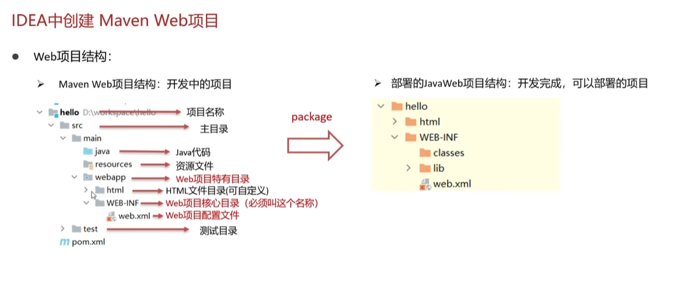

+ 集成web服务
1. 使用骨架  
    + 选择web项目骨架，创建项目
    + 删除pom.xml中多余的坐标
    + 补齐缺失的目录结构

    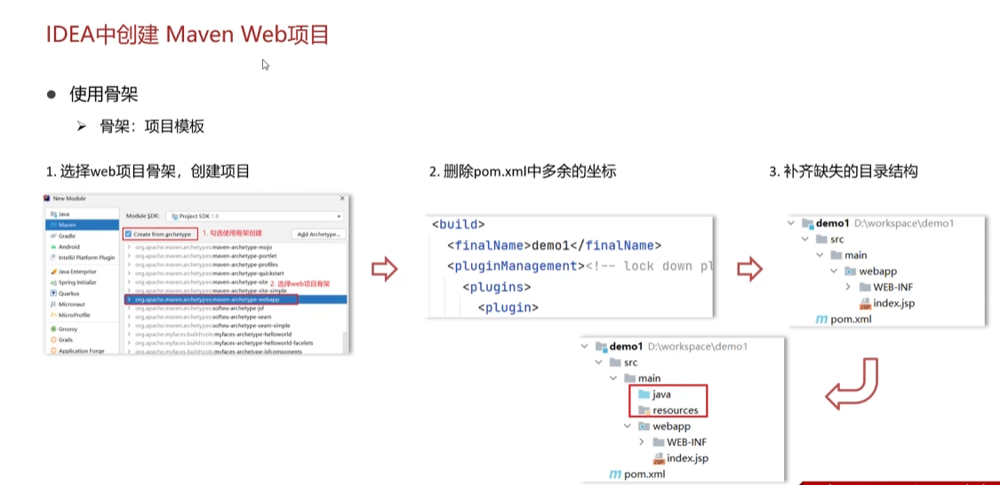
    
2. 不使用骨架  
    + 选择web项目骨架，创建项目
    + pom.xml中添加打包方式为war
    + 补齐缺失的目录结构:webapp
    
    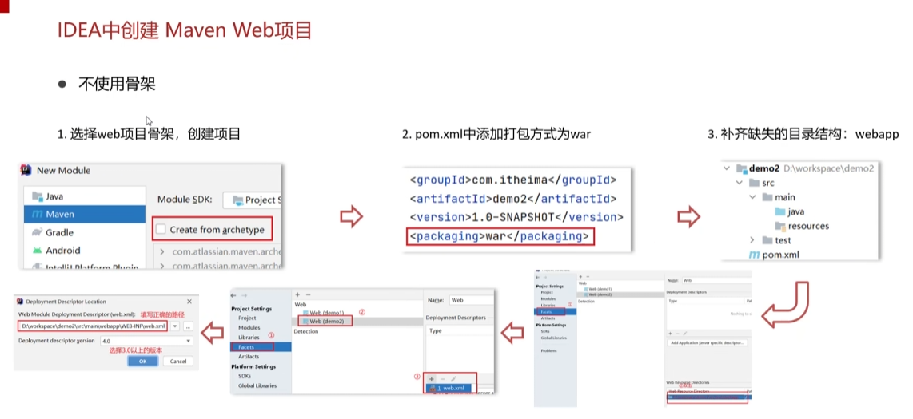

+ 在maven中部署tomcat
1. 将本地Tomcat 集成到ldea中，然后进行项目部署即可

2. 

3. pom.xml添加 Tomcat插件------> 使用Maven Helper 插件快速启动项目，选中项目，右键 -->Run Maven -->tomcat7:run
```xml
<build>
    <plugins>
      <plugin>
        <groupId>org.apache.tomcat.maven</groupId>
        <artifactId>tomcat7-maven-plugin</artifactId>
        <version>2.2</version>
        <configuration>
          <port>80</port>
          <path>/</path>
        </configuration>
      </plugin>
    </plugins>
  </build>
```

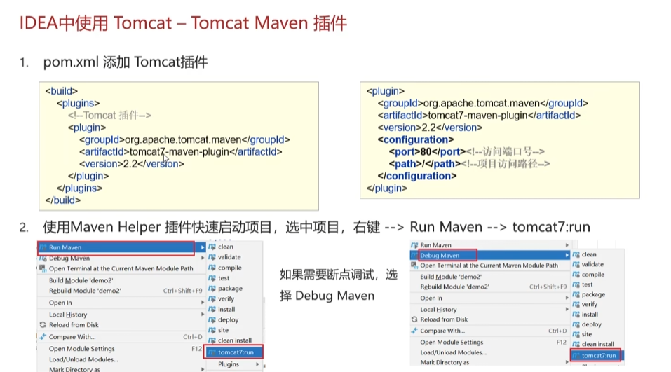

## Servlet
+ Servlet 是Java提供的一门动态web资源开发技术
+ Servlet 是JavaEE 规范之一，其实就是一个接口，将来我们需要定义Servet类实现Servet接口，并由web服务器运行Servlet

### Servlet的快速入门  

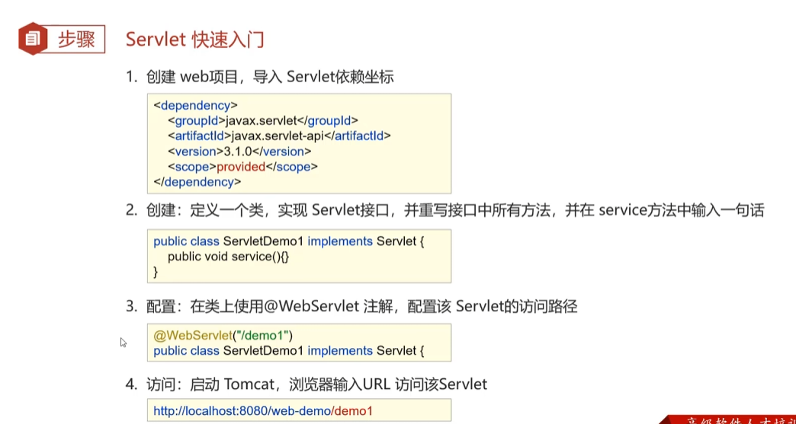

### Servlet执行流程  
1. Servlet 由谁创建?
+ servet方法由谁调用?Servlet由web服务器创建，Servlet方法由web服务器调用。


2. 服务器怎么知道Servlet中一定有service方法?
+ 因为我们自定义的Servlet，必须实现Servlet接口并复写其方法，而Servlet接口中有service方法

### Servlet生命周期  
+ Servlet运行在Servlet容器(web服务器)中，其生命周期由容器来管理，分为4个阶段:
1. 加载和实例化:默认情况下，当Servet第一次被访问时，由容器创建Servlet对象.
2. 初始化:在Servlet实例化之后，容器将调用servlet的init()方法初始化这个对象，完成一些如加载配置文件、创建连接等初始化的工作。该方法只调用一次
3. 请求处理:每次请求servlet时，Serviet容器都会调用Servlet的service()方法对请求进行处理。
4. 服务终止:当需要释放内存或者容器关闭时，容器就会调用Servlet实例的destroy()方法完成资源的释放。在destroy()方法调用之后，容器会释放这个Servlet实例，该实例随后会被Java的垃圾收集器所回收

### Servlet方法介绍  
1. 初始化方法，在Servlet被创建时执行，只执行一次
	void init(ServletConfig config)
2. 提供服务方法，每次Servlet被访问，都会调用该方法---常用
	void service(ServletRequest req, ServletResponse res)
3. 销毁方法，当Servlet被销毁时，调用该方法。在内存释放或服务器关闭时销毁Servlet
	void destroy()
4. 获取ServletConfig对象
	ServletConfig getServletConfig()
5. 获取Servlet信息
	String getServletinfo()
	
### HttpServlet  
+ 简化上述的servlet的开发
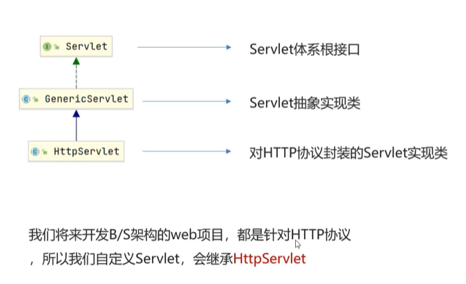
+ 如何使用httpservlet
 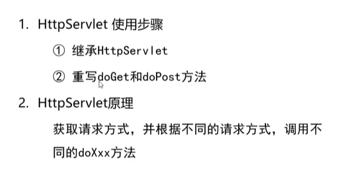


1.HttpServlet中为什么要根据请求方式的不同，调用不同方法?
+ 契合 HTTP 协议的设计规范，并简化开发者对不同请求类型的处理逻辑。
2.如何调用?
+ 重写doget dopost方法

### Servlet urlPattern配置  

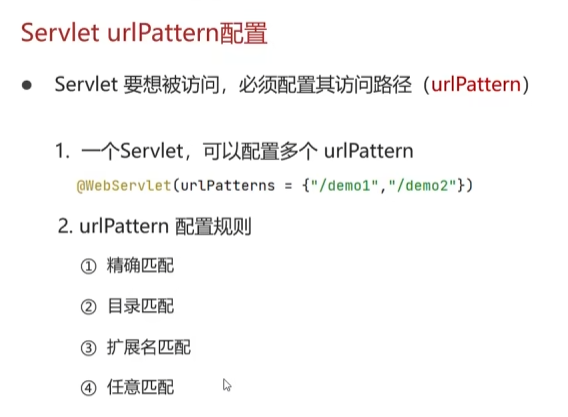

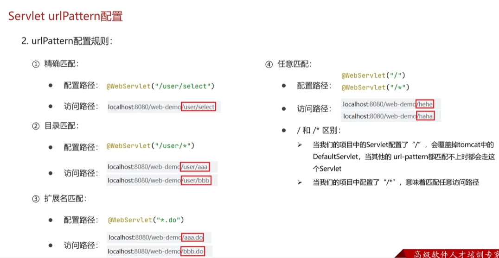

### XML配置Servlet  

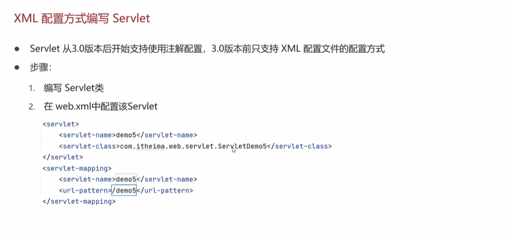

## Request(请求)
### Request 继承体系   

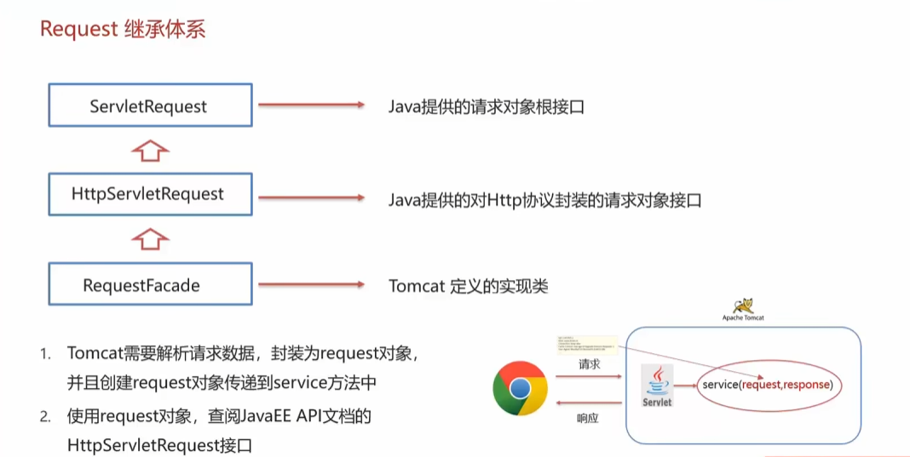

### Request 获取请求数据  

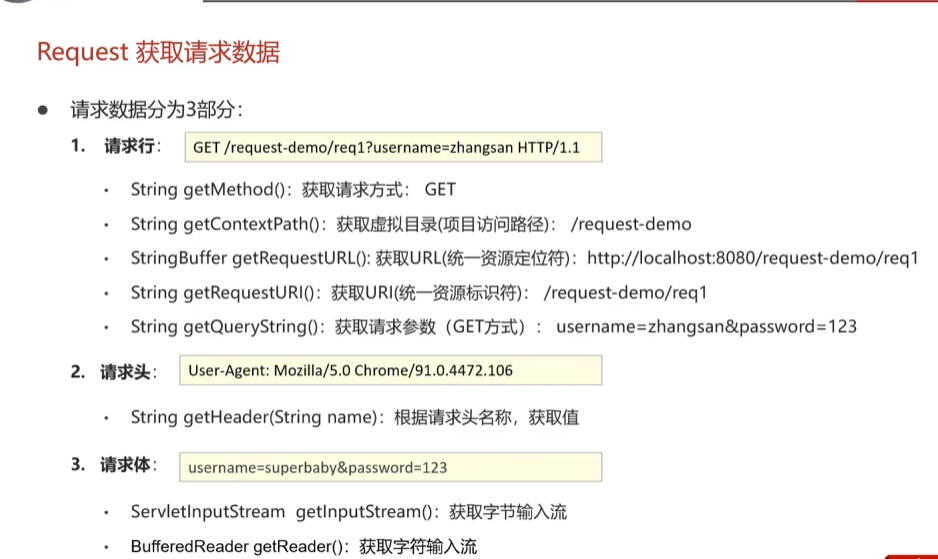

```java
package com.ryan.web;

import javax.servlet.ServletException;
import javax.servlet.annotation.WebServlet;
import javax.servlet.http.HttpServlet;
import javax.servlet.http.HttpServletRequest;
import javax.servlet.http.HttpServletResponse;
import java.io.BufferedReader;
import java.io.IOException;

/**
 * @version 1.0
 * @auther Ryan
 */
@WebServlet(urlPatterns = "/req1")
public class ServletDemo7 extends HttpServlet {
    @Override
    protected void doGet(HttpServletRequest req, HttpServletResponse resp) throws ServletException, IOException {
        // string getMethod():获取请求方式:GET
        String method =req.getMethod();
        System.out.println(method);//GET

        // string getContextPath():获取虚拟目录(项目访问路径):/request-demo
        String contextPath=req.getContextPath();
        System.out.println(contextPath);
        //stringBuffer getRequestURL():获取URL(统一资源定位符):http://localhost:8080/request-demo/req1

        StringBuffer url = req.getRequestURL();
        System.out.println(url.toString());
        //string getRequestURI():获URI(统一资源标识符):/request-demo/req1
        String uri = req.getRequestURI();
        System.out.println(uri);

        //string getQuerystring():获取请求参数(GET方式):username=zhangsan
        String querystring=req.getQueryString();
        System.out.println(querystring);

        //-----------
        // 获取请求头:user-agent:浏览器的版本信息
        String agent=req.getHeader("user-agent");
        System.out.println(agent);
    }

    @Override
    protected void doPost(HttpServletRequest req, HttpServletResponse resp) throws ServletException, IOException {
        //获取post 请求体:请求参数
        //1. 获取字符输入流
        BufferedReader br = req.getReader();
        //2. 读取数据
        String line = br.readLine();
        System.out.println(line);
    }
}
```

### 通用方式获取请求参数  

+ Request 通用方式获取请求参数

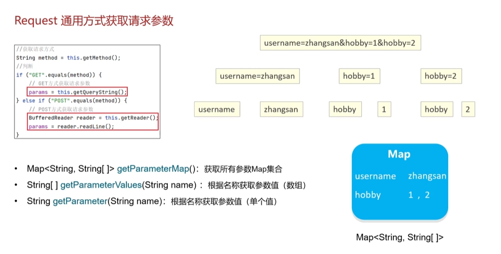

```java
package com.ryan.web;

import javax.servlet.ServletException;
import javax.servlet.annotation.WebServlet;
import javax.servlet.http.HttpServlet;
import javax.servlet.http.HttpServletRequest;
import javax.servlet.http.HttpServletResponse;
import java.io.BufferedReader;
import java.io.IOException;
import java.util.Map;

/**
 * @version 1.0
 * @auther Ryan
 */
@WebServlet(urlPatterns = "/req2")
public class ServletDemo8 extends HttpServlet {
    @Override
    protected void doGet(HttpServletRequest req, HttpServletResponse resp) throws ServletException, IOException {
        //GET请求逻辑

        //1.获取所有参数的Map 集合
        Map<String,String[]> map = req.getParameterMap();
        for(String key : map.keySet()){
            //username:zhangsan
            System.out.print(key+":");

            //获取值
            String[] values = map.get(key);
            for(String value :values){
                System.out.print(value + " ");
            }
            System.out.println(" ");
        }

        System.out.println("---------------------------");

        //2.根摔key获取参数值，数组
        String[] hobbies =req.getParameterValues("hobby");
        for(String hobby : hobbies) {
            System.out.println(hobby);
        }

        //3.根key 获取单个参数值
        String username =req.getParameter("username");
        String password=req.getParameter("password");
        System.out.println(username);
        System.out.println(password);


    }

    @Override
    protected void doPost(HttpServletRequest req, HttpServletResponse resp) throws ServletException, IOException {
        this.doGet(req, resp);
        //        //GET请求逻辑
//        System.out.println("post...");
//
//        //1.获取所有参数的Map 集合
//        Map<String,String[]> map = req.getParameterMap();
//        for(String key : map.keySet()){
//            //username:zhangsan
//            System.out.print(key+":");
//
//            //获取值
//            String[] values = map.get(key);
//            for(String value :values){
//                System.out.print(value + " ");
//            }
//            System.out.println(" ");
//        }
//
//        System.out.println("---------------------------");
//
//        //2.根摔key获取参数值，数组
//        String[] hobbies =req.getParameterValues("hobby");
//        for(String hobby : hobbies) {
//            System.out.println(hobby);
//        }
//
//        //3.根key 获取单个参数值
//        String username =req.getParameter("username");
//        String password=req.getParameter("password");
//        System.out.println(username);
//        System.out.println(password);
    }
}
```

```html
<!DOCTYPE html>
<html lang="en">
<head>
    <meta charset="UTF-8">
    <title>Title</title>
</head>
<body>
    <form action="req2" method="post">
        <input type="text" name="username">
        <input type="password" name="password">
        <input type="checkbox" name="hobby" value="1"> 游泳
        <input type="checkbox" name="hobby" value="2"> 爬山 <br>
        <input type="submit">
    </form>
</body>
</html>
```

### 使用idea模板创建Servlet  

### 解决中文乱码问题 (Tomcat8之后已经解决这个问题)   
+ post请求解决中文乱码问题 
```java
//1.解决乱码:PosT,getReader()
        request.setCharacterEncoding("UTF-8");//没置字行给入流的编码
```

+ url编码
```java
package com.ryan.web;

import java.io.UnsupportedEncodingException;
import java.net.URLDecoder;
import java.net.URLEncoder;

/**
 * @version 1.0
 * @auther Ryan
 */
public class URLDemo {
    public static void main(String[] args) throws Exception {
        String username ="张三";
        //1.URL编码
        String encode = URLEncoder.encode(username,"utf-8");
        System.out.println(encode);

        //2.URL解码
        String decode= URLDecoder.decode(encode,"utf-8");
        //String decode =URLDecoder.decode(encode,enc:"IS0-8859-1")

        System.out.println(decode);

        //3.转换为字书数据
        byte[]bytes = decode.getBytes("ISO-8859-1");
        for(byte b:bytes) {
            System.out.print(b +"");
        }

        //4.将字节数组转为字符中
        String s= new String(bytes,"utf-8");
        System.out.println(s);
    }
}
```

+ get请求解决中文乱码问题 
```java
package com.ryan.web; /**
 * @auther Ryan
 * @version 1.0
 */

import javax.servlet.*;
import javax.servlet.http.*;
import javax.servlet.annotation.*;
import java.io.IOException;
import java.nio.charset.StandardCharsets;

@WebServlet("/req3")
public class ServletDemo9 extends HttpServlet {
    @Override
    protected void doGet(HttpServletRequest request, HttpServletResponse response) throws ServletException, IOException {
        //1.解决乱码:PosT,getReader()
        request.setCharacterEncoding("UTF-8");//没置字行给入流的编码

        //2.获username
        String username =request.getParameter("username");
        System.out.println("乱码前：" + username);

        //3.GET,获取参数的方式:getquerystring
        //乱码原因:tomcat进行URL解码，默认的字符集IS0-8859-1
        //3.1 先对乱码数进行编码:转为字节数组
        byte[] bytes =username.getBytes(StandardCharsets.ISO_8859_1);
        //3.2 字书数组解码
        username = new String(bytes,StandardCharsets.UTF_8);

        System.out.println("乱码后：" + username);


    }

    @Override
    protected void doPost(HttpServletRequest request, HttpServletResponse response) throws ServletException, IOException {
        this.doGet(request, response);
    }
}
```
### Request请求转发  

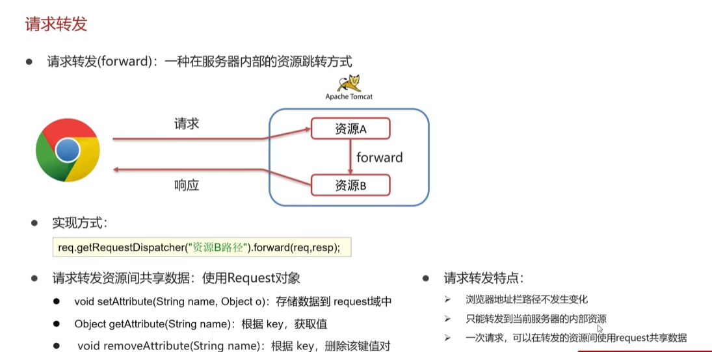

```java
package com.ryan.web; /**
 * @auther Ryan
 * @version 1.0
 */

import javax.servlet.ServletException;
import javax.servlet.annotation.WebServlet;
import javax.servlet.http.HttpServlet;
import javax.servlet.http.HttpServletRequest;
import javax.servlet.http.HttpServletResponse;
import java.io.IOException;
import java.nio.charset.StandardCharsets;

@WebServlet("/req4")
public class RequestDemo1 extends HttpServlet {
    @Override
    protected void doGet(HttpServletRequest request, HttpServletResponse response) throws ServletException, IOException {
        System.out.println("demo1");

        //存储数据
        request.setAttribute( "msg","hello");

        //请球转发
        request.getRequestDispatcher("/req5").forward(request,response);
    }

    @Override
    protected void doPost(HttpServletRequest request, HttpServletResponse response) throws ServletException, IOException {
        this.doGet(request, response);
    }
}
```

```java
package com.ryan.web; /**
 * @auther Ryan
 * @version 1.0
 */

import javax.servlet.ServletException;
import javax.servlet.annotation.WebServlet;
import javax.servlet.http.HttpServlet;
import javax.servlet.http.HttpServletRequest;
import javax.servlet.http.HttpServletResponse;
import java.io.IOException;

@WebServlet("/req5")
public class RequestDemo2 extends HttpServlet {
    @Override
    protected void doGet(HttpServletRequest request, HttpServletResponse response) throws ServletException, IOException {
        System.out.println("demo2");

        //获取数据
        Object msg = request.getAttribute("msg");
        System.out.println(msg);
    }

    @Override
    protected void doPost(HttpServletRequest request, HttpServletResponse response) throws ServletException, IOException {
        this.doGet(request, response);
    }
}
```

## Response(响应)   
### 简单介绍  

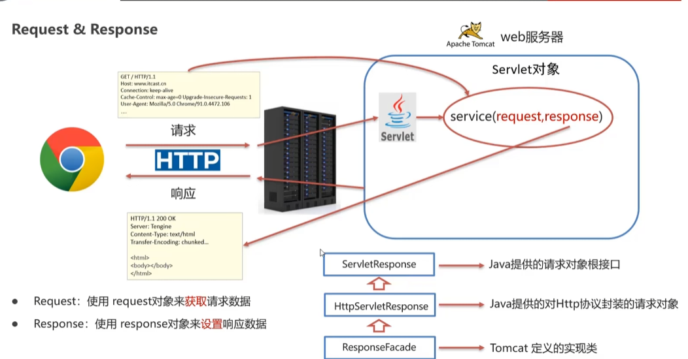

### Response 设置响应数据功能介绍  

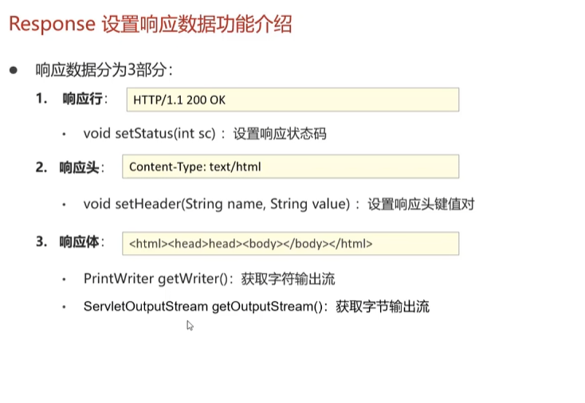

### Response 完成重定向   

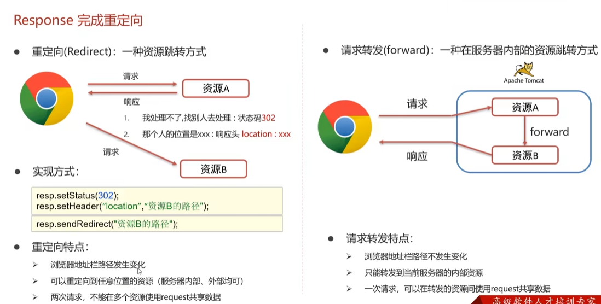

```java
package com.ryan.web.response;/**
 * @auther Ryan
 * @version 1.0
 */

import javax.servlet.*;
import javax.servlet.http.*;
import javax.servlet.annotation.*;
import java.io.IOException;

@WebServlet("/resp1")
public class ResponseDemo1 extends HttpServlet {
    @Override
    protected void doGet(HttpServletRequest request, HttpServletResponse response) throws ServletException, IOException {
        System.out.println("resp1...");

//        //重定向
//        //1.设置响应状态码 302
//        response.setStatus(302);
//        //2. 设置响应头 Location
//        response.setHeader("Location","/JavaWeb_war/resp2");

        //简化方式完成重定向
        response.sendRedirect( "/JavaWeb_war/resp2");
    }

    @Override
    protected void doPost(HttpServletRequest request, HttpServletResponse response) throws ServletException, IOException {
        doGet(request, response);
    }
}
```

### 路径问题  

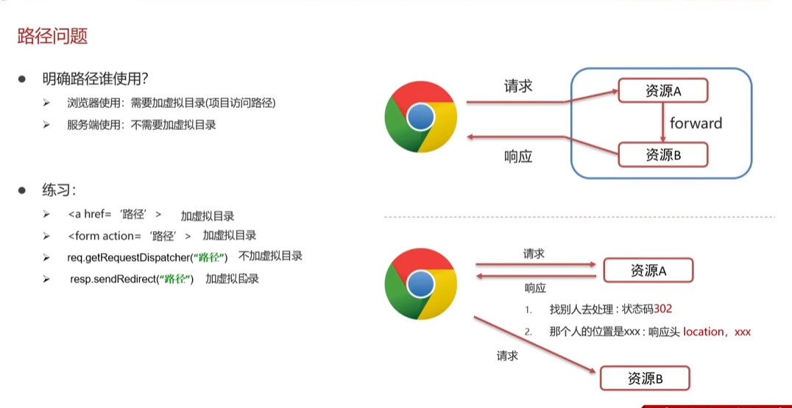

```java
//动态获取虚拟目录
        String contextPath = request.getContextPath();
        System.out.println(contextPath);

        //简化方式完成重定向
        response.sendRedirect( contextPath + "/resp2");
```

### Response 响应字符数据   

```java
package com.ryan.web.response;/**
 * @auther Ryan
 * @version 1.0
 */

import javax.servlet.ServletException;
import javax.servlet.annotation.WebServlet;
import javax.servlet.http.HttpServlet;
import javax.servlet.http.HttpServletRequest;
import javax.servlet.http.HttpServletResponse;
import java.io.IOException;
import java.io.PrintWriter;

@WebServlet("/resp3")
public class ResponseDemo3 extends HttpServlet {
    @Override
    protected void doGet(HttpServletRequest request, HttpServletResponse response) throws ServletException, IOException {

        //1.获取字符输出流
        PrintWriter writer = response.getWriter();
        //content-type
        response.setHeader("content-type","text/html");
        writer.write("aaa");
        writer.write("<h1>aaa</h1>");

        //细节:流不需要关闭
    }

    @Override
    protected void doPost(HttpServletRequest request, HttpServletResponse response) throws ServletException, IOException {
        doGet(request, response);
    }
}
```

### Response 响应字节数据   

```java
package com.ryan.web.response;/**
 * @auther Ryan
 * @version 1.0
 */

import javax.servlet.ServletException;
import javax.servlet.ServletOutputStream;
import javax.servlet.annotation.WebServlet;
import javax.servlet.http.HttpServlet;
import javax.servlet.http.HttpServletRequest;
import javax.servlet.http.HttpServletResponse;
import java.io.FileInputStream;
import java.io.IOException;
import java.io.PrintWriter;

@WebServlet("/resp4")
public class ResponseDemo4 extends HttpServlet {
    @Override
    protected void doGet(HttpServletRequest request, HttpServletResponse response) throws ServletException, IOException {
        //1.读取文件
        FileInputStream fis = new FileInputStream("d://a.jpg");

        //2.获取response字节输出流
        ServletOutputStream os=response.getOutputStream();

        //3.完成流的copy
        byte[] buff = new byte[1024];
        int len = 0;
        while((len =fis.read(buff))!=-1) {
            os.write(buff, 0, len);
        }
        fis.close();

    }

    @Override
    protected void doPost(HttpServletRequest request, HttpServletResponse response) throws ServletException, IOException {
        doGet(request, response);
    }
}
```

+ 简化使用工具类
```xml
 <dependency>
      <groupId>commons-io</groupId>
      <artifactId>commons-io</artifactId>
      <version>2.6</version>
    </dependency>
```

```java
package com.ryan.web.response;/**
 * @auther Ryan
 * @version 1.0
 */

import org.apache.commons.io.IOUtils;

import javax.servlet.ServletException;
import javax.servlet.ServletOutputStream;
import javax.servlet.annotation.WebServlet;
import javax.servlet.http.HttpServlet;
import javax.servlet.http.HttpServletRequest;
import javax.servlet.http.HttpServletResponse;
import java.io.FileInputStream;
import java.io.IOException;
import java.io.PrintWriter;

@WebServlet("/resp4")
public class ResponseDemo4 extends HttpServlet {
    @Override
    protected void doGet(HttpServletRequest request, HttpServletResponse response) throws ServletException, IOException {
        //1.读取文件
        FileInputStream fis = new FileInputStream("d://a.jpg");

        //2.获取response字节输出流
        ServletOutputStream os=response.getOutputStream();

        //3.完成流的copy
        /*byte[] buff = new byte[1024];
        int len = 0;
        while((len =fis.read(buff))!=-1) {
            os.write(buff, 0, len);
        }
        */

        IOUtils.copy(fis, os);

        fis.close();

    }

    @Override
    protected void doPost(HttpServletRequest request, HttpServletResponse response) throws ServletException, IOException {
        doGet(request, response);
    }
}
```

### 登录注册案例  


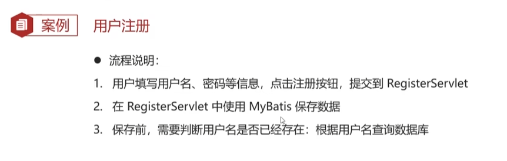


### SqlSessionFactory工具类抽取  
1. 问题:
+ 代码重复
+ SqlSessionFactory 工厂只创建一次，不要重复创建

```java
package com.ryan.web.util;

import org.apache.ibatis.io.Resources;
import org.apache.ibatis.session.SqlSessionFactory;
import org.apache.ibatis.session.SqlSessionFactoryBuilder;

import java.io.IOException;
import java.io.InputStream;

/**
 * @version 1.0
 * @auther Ryan
 */
public class SqlSessionFactoryUtils {

    private static SqlSessionFactory sqlSessionFactory;

    static {
        //静态代码块会随着类的加裁而自动执行，且只执行一次
        try {
            //2.调用MyBatis完成查询
            //2.1 获取SqlSessionFactory对象
            String resource = "mybatis-config.xml";
            InputStream inputStream = Resources.getResourceAsStream(resource);
            sqlSessionFactory = new SqlSessionFactoryBuilder().build(inputStream);
        } catch (IOException e) {
            throw new RuntimeException(e);
        }
    }

    public static SqlSessionFactory getsqlsessionFactory() {
        return sqlSessionFactory;
    }
}
```

```java
package com.ryan.web;/**
 * @auther Ryan
 * @version 1.0
 */

import com.ryan.web.mapper.UserMapper;
import com.ryan.web.pojo.User;
import com.ryan.web.util.SqlSessionFactoryUtils;
import org.apache.ibatis.io.Resources;
import org.apache.ibatis.session.SqlSession;
import org.apache.ibatis.session.SqlSessionFactory;
import org.apache.ibatis.session.SqlSessionFactoryBuilder;

import javax.servlet.*;
import javax.servlet.http.*;
import javax.servlet.annotation.*;
import java.io.IOException;
import java.io.InputStream;

@WebServlet("/registerServlet")
public class RegisterServlet extends HttpServlet {
    @Override
    protected void doGet(HttpServletRequest request, HttpServletResponse response) throws ServletException, IOException {
        //1。接收用户数据
        String username=request.getParameter("username");
        String password=request.getParameter("password");
        //封装用户对象
        User user =new User();
        user.setUsername(username);
        user.setPassword(password);

//        //2.1 获取SqlSessionFactory对象
//        String resource = "mybatis-config.xml";
//        InputStream inputStream = Resources.getResourceAsStream(resource);
//        SqlSessionFactory sqlSessionFactory = new SqlSessionFactoryBuilder().build(inputStream);

        SqlSessionFactory sqlSessionFactory = SqlSessionFactoryUtils.getsqlsessionFactory();

        //2.2 获取SqlSession对象
        SqlSession sqlSession = sqlSessionFactory.openSession();

        //2.3 获取Mapper
        UserMapper userMapper = sqlSession.getMapper(UserMapper.class);

        //2.4调用方法
        User u=userMapper.selectByUsername(username);

        //3.判断用户对象释放为null
        if( u == null){
        // 用户名不存在，添加用户
            userMapper.add(user);

            // 提交事务
            sqlSession.commit();

            // 释放资源
            sqlSession.close();
        }else {
            // 用户名存在、给出提示信息
            response.setContentType("text/html;charset=utf-8");
            response.getWriter().write("用户名已存在");
        }
    }

    @Override
    protected void doPost(HttpServletRequest request, HttpServletResponse response) throws ServletException, IOException {
        this.doGet(request, response);
    }
}
```

## MVC模式和三层架构

### MVC  
+ MVC 是一种分层开发的模式，其中:
    + M:Model，业务模型，处理业务
    + V:View，视图，界面展示
    + C:Controller，控制器，处理请求，调用模型和视图
    

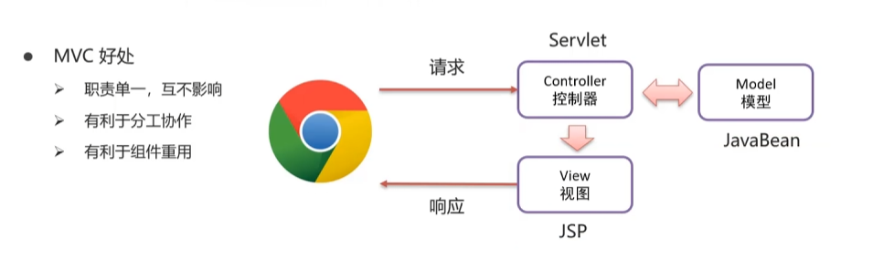

### 三层架构  

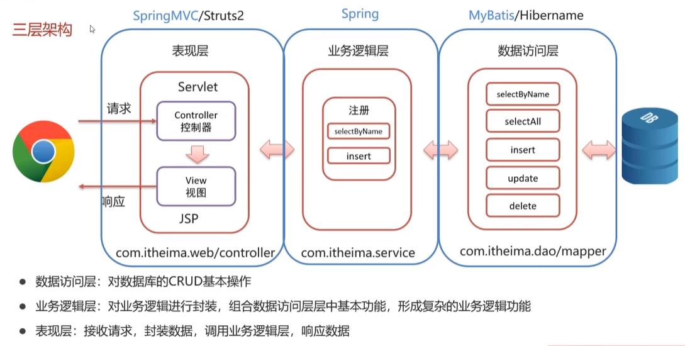

## 会话跟踪技术  
+ 会话:用户打开浏览器，访问web服务器的资源，会话建立，直到有一方断开连接，会话结束。在一次会话中可以包含多次请求和响应
+ 会话跟踪:一种维护浏览器状态的方法，服务器需要识别多次请求是否来自于同一浏览器，以便在同一次会话的多次请求间共享数据
+ HTTP协议是无状态的，每次浏览器向服务器请求时，服务器都会将该请求视为新的请求，因此我们需要会话跟踪技术来实现会话内数据共享

+ 实现方式:
1. 客户端会话跟踪技术:Cookie
2. 服务端会话跟踪技术:Session

## Cookie  
### Cookie的基本使用  

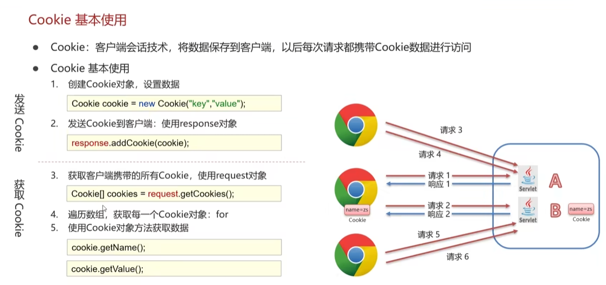

```java
package com.itheima.web.cookie;

import javax.servlet.*;
import javax.servlet.http.*;
import javax.servlet.annotation.*;
import java.io.IOException;
import java.net.URLEncoder;

@WebServlet("/aServlet")
public class AServlet extends HttpServlet {
    @Override
    protected void doGet(HttpServletRequest request, HttpServletResponse response) throws ServletException, IOException {
        //发送Cookie

        //1. 创建Cookie对象
//        Cookie cookie = new Cookie("username","zs");

        String value = "张三";
        //URL编码
        value = URLEncoder.encode(value, "UTF-8");
        System.out.println("存储数据："+value);

        Cookie cookie = new Cookie("username",value);

        //设置存活时间   ，1周 7天
        cookie.setMaxAge(60*60*24*7);

        //2. 发送Cookie，response
        response.addCookie(cookie);
    }

    @Override
    protected void doPost(HttpServletRequest request, HttpServletResponse response) throws ServletException, IOException {
        this.doGet(request, response);
    }
}
```

### Cookie的原理  

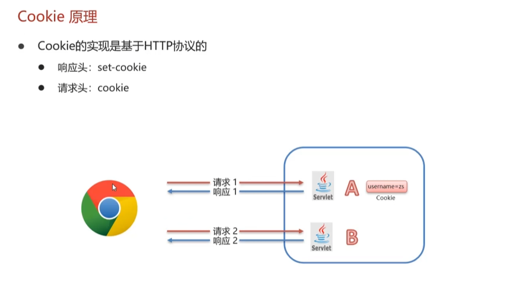

### Cookie的细节  

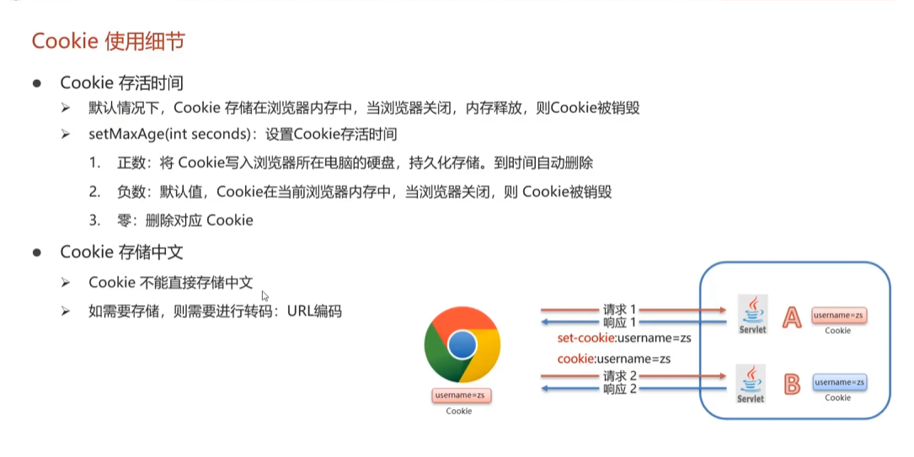

### Session的基本使用  

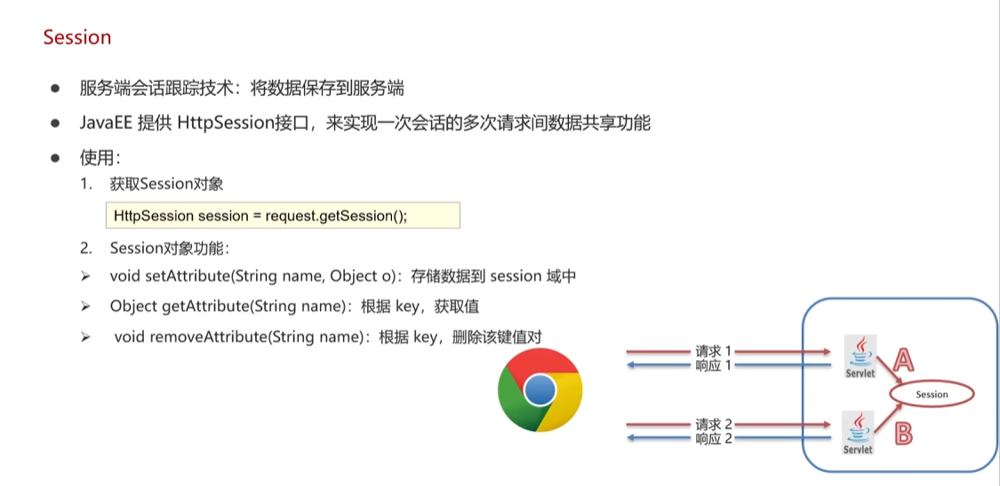

```java
package com.itheima.web.session;

import javax.servlet.*;
import javax.servlet.http.*;
import javax.servlet.annotation.*;
import java.io.IOException;

@WebServlet("/demo1")
public class SessionDemo1 extends HttpServlet {
    @Override
    protected void doGet(HttpServletRequest request, HttpServletResponse response) throws ServletException, IOException {
        //存储到Session中
        //1. 获取Session对象
        HttpSession session = request.getSession();
        System.out.println(session);
        //2. 存储数据
        session.setAttribute("username","zs");
    }

    @Override
    protected void doPost(HttpServletRequest request, HttpServletResponse response) throws ServletException, IOException {
        this.doGet(request, response);
    }
}
```

### Session的原理  

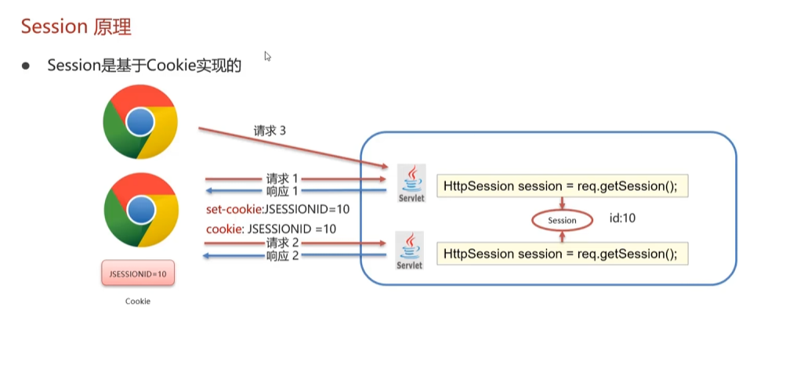

### Session的细节  

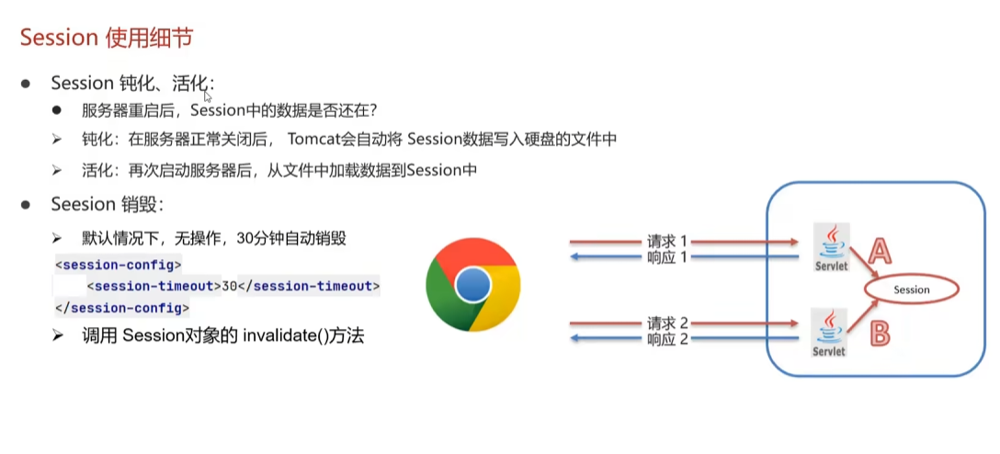

### 小结   

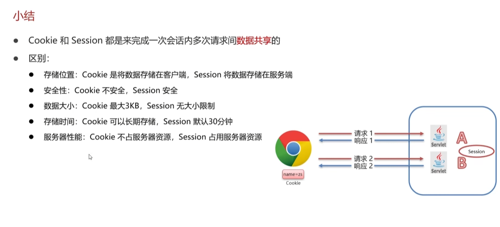

## Filter 过滤器  
+ Filter 表示过滤器，是JavaWeb 三大组件(Servlet、Filter、Listener)之一
+ 过滤器可以把对资源的请求拦截下来，从而实现一些特殊的功能。
+ 过滤器一般完成一些通用的操作，比如:权限控制、统一编码处理、敏感字符处理等等.


### Filter的快速入门  
```java
package com.itheima.web.filter;

import javax.servlet.*;
import javax.servlet.annotation.WebFilter;
import java.io.IOException;


@WebFilter("/*")
public class FilterDemo implements Filter {


    @Override
    public void doFilter(ServletRequest request, ServletResponse response, FilterChain chain) throws IOException, ServletException {

        //1. 放行前，对 request数据进行处理
        System.out.println("1.FilterDemo...");

        //放行
        chain.doFilter(request,response);
        //2. 放行后，对Response 数据进行处理
        System.out.println("5.FilterDemo...");
    }

    @Override
    public void init(FilterConfig filterConfig) throws ServletException {

    }


    @Override
    public void destroy() {

    }
}
```

### Filter 执行流程  

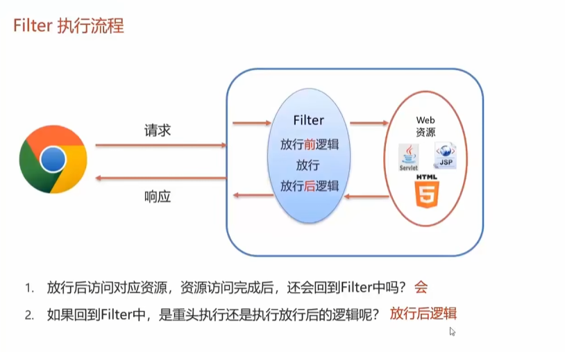

### Filter 使用细节  
+ Filter 拦截路径配置

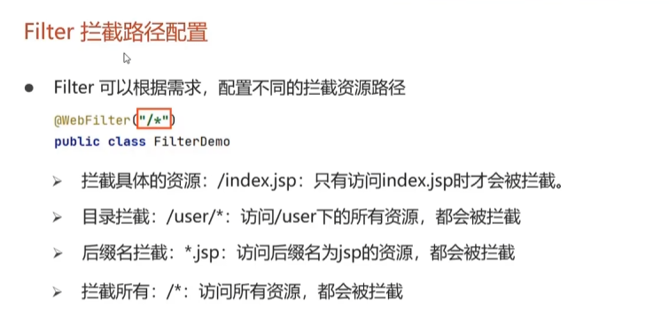


+ 过滤器链 : 一个Web应用，可以配置多个过滤器，这多个过滤器称为过滤器链

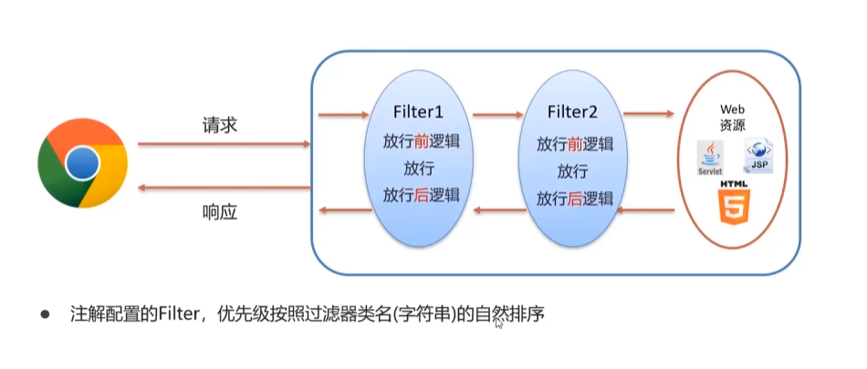

## Lisner 监听器
+ 概念:Listener 表示监听器，是JavaWeb 三大组件(Servlet、Filter、Listener)之一
+ 监听器可以监听就是在application,session,request三个对象创建、销毁或者往其中添加修改删除属性时自动执行代码的功能组件
+ Listener分类:JavaWeb中提供了8个监听器

### Listener 的使用  

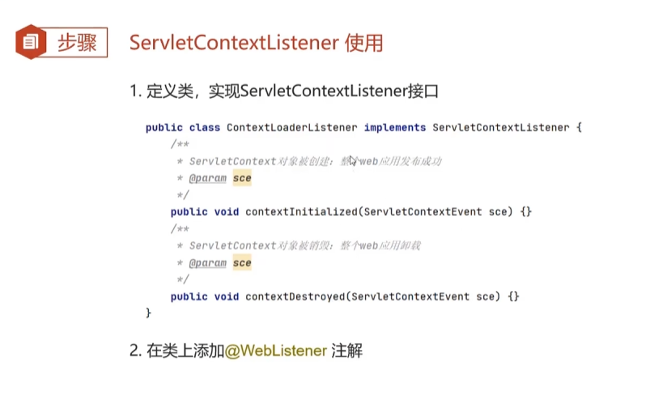

## AJAX
+ 概念:AJAX(Asynchronous JavaScript And XML): 异步的 JavaScript 和 XMI
+ AJAX作用:
	1. 与服务器进行数据交换:通过AJAX可以给服务器发送请求，并获取服务器响应的数据使用了AJAX和服务器进行通信，就可以使用 HTML+AJAX来替换JSP页面了
	2. 异步交互:可以在不重新加载整个页面的情况下，与服务器交换数据并更新部分网页的技术，如:搜索联想、用户名是否可用校验，等等..

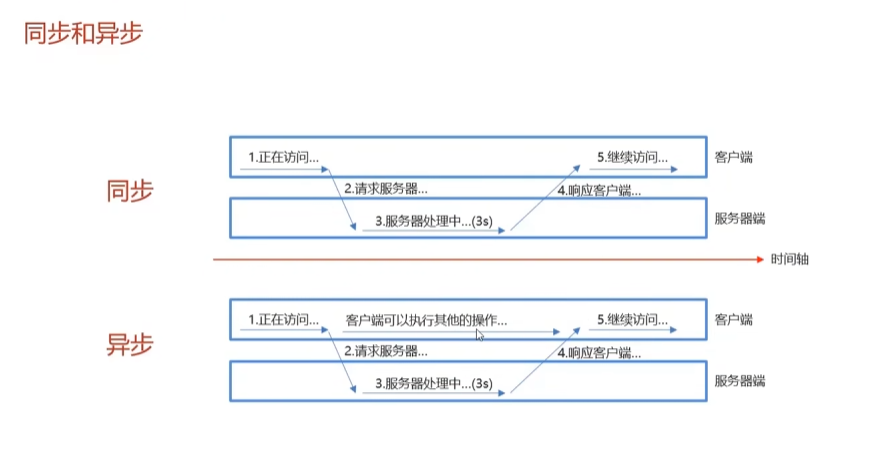

### AJAX快速入门  

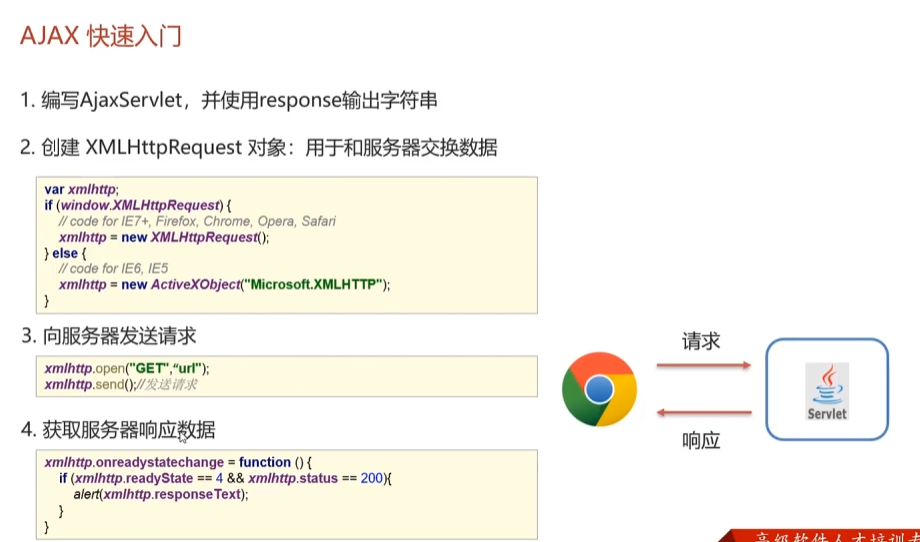

```html
<!DOCTYPE html>
<html lang="en">
<head>
    <meta charset="UTF-8">
    <title>Title</title>
</head>
<body>


<script>
    //1. 创建核心对象
    var xhttp;
    if (window.XMLHttpRequest) {
        xhttp = new XMLHttpRequest();
    } else {
        // code for IE6, IE5
        xhttp = new ActiveXObject("Microsoft.XMLHTTP");
    }
    //2. 发送请求
    xhttp.open("GET", "http://localhost:8080/ajax-demo/ajaxServlet");
    xhttp.send();

    //3. 获取响应
    xhttp.onreadystatechange = function() {
        if (this.readyState == 4 && this.status == 200) {
               alert(this.responseText);
        }
    };


</script>
</body>
</html>
```

```java
package com.itheima.web.servlet;

import javax.servlet.*;
import javax.servlet.http.*;
import javax.servlet.annotation.*;
import java.io.IOException;

@WebServlet("/ajaxServlet")
public class AjaxServlet extends HttpServlet {
    @Override
    protected void doGet(HttpServletRequest request, HttpServletResponse response) throws ServletException, IOException {
        //1. 响应数据
        response.getWriter().write("hello ajax~");
    }

    @Override
    protected void doPost(HttpServletRequest request, HttpServletResponse response) throws ServletException, IOException {
        this.doGet(request, response);
    }
}
```

### Axios框架  

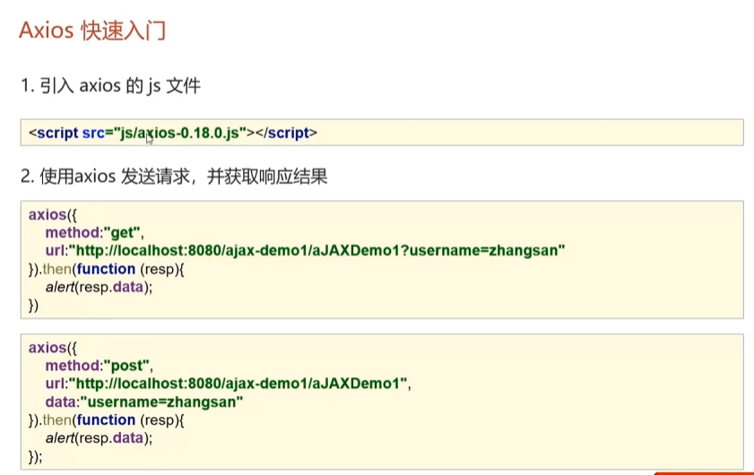

```html
<!DOCTYPE html>
<html lang="en">
<head>
    <meta charset="UTF-8">
    <title>Title</title>
</head>
<body>


<script src="js/axios-0.18.0.js"></script>

<script>
    //1. get
    axios({
        method:"get",
        url:"http://localhost:8080/ajax-demo/axiosServlet?username=zhangsan"
    }).then(function (resp) {
        alert(resp.data);
    })


    //2. post
    axios({
        method:"post",
        url:"http://localhost:8080/ajax-demo/axiosServlet",
        data:"username=zhangsan"
    }).then(function (resp) {
        alert(resp.data);
    })


</script>

</body>
</html>
```

```java
package com.itheima.web.servlet;

import javax.servlet.ServletException;
import javax.servlet.annotation.WebServlet;
import javax.servlet.http.HttpServlet;
import javax.servlet.http.HttpServletRequest;
import javax.servlet.http.HttpServletResponse;
import java.io.IOException;

@WebServlet("/axiosServlet")
public class AxiosServlet extends HttpServlet {
    @Override
    protected void doGet(HttpServletRequest request, HttpServletResponse response) throws ServletException, IOException {
        System.out.println("get...");

        //1. 接收请求参数
        String username = request.getParameter("username");
        System.out.println(username);

        //2. 响应数据
        response.getWriter().write("hello Axios~");
    }

    @Override
    protected void doPost(HttpServletRequest request, HttpServletResponse response) throws ServletException, IOException {
        System.out.println("post...");
        this.doGet(request, response);
    }
}
```

###  Axios 起别名  

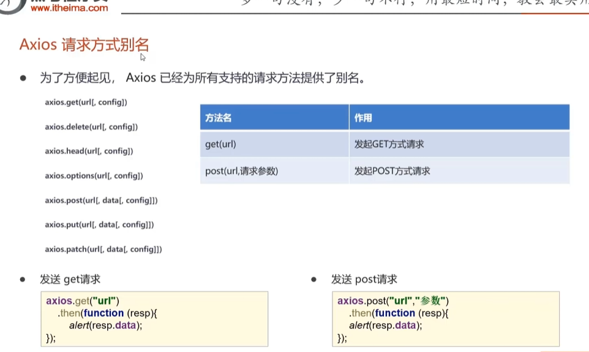

```html
<!DOCTYPE html>
<html lang="en">
<head>
    <meta charset="UTF-8">
    <title>Title</title>
</head>
<body>


<script src="js/axios-0.18.0.js"></script>

<script>
    //1. get
    axios.get("http://localhost:8080/ajax-demo/axiosServlet?username=zhangsan").then(function (resp) {
        alert(resp.data);
    })


    //2. post
    axios.post("http://localhost:8080/ajax-demo/axiosServlet","username=zhangsan").then(function (resp) {
        alert(resp.data);
    })


</script>

</body>
</html>
```

## JSON   
+ 概念:JavaScript Object Notation。JavaScript 对象表示法
+ 由于其语法简单，层次结构鲜明，现多用于作为数据载体，在网络中进行数据传输

### JSON 基础语法  

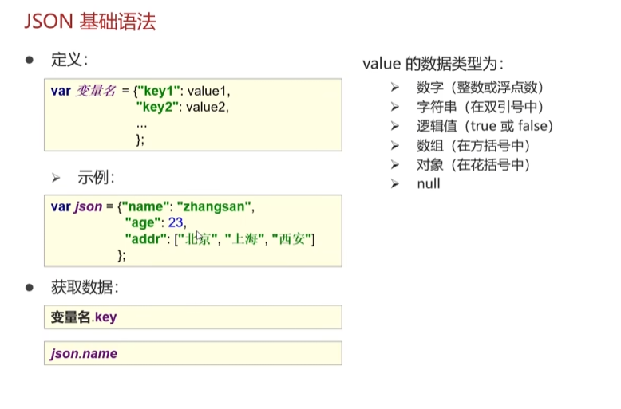

```javascript
  //1. 定义JSON字符串
  var jsonStr = '{"name":"zhangsan","age":23,"addr":["北京","上海","西安"]}';
  //alert(jsonStr);
  //2. 将JSON字符串转为JS对象
  let jsObject = JSON.parse(jsonStr);
  //alert(jsObject);
  let name = jsObject.name;
  //alert(name);

  //3. JS对象转为JSON字符串
  let jsonStr2 = JSON.stringify(jsObject);
  alert(jsonStr2)
```

### JSON 数据和Java对象转换   
+ 请求数据:JSON字符串转为Java
+ 对象响应数据:Java对象转为JSON字符串

+ Fastjson是阿里巴巴提供的一个Java语言编写的高性能功能完善的JSON库，是目前Java语言中最快的JSON库，可以实现Java对象和JSON字符串的相互转换。

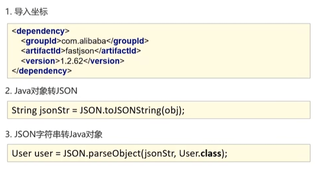

```java
package com.itheima.json;

import com.alibaba.fastjson.JSON;

public class FastJsonDemo {

    public static void main(String[] args) {
        //1. 将Java对象转为JSON字符串
        User user = new User();
        user.setId(1);
        user.setUsername("zhangsan");
        user.setPassword("123");

        String jsonString = JSON.toJSONString(user);
        System.out.println(jsonString);//{"id":1,"password":"123","username":"zhangsan"}


        //2. 将JSON字符串转为Java对象

        User u = JSON.parseObject("{\"id\":1,\"password\":\"123\",\"username\":\"zhangsan\"}", User.class);
        System.out.println(u);


    }
}
```


